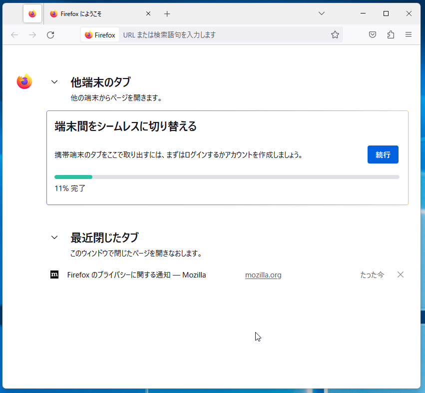
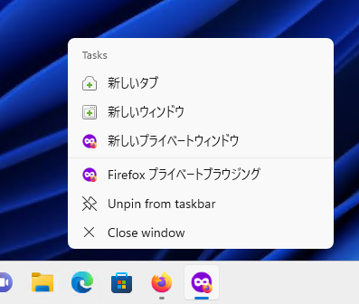

# Firefox ESR115のリリーススケジュール

[Mozillaのリリースカレンダー](https://wiki.mozilla.org/RapidRelease/Calendar)では、Firefox ESR115のリリース予定は以下の通り記載されています。

|リリース日     |通常版リリースバージョン|ESR版リリースバージョン|備考                |
|---------------|------------------------|-----------------------|--------------------|
| 2023年6月6日  | Firefox 114            | 102.12                |ESR115ベータ版      |
| 2023年7月4日  | Firefox 115            | 102.13/115.0          |ESR115正式版        |
| 2023年8月1日  | Firefox 116            | 102.14/115.1          |                    |
| 2023年8月29日 | Firefox 117            | 102.15/115.2          |                    |
| 2023年9月26日 | Firefox 118            | 115.3                 |ESR102のサポート終了|

Firefox ESR102のサポートは、2024年9月26日で終了します（以後はセキュリティ更新が提供されません）。

* 日付は太平洋標準時 (UTC-0800) 基準のため、日本時間では表記の日付の約1日後がリリース日となります。
* なお、リリーススケジュールは予告なく変更される可能性があります。

# 法人利用への影響が予想される代表的な変更点

\newpage

# カテゴリごとの変更点

## 外観、メニュー構成の変更

* Windowsの設定の「アクセシビリティ」→「テキストのサイズ」の設定が、システムフォントのサイズ以外にもUIやWebページの表示文字にも反映されるようになった。（Firefox 103）
* 以前に閲覧したコンテンツを閲覧しやすくする[Firefox View](https://support.mozilla.org/en-US/kb/how-set-tab-pickup-firefox-view)機能を追加し、現在のコンピューターで最近閉じたタブを探したり、他のコンピューターのタブを開いたり（Tab Pickup機能）、<!--[Colorways](https://support.mozilla.org/en-US/kb/personalize-firefox-colorways)機能でブラウザーの外観を変えたり-->といったことを行えるようになった。（Firefox 106）
  
* [ポリシー設定の`BlockAboutSupport`](https://github.com/mozilla/policy-templates/blob/master/README.md#blockaboutsupport)を使用している際に、[メニュー項目の`他のトラブルシューティング情報`自体が無効化されるようになった。](https://bugzil.la/1792205)（Firefox 107）
* ブックマークツールバーの設定が「新しいタブのみ表示する」の時に、`about:newtab`だけでなく`about:blank`でもブックマークツールバーが表示されるようになった。（Firefox 108）

## UIの操作性の変更

* Ctrl-Lでアドレスバーにフォーカス移動した後などの状態から、タブバーにあるボタンにTab、Shift-Tab、およびカーソルキーでフォーカス移動できるようになった。（[詳細な説明](https://support.mozilla.org/en-US/kb/access-toolbar-functions-using-keyboard)）（Firefox 103）
* フォームコントロールからのテキストのコピー時に、ノーブレークスペース（U+00A0）が維持されるようになった。（Firefox 103）
* HTTPSのみのエラーページを無視して先に進んだ後の「戻る」操作で、エラーページではなく、その前に閲覧していたWebページに戻るようになった。（Firefox 104）
* Webページ中の入力フォームに対して、キーボードショートカット「Ctrl-Shift-V（⌘-Shift-V）」で書式情報無しでの貼り付けができるようになった。（Firefox 104）
* [ポリシー設定の`GoToIntranetSiteForSingleWordEntryInAddressBar`](https://github.com/mozilla/policy-templates/blob/master/README.md#gotointranetsiteforsinglewordentryinaddressbar)で、1単語だけをアドレスバーで入力した際に、Web検索する代わりにWebサイトに直接アクセスできるようになった。（Firefox 104、Firefox ESR102）
* 印刷プレビューのダイアログにおいて、現在のページだけを印刷する選択肢が追加。（Firefox 105）
* Windowsにおいて、タッチパッド上での二本指でのスワイプによる「戻る」「進む」操作を初期状態で有効化。（Firefox 105）
* プライベートウィンドウをWindows 10およびWindows 11のタスクバーにピン留めできるようになった。（Firefox 106）
  
* 特定の印刷ルールにより適切に対応するために、Firefox上でテキストをコピーする際にノーブレークスペース（U+00A0）を通常のスペースに置き換えないようになった。（副作用として、インデントをノーブレークスペースで行っている場合に問題となりうる。）（Firefox 107）
* キーボードショートカット「Shift+ESC」でFirefox組み込みの[プロセスマネージャー](https://support.mozilla.org/en-US/kb/task-manager-tabs-or-extensions-are-slowing-firefox)を開けるようになった。（Firefox 108）

## セキュリティ・プライバシー保護

* もはや充分に安全とは言えなくなったアルゴリズムであるSHA-1について、証明書の署名アルゴリズムとして受け付ける後方互換性のための設定を廃止。（Firefox 103）
* Total Cookie Protectionが初期状態で有効化され、すべてのサードパーティーCookieをそれぞれ用のストレージ領域に保存するようになり、トラッキングに対する保護がより強力になった。（Firefox 103）
* [iframe内でWindowsのシングルサインオンが機能しない問題](https://bugzilla.mozilla.org/show_bug.cgi?id=1778325)を解消。（Firefox 104）
* [ポリシー設定の`Cookies`](https://github.com/mozilla/policy-templates/blob/master/README.md#cookies)でTotal Cookie Protectionの状態を制御できるようになった。（Firefox 104）
* [HTTPSで保護されていないページでのログイン情報の入力時の警告メッセージを抑止する隠し設定`security.insecure_field_warning.contextual.enabled`を廃止](https://bugzil.la/1773047)（当該警告メッセージを抑止できなくなった）。（Firefox 104）
* サードパーティのコンテキストでの分離されたService Workerに対応し、トップレベルのドメインの下に分離された形で、インラインフレーム内のサードパーティ製コンテンツにService Workerを登録できるようになった。（Firefox 105）

## インストール・更新

* Windows 10およびWindows 11において、インストーラがタスクバーにFirefoxをピン留めできるようになった。（Firefox 103）
* [ポリシー設定の`AppUpdatePin`](https://github.com/mozilla/policy-templates/blob/master/README.md#appversionpin)で`115.`のように指定することにより、「特定のメジャーバージョンのマイナーアップデートのみ自動更新を行い、それを超えるバージョンへのメジャーアップデートは行わない」という運用を容易に行えるようになった。（Firefox 104、Firefox ESR102）
* FirefoxをWindowsの既定のPDFビューワーの選択肢の1つとして登録するようになった。（Firefox 106）

## 内臓PDFビューワー

* PDFフォームについて、入力必須の項目をハイライト表示するようにした。（Firefox 103）
* テキストの入力、線の描画、署名の追加など、PDFの編集に対応。（Firefox 106）
* PDFフォームの印刷時に、英語以外の文字も使用可能になった。（Firefox 108）

## 動画・音声・音楽再生

* Picture-in-Pictureウィンドウにおいて字幕の文字サイズが変更可能となった。（Firefox 103）
* Picture-in-Pictureウィンドウでの字幕表示の対応サービスを拡大。
  * Funimation、Dailymotion、Tubi、Hotstar、SonyLIV（Firefox 103）
  * Disney+（Firefox 104）
* WebRTCの実装の更新によるビデオチャットの改善。（Firefox 106）
  * WindowsとWaylandを使用しているLinux環境での画面の共有が改善された。
  * macOSでのWebRTCでの画面キャプチャのパフォーマンス改善により、CPU使用率が低下し、フレームレートが向上した。
  * RTPのパフォーマンスと信頼性の向上。
  * より詳細な統計情報の提供。
  * Webサービスとの互換性を向上。
* WebMIDI APIに対応（APIの初回使用時に[専用のアドオン](https://support.mozilla.org/en-US/kb/site-permission-add-ons)の[インストールを求められる](https://bugzil.la/1795025)）。（Firefox 108）

## レガシーな仕様への対応終了、機能の廃止

* [HTMLの`<menuitem>`要素の対応を廃止。](https://bugzil.la/1372276)（Firefox 103）
* [MathMLの`scrptminsize`および`scriptsizemultiplier`属性の対応を廃止。](https://bugzil.la/1772697)（Firefox 103）
* [`IDBFactory.open()`](https://developer.mozilla.org/en-US/docs/Web/API/IDBFactory/open)の[非標準のオプションであった`options`引数への対応を廃止](https://bugzil.la/1354500)（代わりに[`StorageManager.persist()`](https://developer.mozilla.org/en-US/docs/Web/API/StorageManager/persist)を使うことを推奨）。（Firefox 104）
* [MathMLの`<ms>`の非推奨の属性である`lquote`および`rquote`を初期状態で無効化。](https://bugzil.la/1793387)（`mathml.ms_lquote_rquote_attributes.disabled`を`false`に切り替えることで従来の挙動に戻すことは可能）（Firefox 107）
* [非標準かつ非推奨の`SVGSVGElement.useCurrentView`プロパティを廃止。](https://bugzil.la/1174097)（Firefox 107）

## Webアプリの動作の互換性に影響する変更

* [`caches`、`CacheStorage`、`Cache`が安全なコンテキストでのみ使用可能になった。](https://bugzil.la/1112134)（Firefox 103）
* CSSの`scroll-snap-stop`プロパティでの[再スナップ](https://drafts.csswg.org/css-scroll-snap/#re-snap)に対応。（Firefox 104）
* YahooメールおよびOutlookのメール編集ページにおいて、Enterキーの入力後にハイライトの色がおかしくなる問題を修正。（Firefox 104）
* `<iframe>`のコンテンツ内で定義されたSVGなどにおいて、OSやブラウザーの設定よりも埋め込み要素自体のテーマ設定を尊重するようになった。（Firefox 105)
* [アドオンの定義でWebページからの読み込みを許可するよう明示されている場合を除き、あるアドオンのコンテンツを他のアドオンからは直接的には参照できなくなった。](https://bugzil.la/1711168)（Firefox 105）
* [MathMLの`<semantics>`と`<maction>`について、初期状態で最初の子要素のみを表示するようになった。](https://bugzil.la/1588733)（Firefox 106）

<!--
以下、ブラウザーとしての使い勝手には影響しないため非表示

## その他のパフォーマンス向上

* 120Hzを超える高リフレッシュレートのモニターでの性能を向上。（Firefox 103）
* Webコンテンツのローカルストレージの処理のためにFirefoxの起動に非常に時間がかかる場合があったのを修正。（Firefox 103）
* 最小化されたり他のウィンドウの下になったりしている時に、バックグラウンドのタブの内容がそうなるのと同様に、FirefoxのUIの再描画の頻度を落とすようにした。（Firefox 104）
* `Array.prototype.includes()`と`Array.prototype.indexOf()`のSIMD最適化版により、長大なリストからの検索処理が2倍高速化した。（Firefox 105）
* Windows 11 22H2において、フォーカスされたドキュメントのURLをMicrosoft IMEとMicrosoft Defenderが走査する際のパフォーマンスを改善。（Firefox 107）
* Windows 11において、バックグラウンドのタブのプロセスを[efficiencyモード](https://devblogs.microsoft.com/performance-diagnostics/reduce-process-interference-with-task-manager-efficiency-mode/)に切り替えて、リソース消費をより抑制するようになった。（Firefox 108）
* 高負荷時のフレーム描画のスケジューリング処理を改善した（実質的に、MotionMarkのベンチマークスコアの改善につながる）。（Firefox 108）

## その他の安定性の向上

* Windowsにおいて、空きメモリが逼迫している状況での安定性が改善。（Firefox 105）
* ICCv4プロファイルが埋め込まれた画像の色を適切に表示できるようになった。（Firefox 108）

## 開発者向け機能

* Firefox Profilerで電力消費の状況を分析できるようになった。
  * Windows 11およびM1 Macに対応（Firefox 104）
  * LinuxとインテルCPUのmacOS環境に対応（Firefox 107）
* [User Timing Level 3の仕様](https://www.w3.org/TR/user-timing/)に対応し、経過時間などを計測する`performance.mark`と`performance.measure`の追加の引数を受け付けるようになった。（Firefox 105）
* オフスクリーンでのCanvas描画にすべてのコンテキストで対応し、Webページに紐付くコンテキストでもWeb Workerのコンテキストでも画面描画を行えるようになった。（Firefox 105）
* [JavaScriptのインポートマップ](https://developer.mozilla.org/ja/docs/Web/HTML/Element/script/type/importmap)を初期状態で有効化した。（Firefox 108）

## macOS固有の改善・変更

* 現代的なロックAPIを使用するよう切り替えた事による、CPU使用率が高い状況での応答性を向上。（Firefox 103）
* タッチパッドによるスクロールで意図せず斜めにスクロールしてしまいにくくなった。（Firefox 105）
* [macOS 10.15以降の環境で、OSのテキスト認識機能を使って、選択された画像からテキストを抽出できるようになった。](https://support.mozilla.org/en-US/kb/text-recognition)（Firefox 106）

## Linux固有の改善・変更

* NVIDIAのドライバーを使用している場合のWebGLのパフォーマンスの問題を修正。（Firefox 103）
* メモリ不足の状況に陥りにくくなった他、仮にメモリ不足の状況でもシステムの他の部分に影響を与えにくくなった。（Firefox 105）
* スワイプによる「戻る」「進む」操作がWaylandを使用しているLinux環境でも使用可能になった。（Firefox 106）

-->

