# Firefox ESR115のリリーススケジュール

[Mozillaのリリースカレンダー](https://wiki.mozilla.org/RapidRelease/Calendar)では、Firefox ESR115のリリース予定は以下の通り記載されています。

|リリース日     |通常版リリースバージョン|ESR版リリースバージョン|備考                |
|---------------|------------------------|-----------------------|--------------------|
| 2023年6月6日  | Firefox 114            | 102.12                |ESR115ベータ版      |
| 2023年7月4日  | Firefox 115            | 102.13/115.0          |ESR115正式版        |
| 2023年8月1日  | Firefox 116            | 102.14/115.1          |                    |
| 2023年8月29日 | Firefox 117            | 102.15/115.2          |                    |
| 2023年9月26日 | Firefox 118            | 115.3                 |ESR102のサポート終了|

Firefox ESR102のサポートは、2023年9月26日で終了します（以後はセキュリティ更新が提供されません）。

* 日付は太平洋標準時 (UTC-0800) 基準のため、日本時間では表記の日付の約1日後がリリース日となります。
* なお、リリーススケジュールは予告なく変更される可能性があります。

# 法人利用への影響が予想される代表的な変更点

* ツールバーの「アドオンとテーマ」ボタンが「拡張機能パネル」へリニューアルされました。
* 「Firefox View」が導入されました。
* TLS証明書の署名アルゴリズムとしてのSHA-1が完全に廃止されました。
* Total Cookie Protectionが初期状態で有効化されるなど、プライバシー保護とセキュリティが強化されました。
* Windowsのシングルサインオンや多要素認証との互換性が向上しました。
* DNS over HTTPSが環境によって自動的に有効化されるようになり、設定画面上も大きく取り扱われるようになりました。
* メジャーアップデートを禁止しマイナーアップデートのみ適用する形で自動更新を運用できるようになりました。

\newpage

# カテゴリごとの変更点

以下に挙げる変更点は、特段の断りがない限り、初期状態で挙動が従来版から変化しており、従来の挙動に戻すことはできません。
初期状態での挙動が従来版からは変化せず、任意の設定変更により新しい挙動を有効化できる物や、初期状態での挙動は変化するものの設定変更で従来の挙動に戻せる物については、個別にその旨を記載しています。

## 外観、メニュー構成の変更

* Windowsの設定の「アクセシビリティ」→「テキストのサイズ」の設定が、システムフォントのサイズ以外にもUIやWebページの表示文字にも反映されるようになった。（Firefox 103）  
  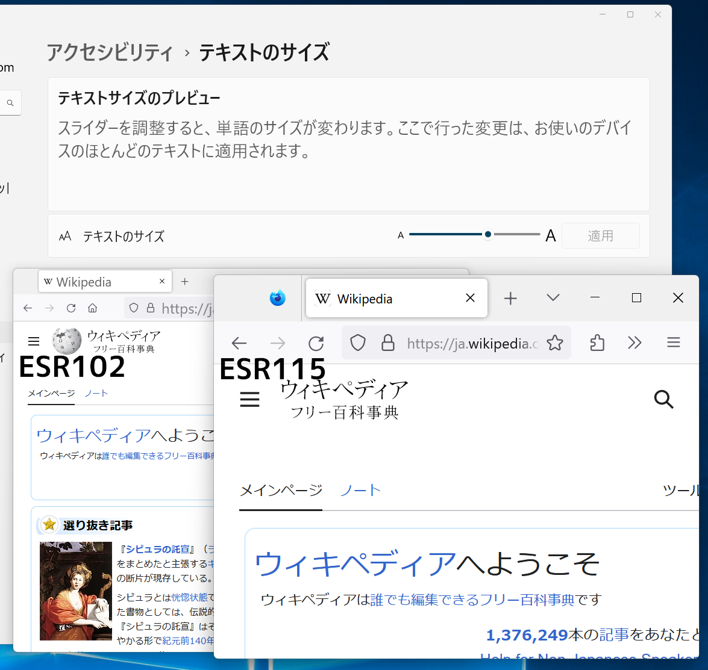{ width=400px }
  <!-- https://bugzil.la/1773342 -->
  * 初期状態の挙動は変化せず、ユーザーまたは管理者による明示的なWindowsの設定変更を要します。
  <!-- - この挙動は設定で無効化できません。 -->
* 以前に閲覧したコンテンツを閲覧しやすくする[Firefox View](https://support.mozilla.org/en-US/kb/how-set-tab-pickup-firefox-view)機能の追加により、現在のコンピューターで最近閉じたタブを探したり、他のコンピューターのタブを開いたり（Tab Pickup機能）、といったことを少ないアクションで行えるようになった。（Firefox 106）  
  { width=400px }
  * Firefox Viewは以下の操作で表示されます。
    <!--* ウィンドウ内の最後のタブを閉じる（browser.tabs.closeWindowWithLastTab）-->
    * タブバー左端のボタンをクリック
    * 「ツール」メニューの「Firefox View」を選択
  * 「他のコンピューターのタブを開く」機能はFirefox Syncに依存します。Firefox Syncを使用していない場合、この機能は動作しません。
  * この変更は可逆的で、`browser.tabs.firefox-view`を`false`にすることで従来の動作に戻せます。
    * この場合でも、「ツール」メニューの「Firefox View」からのFirefox Viewの表示は依然として可能です（このメニュー項目は無効化できません）。
  <!-- * 「最近閉じたタブ」セクションで、ユーザーが手動で項目を閉じたり削除したりできるようになった。（Firefox 109）-->
  <!-- * ユーザー体験向上のため、Firefoxビューの「Tab Pickup」「最近閉じたタブ」セクションが空の時に表示されるメッセージと画像を更新。（Firefox 109） -->
* [ポリシー設定の`BlockAboutSupport`](https://github.com/mozilla/policy-templates/blob/master/README.md#blockaboutsupport)を有効化した場合に、[メニュー項目の`他のトラブルシューティング情報`の遷移先ページだけでなく、メニュー項目自体も無効化するようになった。](https://bugzil.la/1792205)（Firefox 107）
  * 初期状態の挙動は変化せず、管理者による明示的な設定変更を要します。
  <!-- - この挙動は設定で無効化できません。 -->
* 初期状態（ツールバー上での右クリックメニューで「ブックマークツールバー」→「新しいタブのみ表示する」を選択している状態）で、`about:newtab`だけでなく`about:blank`でもブックマークツールバーを自動的に表示するようになった。（Firefox 108）  
  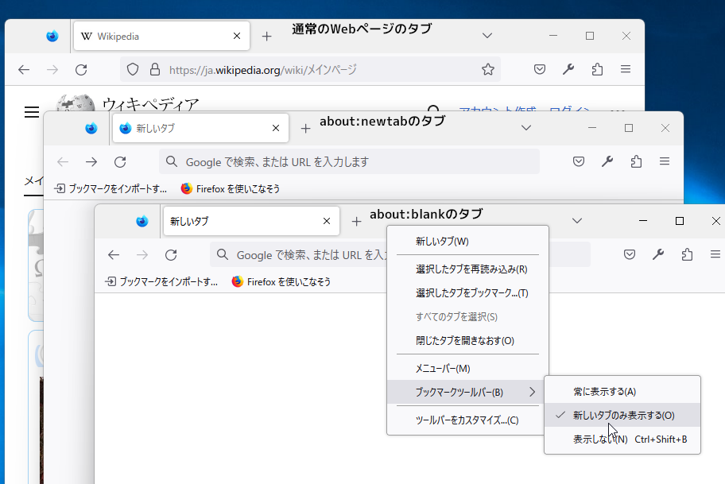{ width=400px }
  <!-- - この挙動は設定で無効化できません。 -->
  <!-- ブックマークツールバーの自動表示設定自体は`policies.json`などで`browser.toolbars.bookmarks.visibility`で指定可能。（Appearance-5） -->
* ツールバーの「アドオンとテーマ」ボタンが「拡張機能パネル」へとリニューアルされ、パネル形式で拡張機能を一覧表示できるようになった。（Firefox 109）
  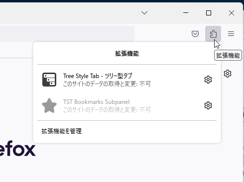{ width=350px }
  <!-- - この挙動は設定で無効化できません。 -->
  * 拡張機能パネル内の項目の順番は歯車アイコンのボタンのメニューから変更できます。（Firefox 114）  
    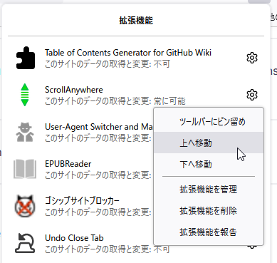{ width=250px }
    <!-- - この挙動は設定で無効化できません。 -->
* デスクトップ通知を、Firefox独自のポップアップ通知ではなくWindowsネイティブの通知として表示するようになった。（Firefox 111）  
  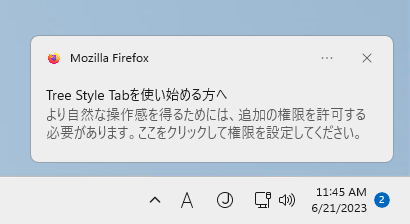{ width=250px }
  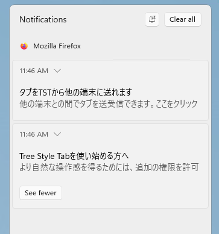{ width=250px }
  * 見過ごした通知も、Windowsの通知一覧に保存されて後から見返すことができます。
  * この変更は可逆的で、`alerts.useSystemBackend`を`false`にすることで従来の動作に戻せます。
* アドレスバーからWeb検索を実行した際の検索結果のページを表示している間、検索サービスのURLではなく、入力した検索語句をアドレスバーに表示できるようになった。（Firefox 113）  
  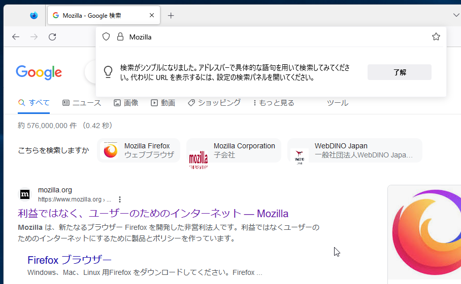{ width=400px }
  * 本稿執筆時点では、この機能は初期状態では無効のため挙動は変化しません。ただし、Firefox ESR115正式版では初期状態で有効になる可能性はあります。
  * `browser.urlbar.showSearchTerms.featureGate`が`true`の時にのみ機能及び設定UIが有効化されます。  
    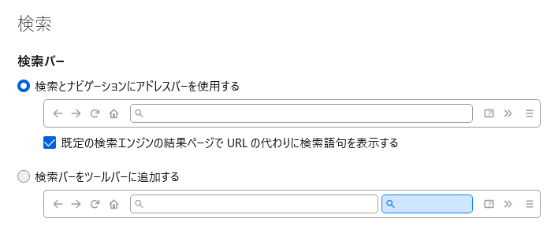{ width=400px }
  * この変更は可逆的で、`browser.urlbar.showSearchTerms.enabled`を`false`にすることで従来の動作に戻せます。
* ブックマークメニューと履歴メニュー（アプリケーションメニュー配下、メニューバー配下、ツールバーボタン配下の物）に、アドレスバーでのブックマークまたは履歴のみを対象とした検索を開始するための項目を追加。（Firefox 114）  
  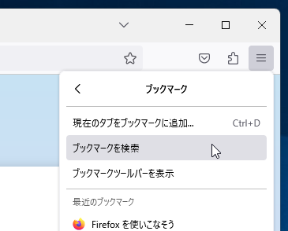{ width=250px }
  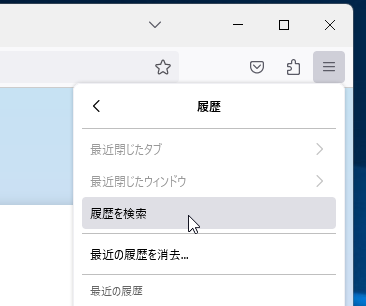{ width=250px }
  <!-- - この挙動は設定で無効化できません。 -->
* タブバー上のタブリストパネル上で、「閉じる」ボタン（Firefox 115）および中クリック（Firefox 112）でタブを閉じられるようになった。  
  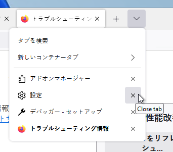{ width=250px }
  <!-- - この挙動は設定で無効化できません。 -->

## UIの操作性の変更

* Ctrl-Lでアドレスバーにフォーカス移動した後などの状態から、タブバーにあるボタンにTab、Shift-Tab、およびカーソルキーでフォーカス移動できるようになった。（[詳細な説明](https://support.mozilla.org/en-US/kb/access-toolbar-functions-using-keyboard)）（Firefox 103）
  <!-- - この挙動は設定で無効化できません。 -->
* Webページ内のテキストおよびフォームコントロールからのテキストのコピー時に、テキスト中のノーブレークスペース（U+00A0）を通常の半角スペースに置き換えないようになった。（Firefox 103、Firefox 107）  
  （副作用として、インデントをノーブレークスペースで行っている場合に問題となり得ます。）
  <!-- - この挙動は設定で無効化できません。 -->
* HTTPSのみのエラーページを無視して先に進んだ後の「戻る」操作で、エラーページではなく、その前に閲覧していたWebページに戻るようになった。（Firefox 104）
  <!-- - この挙動は設定で無効化できません。 -->
* Webページ中の入力フォームに対して、キーボードショートカット「Ctrl-Shift-V<!--（⌘-Shift-V）-->」で書式情報無しでの貼り付けができるようになった。（Firefox 104）
  <!-- - この挙動は設定で無効化できません。 -->
* 1単語だけをアドレスバーで入力した時の動作として、Web検索する代わりにWebサイトに直接アクセスできるようにする動作を、[ポリシー設定の`GoToIntranetSiteForSingleWordEntryInAddressBar`](https://github.com/mozilla/policy-templates/blob/master/README.md#gotointranetsiteforsinglewordentryinaddressbar)で制御できるようになった。（Firefox 104、Firefox ESR102）
  * 「.」をホスト名に含まない独自ホストを組織内で運用していて、そのようなホストのURLをアドレスバーから手入力する機会が多い場合に有用です。
  <!-- - この挙動は設定で無効化できません。 -->
* 印刷プレビューのダイアログでの印刷対象ページの選択時に、現在のページだけを印刷する選択肢を選べるようになった。（Firefox 105）
  * 初期状態の挙動は変化せず、ユーザーによる明示的な選択を要します。
  <!-- - この挙動は設定で無効化できません。 -->
* Windowsにおいて、タッチパッド上での二本指でのスワイプによる「戻る」「進む」操作が初期状態で有効となった。（Firefox 105）
  * この変更は可逆的で、`widget.disable-swipe-tracker`を`true`にすることで従来の動作に戻せます。
* プライベートウィンドウをWindows 10およびWindows 11のタスクバーにピン留めできるようになった。（Firefox 106）  
  { width=250px }
  <!-- - この挙動は設定で無効化できません。 -->
* キーボードショートカット「Shift-ESC」で、Firefox組み込みの[プロセスマネージャー](https://support.mozilla.org/en-US/kb/task-manager-tabs-or-extensions-are-slowing-firefox)を開けるようになった。（Firefox 108）
  <!-- - この挙動は設定で無効化できません。 -->
* HTMLフォームの日付・時刻入力UIにおいて、スクリーンリーダー使用者へのアクセシビリティ向上のため、キーボード操作だけでの入力が可能となった。（Firefox 109）
  <!-- - この挙動は設定で無効化できません。 -->
* 日付や時刻の入力フィールドにおいて、Windows<!--とLinux-->ではCtrl-BackSpace/Deleteで<!--、macOSでは⌘-BackSpace/Deleteで、-->現在の入力内容を消去できるようになった。（Firefox 110）
  <!-- - この挙動は設定で無効化できません。 -->
* キーボードショートカットのCtrl-Shift-T<!--（⌘-Shift-T）-->について、すべての閉じたタブを復元しきった後で再度実行すると、前回のセッションを復元するようになった。（Firefox 112）
  <!-- - この挙動は設定で無効化できません。 -->
* 他のアプリケーションからのドラッグ＆ドロップ時に、ドラッグ対象のデータが一時ファイルを介して受け渡されるデータをファイルとして受け取れるようになった。（Firefox 113）
  * Microsoft Outlook（デスクトップアプリケーション版）のメールなどが該当します。
  <!-- - この挙動は設定で無効化できません。 -->
* パスワード入力フォームでのアンドゥ・リドゥ操作が可能になった。（Firefox 115）
  <!-- - この挙動は設定で無効化できません。 -->

## セキュリティ・プライバシー保護

* もはや充分に安全とは言えなくなったアルゴリズムであるSHA-1について、TLS証明書の署名アルゴリズムとして受け付ける後方互換性のための設定を廃止。（Firefox 103）
  <!-- - この挙動は設定で無効化できません。 -->
* Total Cookie Protectionを初期状態で有効化し、すべてのサードパーティーCookieをそれぞれのオリジン用のストレージ領域に保存するようになり、トラッキング防止がより強力になった。（Firefox 103）
  * この変更は可逆的で、`network.cookie.cookieBehavior`を`4`に、  
    `browser.contentblocking.features.strict`を  
    `tp,tpPrivate,cookieBehavior5,cookieBehaviorPBM5,cm,fp,stp,`  
    `lvl2,rp,rpTop,ocsp,qps`  
    にすることで従来の動作に戻せます。  
    または、[ポリシー設定の`Cookies`](https://github.com/mozilla/policy-templates/blob/master/README.md#cookies)でも制御が可能です。（Firefox 104）
* [iframe内でWindowsのシングルサインオンが機能しない問題](https://bugzilla.mozilla.org/show_bug.cgi?id=1778325)を解消。（Firefox 104）
  <!-- - この挙動は設定で無効化できません。 -->
* [HTTPSで保護されていないページでのログイン情報の入力時の警告メッセージを抑止する隠し設定`security.insecure_field_warning.contextual.enabled`を廃止](https://bugzil.la/1773047)（当該警告メッセージを抑止できなくなった）。（Firefox 104）
  <!-- - この挙動は設定で無効化できません。 -->
* メディア再生のプロセスにおける脆弱性を突かれた際の被害を最小化するため、Windowsに備わったArbitrary Code Guard機構による脆弱性保護を有効化し、メモリアクセス権限を変更できなくすることによって、Windowsでのセキュリティが向上した。（Firefox 109）
  * この変更は可逆的で、  
    `security.sandbox.rdd.acg.enabled`  
    および  
    `security.sandbox.utility-wmf.acg.enabled`  
    を`false`にすることで従来の動作に戻せます。
* GPUのサンドボックス化をWindowsで有効化。（Firefox 110）
  * 既存のソフトウェアが影響を受ける可能性があります。既知の事例として、X-Mouse Button Control（XMBC） バージョン2.20より古いバージョンを使用している場合、マウスのホイールスクロールが動作しなくなる可能性があります。（XMBCバージョン2.20以降への更新が推奨されます。）
  * セキュリティ向上のため、サンドボックスの制限をさらに強化。（Firefox 113）
    * この変更は可逆的で、`security.sandbox.gpu.level`を`0`にすることで従来の動作に戻せます。
* Windowsにおいて、[クラッシュ防止などのために、アンチウィルスソフトなどのサードパーティ製モジュールを、ユーザーの判断で任意に読み込み停止できるようになった](https://support.mozilla.org/kb/identify-problems-third-party-modules-firefox-windows)。（Firefox 110）
  * 初期状態の挙動は変化せず、ユーザーによる明示的な設定変更を要します。
  * この機能は、ポリシー設定[`DisableThirdPartyModuleBlocking`](https://github.com/mozilla/policy-templates/blob/master/README.md#disablethirdpartymoduleblocking)を`true`にすることで、無効化して機能を封印できます。（Firefox 110）
    * このポリシーはWindowsではGPOでのみ有効で、policies.jsonでは機能しません。
* パスワード入力フォームの右クリックメニューからパスワードを表示できるようになった。（Firefox 112）
  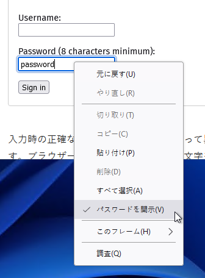{ width=250px }
  * この変更は可逆的で、`layout.forms.reveal-password-context-menu.enabled`を`false`にすることで従来の動作に戻せます。
* 強化型トラッキング防止機能の厳格モードにおいて、クロスサイトでのトラッキングに使われるURLパラメーターをさらに広範囲に渡って削除するようになった。（Firefox 112）
  * 初期状態の挙動は変化せず、ユーザーまたは管理者による明示的な設定変更を要します。
  * この変更は可逆的で、`browser.contentblocking.features.strict`から`qps`（`privacy.query_stripping.enabled`に対応）および`qpsPBM`（`privacy.query_stripping.enabled.pbmode`に対応）を取り除くことで従来の動作に戻せます。
* プライベートウィンドウと強化型トラッキング防止機能の厳格モードにおいて、Eメールのトラッキング防止に対応し、FirefoxユーザーのEメール使用状況を監視しにくくした。（Firefox 112）
  * 初期状態の挙動は変化せず、管理者による明示的な設定変更を要します。
  * この変更は可逆的で、ポリシー設定`EnableTrackingProtection`の新設のオプション`EmailTracking`を`false`にすることで従来の動作に戻せます。（Firefox 112）
* ESR版においてのみ、ポリシー設定`Preferences`で`xpinstall.signatures.required`を制御できるようになった。（Firefox 112）
  * 初期状態の挙動は変化せず、管理者による明示的な設定変更を要します。
  <!-- - この挙動は設定で無効化できません。 -->
* プライベートウィンドウにおいて、サードパーティCookieやトラッカーのストレージ領域へのデータ保存をブロックするようにし、ユーザー保護の度合いを高めた。（Firefox 113）
  * この変更は可逆的で、  
    `privacy.annotate_channels.strict_list.pbmode.enabled`  
    を`false`にすることで従来の動作に戻せます。
* 安全性向上のため、[Firefoxが自動生成するパスワード](https://support.mozilla.org/kb/how-generate-secure-password-firefox)に、初期状態で記号を含めるようになった。（Firefox 113）
  <!-- - この挙動は設定で無効化できません。 -->
* [ポリシー設定の`Containers`](https://github.com/mozilla/policy-templates/blob/master/README.md#containers)で、切り替え可能なコンテナーの初期状態のリストを定義できるようになった。（Firefox 113）
  * 初期状態の挙動は変化せず、管理者による明示的な設定変更を要します。
  <!-- - この挙動は設定で無効化できません。 -->
* ポリシー設定の`Preferences`において、  
  `security.OCSP.enabled`、<!--`xpinstall.signatures.required`（ESR版のみ）、-->  
  `security.ssl.enable_ocsp_stapling`  
  を設定可能になった。（Firefox 113）
  * 初期状態の挙動は変化せず、管理者による明示的な設定変更を要します。
  <!-- - この挙動は設定で無効化できません。 -->
* [Windowsのシングルサインオンの状態が常に反映されていたのを、既定のコンテナーに対してのみ反映し、それ以外のコンテナーには反映しないようになった。](https://bugzil.la/1800971)（Firefox 113）
  * この変更は可逆的で、`network.http.windows-sso.container-enabled.(コンテナーID)`を`true`にすることで従来の動作に戻せます。
* DNS over HTTPSの設定を、設定画面の「プライバシーとセキュリティ」でモード切り替えや例外の管理を行えるようになった。（Firefox 114）  
  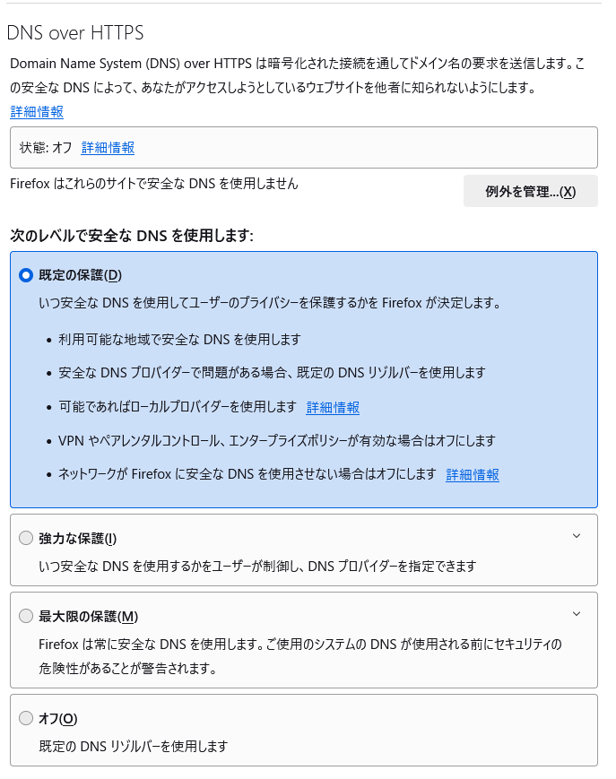{ width=350px }  
  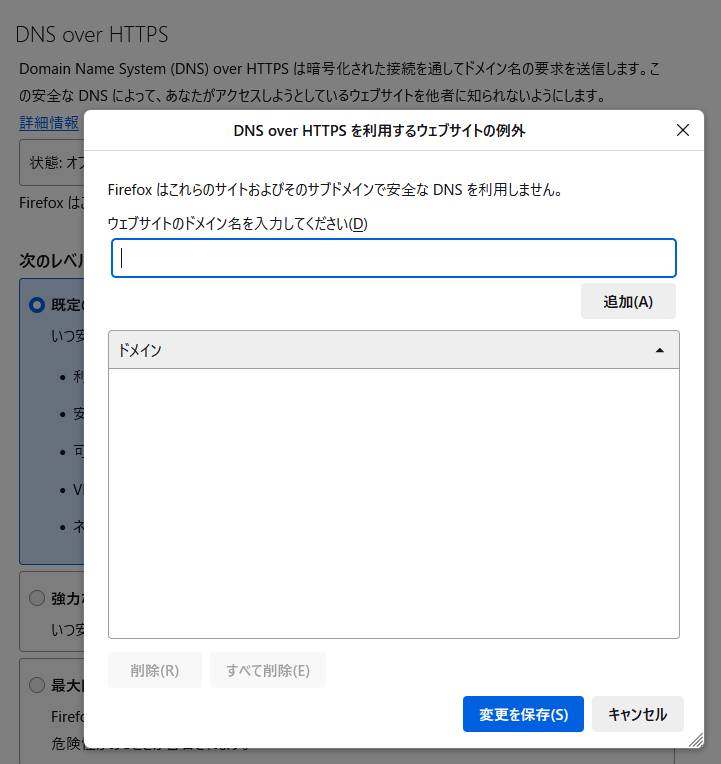{ width=300px }
  <!-- - この挙動は設定で無効化できません。 -->
* <!--macOS、Linux、および-->Windows 7において、USB経由でのFIDO2/WebAuthn（多要素認証）を行えるようになった。（Firefox 114）
* [ポリシー設定の`WebsiteFilter`](https://github.com/mozilla/policy-templates/blob/master/README.md#websitefilter)で、ブロックリストと例外をJSONで設定できるようになった。（Firefox 114）
  * GPOでの設定にはポリシーテンプレートの更新が必要です。
  <!-- - この挙動は設定で無効化できません。 -->
* [ポリシー設定の`Preferences`](https://github.com/mozilla/policy-templates/blob/master/README.md#preferences)で、クライアント認証でのRSA-PSSの使用可否を制御する`security.osclientcerts.assume_rsa_pss_support`を管理できるようになった。（Firefox 114）
  <!-- - この挙動は設定で無効化できません。 -->
* [ポリシー設定の`SecurityDevices`](https://github.com/mozilla/policy-templates/blob/master/README.md#securitydevices)で、セキュリティデバイスの削除に対応。（Firefox 114）
  <!-- - この挙動は設定で無効化できません。 -->

## インストール・更新

* Windows 10およびWindows 11において、インストーラの実行過程でタスクバーにFirefoxがピン留めされるようになった。（Firefox 103）
  * この変更は可逆的で、Firefoxインストーラの`/INI=`オプションで指定するINIファイル（Fx Meta Insallerでの`Firefox-setup.ini`）の`TaskbarShortcut`を`false`にすることで従来の動作に戻せます。
* [ポリシー設定の`AppUpdatePin`](https://github.com/mozilla/policy-templates/blob/master/README.md#appversionpin)を`115.`のように指定することにより、特定のメジャーバージョンのマイナーアップデートのみ自動更新を行い、それを超えるバージョンへのメジャーアップデートは行わない運用を容易に行えるようになった。（Firefox 104、Firefox ESR102）
  * 初期状態の挙動は変化せず、管理者による明示的な設定変更を要します。
  <!-- - この挙動は設定で無効化できません。 -->
* FirefoxをWindowsの既定のブラウザーとして登録する操作を行った際に、PDFビューワーとしても登録するようになった。（Firefox 106）
  * この変更は可逆的で、`browser.shell.setDefaultPDFHandler`を`false`にすることで従来の動作に戻せます。

## 内蔵PDFビューワー

* PDFフォームについて、入力必須の項目をハイライト表示するようにした。（Firefox 103）
  <!-- - この挙動は設定で無効化できません。 -->
* テキストの入力、線の描画、署名の追加など、PDFの編集に対応。（Firefox 106）
  * この変更は可逆的で、`pdfjs.annotationEditorMode`を`-1`にすることで従来の動作に戻せます。
* PDFプレビューからの印刷・保存時に、PDFフォーム内に入力された非ASCII文字を適切に扱うようになった。（Firefox 108）
  <!-- - この挙動は設定で無効化できません。 -->

## 動画・音声・音楽再生

* Picture-in-Pictureウィンドウにおいて字幕の文字サイズが変更可能となった。（Firefox 103）  
  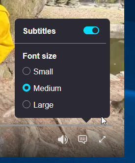{ width=200px }
  <!-- - この挙動は設定で無効化できません。 -->
* Picture-in-Pictureウィンドウでの字幕表示の対応サービスを拡大。
  * Funimation、Dailymotion、Tubi、Hotstar、SonyLIV（Firefox 103）、Disney+（Firefox 104）
  <!-- - この挙動は設定で無効化できません。 -->
  * 初期状態の挙動は変化せず、管理者による明示的な設定変更を要します。
* WebRTCの実装の更新によるビデオチャットの改善。（Firefox 106）
  * Windows<!--とWaylandを使用しているLinux環境-->での画面の共有の動作を改善。
  <!-- * macOSでのWebRTCでの画面キャプチャのパフォーマンス改善により、CPU使用率が低下し、フレームレートを向上。 -->
  * RTP（Real-Time Transport Protocol：データ転送に使われる通信プロトコル）のパフォーマンスと信頼性を向上。
  * より詳細な統計情報の提供。
  * Webサービスとの互換性を向上。
  <!-- - この挙動は設定で無効化できません。 -->
* Webでよく知られている各種のWebサービスで、Picture-in-Pictureウィンドウでの早戻しや動画の再生時間の確認、フルスクリーンモードとの切り替えを簡単に行えるようになった。（Firefox 113）  
  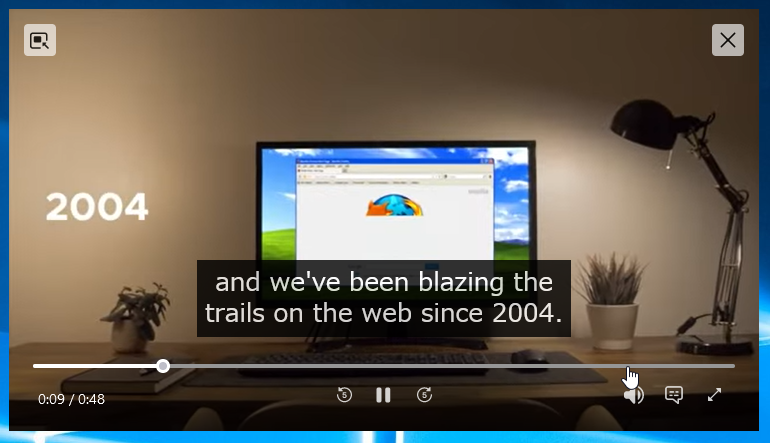{ width=400px }
  <!-- - この挙動は設定で無効化できません。 -->

## アドオン

* Manifest V3形式のアドオンが初期状態で使用可能となった。（Firefox 109）
  * この変更は可逆的で、`extensions.manifestV3.enabled`を`false`にすることで従来の動作に戻せます。

## レガシーな仕様への対応終了、機能の廃止

* [HTMLの`<menuitem>`要素の対応を廃止。](https://bugzil.la/1372276)（Firefox 103）
  <!-- - この挙動は設定で無効化できません。 -->
* [MathMLの`scrptminsize`および`scriptsizemultiplier`属性の対応を廃止。](https://bugzil.la/1772697)（Firefox 103）
  <!-- - この挙動は設定で無効化できません。 -->
* [`IDBFactory.open()`](https://developer.mozilla.org/en-US/docs/Web/API/IDBFactory/open)の[非標準のオプションであった`options`引数への対応を廃止](https://bugzil.la/1354500)（代わりに[`StorageManager.persist()`](https://developer.mozilla.org/en-US/docs/Web/API/StorageManager/persist)を使うことを推奨）。（Firefox 104）
  <!-- - この挙動は設定で無効化できません。 -->
* [MathMLの`<ms>`の非推奨の属性である`lquote`および`rquote`を初期状態で無効化。](https://bugzil.la/1793387)（Firefox 107）
  * この変更は可逆的で、`mathml.ms_lquote_rquote_attributes.disabled`を`false`にすることで従来の動作に戻せます。
* [非標準かつ非推奨の`SVGSVGElement.useCurrentView`プロパティを廃止。](https://bugzil.la/1174097)（Firefox 107）
  <!-- - この挙動は設定で無効化できません。 -->
* [SVG2の仕様から2015年に削除され、他のブラウザーももはやサポートしていない、`SVGGraphicsElement.getTransformToElement()`メソッドを廃止。](https://bugzil.la/1803790)（Firefox 109）
  <!-- - この挙動は設定で無効化できません。 -->
* [SVG2の仕様から2015年に削除された、`SVGGraphicsElement.nearestViewportElement`プロパティと`SVGGraphicsElement.farthestViewportElement`プロパティを、廃止を前提に初期状態で無効化。](https://bugzil.la/1133174)（Firefox 109）
  * この変更は可逆的で、`svg.nearestAndFarthestViewportElement.enabled`を`true`にすることで従来の動作に戻せます。
* 非推奨のU2F（Universal 2nd Factor） JavaScript APIが初期状態で無効化された。（U2Fプロトコル自体はWebAuthn APIで引き続き使用可能）（Firefox 112）
  * この変更は可逆的で、`security.webauth.u2f`を`true`にすることで従来の動作に戻せます。
* [WebRTCの非推奨の機能であった`mozRTCPeerConnection`、`mozRTCIceCandidate`、`mozRTCSessionDescription`を削除。](https://bugzil.la/1531812)（代わりにベンダープレフィックス無しの機能の使用を推奨）（Firefox 113）
  <!-- - この挙動は設定で無効化できません。 -->
* すでに設定で無効化されていた、[非推奨で非標準の  
  `CanvasRenderingContext2D.mozTextStyle`  
  を恒久的に削除。](https://bugzil.la/1294362)（Firefox 113）
  <!-- - この挙動は設定で無効化できません。 -->

## Webアプリの動作の互換性に影響する変更

* [`caches`、`CacheStorage`、`Cache`が安全なコンテキストでのみ使用可能になった。](https://bugzil.la/1112134)（Firefox 103）
  * この変更は可逆的で、`dom.caches.testing.enabled`を`true`にすることで従来の動作に戻せます。
* CSSの`scroll-snap-stop`プロパティでの[再スナップ](https://drafts.csswg.org/css-scroll-snap/#re-snap)に対応。（Firefox 104）
  <!-- - この挙動は設定で無効化できません。 -->
* YahooメールおよびOutlookのメール編集ページにおいて、Enterキーの入力後にハイライトの色がおかしくなる問題を修正。（Firefox 104）
  <!-- - この挙動は設定で無効化できません。 -->
* `<iframe>`のコンテンツ内で定義されたSVGなどにおいて、OSやブラウザーの設定よりも埋め込み要素自体のテーマ設定を尊重するようになった。（Firefox 105)
  * この変更は可逆的で、`svg.embedder-prefers-color-scheme.content.enabled`を`false`にすることで従来の動作に戻せます。
<!-- * [アドオンの定義でWebページからの読み込みを許可するよう明示されている場合を除き、あるアドオンのコンテンツを他のアドオンからは直接的には参照できなくなった。](https://bugzil.la/1711168)（Firefox 105）-->
  <!-- この挙動は設定で無効化できません。 -->
* [MathMLの`<semantics>`と`<maction>`について、初期状態で最初の子要素のみを表示するようになった。](https://bugzil.la/1588733)（Firefox 106）
  * この変更は可逆的で、  
    `mathml.legacy_maction_and_semantics_implementations.disabled`  
    を`false`にすることで従来の動作に戻せます。
* スクロールが完了した時点を示す`scrollend`イベントが初期状態で有効化された。（Firefox 109）
  * この変更は可逆的で、`apz.scrollend-event.content.enabled`を`false`にすることで従来の動作に戻せます。
* WebRTCのメソッドの  
  `RTCRtpSender.getParameters()`、  
  `RTCRtpSender.setParameters()`、  
  `RTCRtpReceiver.getParameters()`  
  が[仕様通りに動作するようになった](https://bugzil.la/1401592)。（Firefox 110）
  * この変更は可逆的で、`media.peerconnection.allow_old_setParameters`を`true`にすることで従来の動作に戻せます。
* [クロスオリジンのリダイレクト、`fetch()`や`XMLHttpRequest`等での通信でのリダイレクト時に、`Authorization`ヘッダーが削除されるようになった。](https://bugzil.la/1802086)（Firefox 111）
  * この変更は可逆的で、`network.http.redirect.stripAuthHeader`および`network.fetch.redirect.stripAuthHeader`を`false`にすることで従来の動作に戻せます。
* Webページ内のリッチテキストエディタ（`contenteditable`や`designMode`を使用した物）の振る舞いが他のブラウザーと同様に改められた。（Firefox 115）
  * この変更は可逆的で、  
    `editor.join_split_direction.compatible_with_the_other_browsers`  
    を`false`にすることで従来の動作に戻せます。

## その他、法人運用への影響度が低いと思われる変更

* Total Cookie Protectionが有効な状態で、サードパーティのコンテキストに分離されたService Workerを使用できるようになった。（Firefox 105）
  * 従来版では、Total Cookie Protectionが有効な状態では、サードパーティのコンテキストでのService Workerは一切使用できませんでした。  
    この変更により、トップレベルのドメインからは分離された状態で、インラインフレーム内のサードパーティ製コンテンツにService Workerを登録できるようになりました。
  * この変更は可逆的で、`privacy.partition.serviceWorkers`を`false`にすることで従来の動作に戻せます。
  <!-- 詳細： https://groups.google.com/a/mozilla.org/g/dev-platform/c/-ReVw4IGhaw -->
* WebMIDI APIに対応。（Firefox 108）
  * 初期状態の挙動は変化せず、ユーザーによる明示的な設定変更を要します。
  * Webサイトからの求めでAPIを初回する際に、[特定のWebサイト専用のアドオン](https://support.mozilla.org/en-US/kb/site-permission-add-ons)の[インストールを求められる場合があります](https://bugzil.la/1795025)。
  * このAPIは、`dom.webmidi.enabled`を`false`にすることで無効化できます。
* スペルチェック辞書の追加インストールにより、スペイン地域のスペイン語とアルゼンチン地域のスペイン語のスペルチェックを行えるようになった。（Firefox 109）
  <!-- - この挙動は設定で無効化できません。 -->
  * 初期状態の挙動は変化せず、ユーザーによる明示的な設定変更を要します。
* クロスサイトの追跡を防ぐためのストレージ分離の動作について、他のブラウザーとの互換性向上のため、サードパーティのコンテキストでストレージとCookieの保存領域を永続的に分離するようになった。（Firefox 109）
  * 従来はFirefox独自の動作として、WebサイトからのStorage Access API経由での要求に応じて任意に、分離されていないストレージとCookieにアクセスできる状態となっていましたが、分離する・しないの範囲が明確には定められておらず、他のブラウザーとは異なる動作となっていました。  
    この変更はユーザーのプライバシー保護の強度には影響せず、Webアプリケーションの互換性にのみ影響します。
  * この変更は可逆的で、  
    `privacy.partition.always_partition_third_party_non_cookie_storage`  
    を`false`に、  
    `privacy.partition.always_partition_third_party_non_cookie_storage.`  
    `exempt_sessionstorage`  
    を`true`にすることで従来の動作に戻せます。
  <!-- 詳細： https://groups.google.com/a/mozilla.org/g/dev-platform/c/qXbgQc7WoxM/m/wQ5MrQ5ABwAJ -->
* ブックマーク、履歴、及びパスワードのインポート機能について、Edge、Chrome、Safariに加えて、Opera、Opera GX、Vivaldiからのインポートにも対応。（Firefox 110）
  * 初期状態の挙動は変化せず、ユーザーによる明示的な操作を要します。
  <!-- - この挙動は設定で無効化できません。 -->
* [複数のセキュリティデバイスを追加していた際の、about:policiesでのエラーを解消。](https://bugzil.la/1807008)（Firefox 110）
  <!-- - この挙動は設定で無効化できません。 -->
* [Firefox自体のダウンロードと同じ書式で言語パックをダウンロードできるようになり、ポリシー経由での言語パックのインストールが容易になった。](https://bugzil.la/1799684)（Firefox 110）
  * 初期状態の挙動は変化せず、管理者による明示的な設定変更を要します。
  <!-- - この挙動は設定で無効化できません。 -->
* メールアドレスを秘匿するFirefox Relayについて、Firefoxの資格情報マネージャーから直接Eメールマスクを作成するかどうかをオプトインで選択できるようになった。（Firefox Accountへのサインインの必要あり）（Firefox 111）
  * この変更は可逆的で、`signon.firefoxRelay.feature`を`disabled`にすることで従来の動作に戻せます。
* シルエ・フリウリ語（fur）ロケール、サルディーニャ語（sc）のロケールが利用可能になった。（Firefox 111）
  * 初期状態の挙動は変化せず、当該言語原語版のインストールか、ユーザーまたは管理者による明示的な設定変更を要します。
  <!-- - この挙動は設定で無効化できません。 -->
* Windowsでのタッチスクリーンやタッチパッドの2本指操作によるスクロール時に、ページの終端到達後のアニメーション効果を適用するようになった。（Firefox 113）
  * この変更は可逆的で、`apz.overscroll.enabled`を`false`にすることで従来の動作に戻せます。
* SafariやChromiumベースのブラウザーからのブックマークのインポート時に、faviconも同時にインポートするようになった。（Firefox 113）
  <!-- - この挙動は設定で無効化できません。 -->
* タジク語（tg）ロケールが利用可能になった。（Firefox 113）
  * 初期状態の挙動は変化せず、当該言語版のインストールか、ユーザーまたは管理者による明示的な設定変更を要します。
  <!-- - この挙動は設定で無効化できません。 -->
* AVIF画像の対応の改善の一環として、アニメーションを含むAV1画像形式（AVIS）に対応。（Firefox 113）
  <!-- - この挙動は設定で無効化できません。 -->
* Pocketのおすすめコンテンツがフランス、イタリア、およびスペイン地域でも使用可能になった。（Firefox 114）
* Chromiumベースのブラウザーからの設定のインポート時に、保存されているクレジットカードなどの支払情報をインポート可能になった。（Firefox 115）
  <!-- - この挙動は設定で無効化できません。 -->
* Windows拡大鏡において、Firefoxのタイトルバーが表示されている時、テキスト用カーソルが正しく表示されるようになった。（Firefox 115）
  <!-- - この挙動は設定で無効化できません。 -->
  <!--
* アドオンの自動更新を無効化している環境でも、Firefox Colorwaysで選択していた色設定を、addons.mozilla.orgの対応するテーマに自動的に移行するようになった。
-->

<!--
以下、ブラウザーとしての使い勝手には影響しないため非表示

## その他のパフォーマンス向上

* 120Hzを超える高リフレッシュレートのモニターでの性能を向上。（Firefox 103）
* Webコンテンツのローカルストレージの処理のためにFirefoxの起動に非常に時間がかかる場合があったのを修正。（Firefox 103）
* 最小化されたり他のウィンドウの下になったりしている時に、バックグラウンドのタブの内容がそうなるのと同様に、FirefoxのUIの再描画の頻度を落とすようにした。（Firefox 104）
* `Array.prototype.includes()`と`Array.prototype.indexOf()`のSIMD最適化版により、長大なリストからの検索処理が2倍高速化した。（Firefox 105）
* Windows 11 22H2において、フォーカスされたドキュメントのURLをMicrosoft IMEとMicrosoft Defenderが走査する際のパフォーマンスを改善。（Firefox 107）
* Windows 11において、バックグラウンドのタブのプロセスを[efficiencyモード](https://devblogs.microsoft.com/performance-diagnostics/reduce-process-interference-with-task-manager-efficiency-mode/)に切り替えて、リソース消費をより抑制するようになった。（Firefox 108）
* 高負荷時のフレーム描画のスケジューリング処理を改善した（実質的に、MotionMarkのベンチマークスコアの改善につながる）。（Firefox 108）
* Windows、macOS、Linuxの各プラットフォームでWebGLの性能を向上。（Firefox 110）
* Windows 10/11において、Intel以外のGPUによるハードウェアでの動画のデコードでのオーバーレイを有効化し、動画再生のパフォーマンスと動画の拡大縮小時の画質を改善。（Firefox 110）
* Windowsにおいて、インテルGPUによるソフトウェアでの動画のデコードでのオーバーレイを有効化し、動画再生のパフォーマンスと動画の拡大縮小時の画質を改善。（Firefox 112）
* [アクセシビリティエンジンの再設計](https://blog.mozilla.org/accessibility/firefox-113-accessibility-performance/)により、スクリーンリーダーやその他のアクセシビリティ系ソフトウェア、日本語などの東アジア言語圏のインプットメソッド、法人向けのシングルサインオンソリューション、その他のアクセシビリティ情報を使用するアプリケーション全般との併用時の、Firefoxの動作速度、応答性、安定性が向上した。（Firefox 113）

## その他の安定性の向上

* Windowsにおいて、空きメモリが逼迫している状況での安定性が改善。（Firefox 105）
* ICCv4プロファイルが埋め込まれた画像の色を適切に表示できるようになった。（Firefox 108）

## 開発者向け機能

* Firefox Profilerで電力消費の状況を分析できるようになった。
  * Windows 11およびM1 Macに対応（Firefox 104）
  * LinuxとインテルCPUのmacOS環境に対応（Firefox 107）
* [User Timing Level 3の仕様](https://www.w3.org/TR/user-timing/)に対応し、経過時間などを計測する`performance.mark`と`performance.measure`の追加の引数を受け付けるようになった。（Firefox 105）
* オフスクリーンでのCanvas描画にすべてのコンテキストで対応し、Webページに紐付くコンテキストでもWeb Workerのコンテキストでも画面描画を行えるようになった。（Firefox 105）
* [JavaScriptのインポートマップ](https://developer.mozilla.org/ja/docs/Web/HTML/Element/script/type/importmap)を初期状態で有効化した。（Firefox 108）
* JavaScriptデバッガにおいて、特定のイベントが発生したときに自動でブレークさせられる機能で、`scrollend`イベントを捕捉できるようになった。（Firefox 109）
* 「ネットワーク」パネルでHTTPリクエストをcURLのコマンド列としてコピーする機能について、`--compressed`オプションを使うようになった。（Firefox 114）
* 「アクセシビリティ」パネルのインスペクタが`banner`、`main`、`navigation`、`contentinfo`などのすべてのARIAロールに対応。（Firefox 114）
* CSS Level4の`@import`ルールにおける`()`記法に対応し、ブラウザーの実装状況に応じたスタイルの自動選択が可能となった。（Firefox 114）
  * 「インスペクター」パネルにおいては、インポートされたルールの上部にインポート条件が表示されます。
* [DedicatedWorkerとSharedWorker](https://html.spec.whatwg.org/multipage/workers.html#workeroptions)でのES Modulesの使用に対応。（Firefox 114）
* [WebTransport](https://w3c.github.io/webtransport)を初期状態で有効化した。（Firefox 114）
  * ゲームやライブ配信など、従来は代替手段としてWebSocketsを使わなくてはならなかったユースケースの実装が容易になります。
  * この技術はHTTP3に基づいており、Web互換性の565件のテストのうち505件にパスしています。
* CSSの`calc()`で`inifinity`および`NaN`に対応。（Firefox 114）
* 開発ツールのデバッガーで、サードパーティ製ライブラリのコードを無視できるようになった。（Firefox 115）
* WebRTCにおいて[target](https://w3c.github.io/webrtc-extensions/#rtcrtpreceiver-jitterbuffertarget-attributes)のミリ秒単位での指定が可能になった。（Firefox 115）
* [ArrayとTypedArrayにおいて、破壊的な変更を行わずにソートや部分取り出しを行うAPI](https://github.com/tc39/proposal-change-array-by-copy)が利用可能になった。（Firefox 115）
* [CSSのanimation-compositionプロパティ](https://developer.mozilla.org/docs/Web/CSS/animation-composition)に対応した。（Firefox 115）
* `URL.canParse()`で、URLが妥当な物かどうかを簡単に判別できるようになった。（Firefox 115）

## macOS固有の改善・変更

* 現代的なロックAPIを使用するよう切り替えた事による、CPU使用率が高い状況での応答性を向上。（Firefox 103）
* タッチパッドによるスクロールで意図せず斜めにスクロールしてしまいにくくなった。（Firefox 105）
* [macOS 10.15以降の環境で、OSのテキスト認識機能を使って、選択された画像からテキストを抽出できるようになった。](https://support.mozilla.org/en-US/kb/text-recognition)（Firefox 106）
* 他のブラウザーと同様に、Ctrl-ホイールクリックおよび⌘-ホイールクリック（トラックパッドを含む）で、ズーム操作の代わりにページをスクロールするようになった（誤操作によるズームを行わなくなった）。（Firefox 109）
* Canvas2Dの描画をGPUで高速化する機能を初期状態で有効化。（Firefox 110）
* Firefoxのコンテキストメニューから「サービス」サブメニューに直接アクセスできるようになった。（Firefox 113）
* 1280×720以上の解像度の動画をキャプチャできるようになった。（Firefox 114）

## Linux固有の改善・変更

* NVIDIAのドライバーを使用している場合のWebGLのパフォーマンスの問題を修正。（Firefox 103）
* メモリ不足の状況に陥りにくくなった他、仮にメモリ不足の状況でもシステムの他の部分に影響を与えにくくなった。（Firefox 105）
* スワイプによる「戻る」「進む」操作がWaylandを使用しているLinux環境でも使用可能になった。（Firefox 106）
* Canvas2Dの描画をGPUで高速化する機能を初期状態で有効化。（Firefox 110）
* UbuntuでのSnapパッケージ版でないFirefoxにおいて、SnapパッケージのChromiumからユーザープロファイル情報をインポートできるようになった。（Firefox 112）
* IntelのGPUを使用している環境でハードウェアでの動画エンコーディングに対応。（Firefox 115）
* 「新しいタブ」ボタン上での中クリックで、xclipboardの内容を新しいタブで開く用になった。（Firefox 115）
  * クリップボードの内容がURLであればそれが開かれ、それ以外は既定の検索プロバイダーでの検索結果が開かれます。
  * この変更は可逆的で、`browser.tabs.searchclipboardfor.middleclick`を`false`にすることで従来の動作に戻せます。

-->

## 現時点で判明している設定シートの変更点

### 追加

* Admin-8（項目追加）
* Appearance-15（項目追加）
* Appearance-16（項目追加）
* Install-19（項目追加）
* Location-6（項目追加）
* Network-29（項目追加）
* Network-30（項目追加）
* Network-31（項目追加）
* Network-32（項目追加）
* Network-33（項目追加）
* Privacy-5-6（選択肢追加）
* Privacy-33-6（選択肢追加）
* Privacy-66（項目追加）
* Privacy-67（項目追加）
* Privacy-68（項目追加）
* Script-19（項目追加）
* Script-20（項目追加）
* Script-21（項目追加）
* Script-22（項目追加）
* Script-23（項目追加）
* Script-24（項目追加）
* Script-25（項目追加）
* Script-26（項目追加）
* Script-27（項目追加）
* Script-28（項目追加）
* Script-29（項目追加）
* Security-57（項目追加）
* Security-58（項目追加）
* Security-59（項目追加）
* Security-60（項目追加）
* Startup-17（項目追加）
* Ui-12（項目追加）
* Ui-13（項目追加）
* Ui-14（項目追加）
* Ui-15（項目追加）
* Update-9（項目追加）

### 変更・廃止

* Privacy-13（項目廃止）
* Privacy-39（項目廃止）
* Security-30（項目廃止）
* Security-43（項目廃止）
* Tab-18（項目廃止）
