# Firefox ESR128のリリーススケジュール

Mozillaのリリースカレンダーでは、Firefox ESR128のリリース予定は以下の通り記載されています。

[^release-calendar]: https://whattrainisitnow.com/calendar/

|リリース日     |通常版リリースバージョン|ESR版リリースバージョン|備考                |
|---------------|------------------------|-----------------------|--------------------|
| 2024年6月11日 | Firefox 127            | 115.12                |ESR128ベータ版      |
| 2024年7月9日  | Firefox 128            | 115.13/128.0          |ESR128正式版        |
| 2024年8月6日  | Firefox 129            | 115.14/128.1          |                    |
| 2024年9月3日  | Firefox 130            | 115.15/128.2          |                    |
| 2024年10月1日 | Firefox 131            | 128.3                 |ESR115のサポート終了|

Firefox ESR115のサポートは、2024年10月1日で終了します（以後はセキュリティ更新が提供されません）。

* 日付は太平洋標準時 (UTC-0800) 基準のため、日本時間では表記の日付の約1日後がリリース日となります。
* なお、リリーススケジュールは予告なく変更される可能性があります。

# 法人利用への影響が予想される代表的な変更点

* Windows 7、Windows 8、Windows 8.1への対応が終了しました。
* HTTPSでアクセスしているページ内に埋め込まれた画像、動画および音声について、記載されたURLがHTTPであっても常にHTTPSでデータを取得するようになりました。古い作りのページでは画像、動画および音声が表示・再生できなくなる可能性があります。
* WindowsとmacOSにおいて、パスワードマネージャーに保存されたパスワードの読み出し時にデバイス認証（OSのパスワード、指紋認証、顔認証など）を求められるようになりました。
* アドオンの署名アルゴリズムが更新され、古い署名のXPIパッケージのインストールが禁止されるようになりました。
* MIME Typeが`text/*`である形式のファイルについて、一部の既知のデータ型を除き、原則として内容をタブ内でインライン表示するようになりました。

\newpage

# カテゴリごとの変更点

以下に挙げる変更点は、特段の断りがない限り、初期状態で挙動が従来版から変化しており、従来の挙動に戻すことはできません。
初期状態での挙動が従来版からは変化せず、任意の設定変更により新しい挙動を有効化できる物や、初期状態での挙動は変化するものの設定変更で従来の挙動に戻せる物については、個別にその旨を記載しています。

また、新しいWeb標準仕様への対応や他のブラウザーとの互換性の向上などについては、恩恵を受けるためには原則として、Webページ側での明示的な対応が必要です。
あしからずご了承ください。

## 外観、メニュー構成の変更

* キーボードショートカット Ctrl-Shift-T（macOSではCommand-Shift-T）での「閉じたタブを開き直す」操作で、復元するべきタブがない場合は最後に閉じたウィンドウを、それもない場合は前回のセッションを復元するようになった。（Firefox 116）
  * 実装上[^impossible-to-deactivate-restore-last-session]、この挙動のみを無効化することはできません。（タブの復元・ウィンドウの復元自体を無効化する事は可能）
* Windowsにおいて、システム設定のマウスのプロパティー[^mouse-property]が有効化されている場合に、文字入力中はマウスカーソルを非表示にするようになった。（Firefox 119）
  * 実装上[^impossible-to-deactivate-hiding-cursor]、この挙動のみを無効化することはできません。（Windowsのマウスのプロパティー設定に依存）
* 印刷機能を `PrintingEnabled` ポリシーで無効化できるようになった。（Firefox 120）
* Webページ内のリンクに常に下線を表示する設定（「設定」→「一般」→「ブラウジング」→「常にリンクに下線を付ける」）を追加。（Firefox 121）  
  
  * この挙動は、`Preferences` ポリシーを用いて `layout.css.always_underline_links` で制御可能です。
* Webメールのサービスを `mailto:` リンクの既定のハンドラーとして設定した場合に、同時にFirefox自身をシステム既定のメールクライアントに設定するようになった。（Firefox 121）  
  
<!-- Firefox 125時点で設定が廃止された。
  * この挙動は、`Preferences` ポリシーを用いて `browser.mailto.prompt.os` を `false` に設定することで無効化できます（従来の動作に戻せます）。
-->
* 設定画面のいくつかのボタンを `Preferences` ポリシーで無効化できるようになった。（Firefox 120）
  * 「一般」→「一般」→「起動」→「Firefoxを既定のブラウザーに設定する」
    * `pref.general.disable_button.default_browser`
  * 「一般」→「ファイルとプログラム」→「プログラム」→ファイルの種類と取り扱い方法の一覧（項目の編集）
    * `pref.downloads.disable_button.edit_actions`
  * 「一般」→「Firefoxの更新」→「更新履歴を表示」
    * `app.update.disable_button.showUpdateHistory`
  * 「一般」→「ネットワーク設定」→「接続設定」→「自動プロキシー設定スクリプト」→「再読み込み」
    * `pref.advanced.proxies.disable_button.reload`
  * 「ホーム」→「新しいウィンドウとタブ」→「カスタムURL」選択時の「現在のタブグループを使う」
    * `pref.browser.homepage.disable_button.current_page`
  * 「ホーム」→「新しいウィンドウとタブ」→「カスタムURL」選択時の「ブックマークを使う」
    * `pref.browser.homepage.disable_button.bookmark_page`
  * 「ホーム」→「既定値に戻す」
    * `pref.browser.homepage.disable_button.restore_default`
  * 「プライバシーとセキュリティ」→「ブラウザープライバシー」→「強化型トラッキング防止機能」→「例外を管理」
    * `pref.privacy.disable_button.tracking_protection_exceptions`
  * 「プライバシーとセキュリティ」→「ブラウザープライバシー」→「Cookieとサイトデータ」→「例外を管理」
    * `pref.privacy.disable_button.cookie_exceptions`
  * 「プライバシーとセキュリティ」→「ブラウザープライバシー」→「パスワード」→「例外サイト」
    * `pref.privacy.disable_button.view_passwords_exceptions`
  * 「プライバシーとセキュリティ」→「ブラウザープライバシー」→「パスワード」→「保存されたパスワード」
    * `pref.privacy.disable_button.view_passwords`
  * 「プライバシーとセキュリティ」→「セキュリティ」→「証明書」→「証明書を表示」
    * `security.disable_button.openCertManager` （Firefox 121）
  * 「プライバシーとセキュリティ」→「セキュリティ」→「証明書」→「セキュリティデバイス」
    * `security.disable_button.openDeviceManager` （Firefox 121）
* デスクトップ通知について、以下の挙動を `Preferences` ポリシーで制御可能になった。（Firefox 122）
  * Webサイトのアイコン（favicon）を表示するかどうか `alerts.showFavicons`（初期値：`false`）
  * システムの通知機能で表示するかどうか `alerts.useSystemBackend`（初期値：`true`）
  * システムの通知機能で、一度閉じた通知を通知一覧から再表示できるようにするかどうか `alerts.useSystemBackend.windows.notificationserver.enabled`（初期値：`true`）
* アプリケーションメニューの「動作しないサイトを報告」からWeb互換性の報告を行えるようになった。（Firefox 123）  
  { width=300px }
  * この機能は、`DisableFeedbackCommands` ポリシーを用いて無効化できます。
* いずれの項目も選択されていないラジオボタンのグループにおいて、Tabキーでのフォーカス移動時には最初の項目にのみフォーカスが当たるようになった（項目を選択する場合は上下カーソルキーを使用）。（Firefox 125）
* テレメトリー（使用状況の統計情報の収集）において、検索の使用状況を個人と紐付けない形で「スポーツ」「ビジネス」「旅行」などの20のカテゴリー単位で記録・送信するようになった。（Firefox 126）[^search-category]
  * この挙動は、`DisableTelemetry` ポリシーを `true` に設定することで、他の統計情報の収集・送信と併せて無効化できます。
* 設定画面の「一般」→「起動」→「コンピューターの起動時にFirefoxを自動的に開く」で、Firefoxを現在のユーザーのスタートアップに登録できるようになった。（Firefox 127）[^register-startup]
  * 登録先は  
    `HKEY_CURRENT_USER\Software\Microsoft\Windows\CurrentVersion\Run`  
    です。
  * この機能は、Windows上で、  
    `HKEY_CURRENT_USER\Software\Microsoft\Windows\CurrentVersion`  
    `\Explorer\StartupApproved\Run`  
    でアプリケーションの自動起動が許可されている場合にのみ使用できます。
* タブのコンテキストメニュー、およびタブバー端の全タブの一覧を表示するドロップダウンメニューに「重複タブを閉じる」コマンドが追加された。（Firefox 127）  
  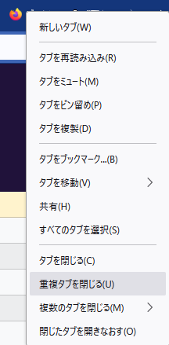{ width=180px }  
  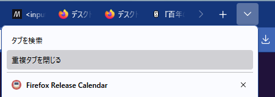{ width=400px }
* スクリーンショット取得機能でSVG画像、XML文書、about:ページなどのスクリーンショットを取得できるようになった。（Firefox 127）
* 履歴やキャッシュなどのユーザーデータの削除時のダイアログについて、削除対象のデータのカテゴリーが「履歴」「Cookieとサイトデータ」「一時的なキャッシュファイル」「サイト設定」の4つに整理され、削除対象のデータの具体的なサイズが表示されるようになった。（Firefox 128）  
  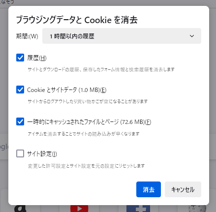{ width=400px }
  * これに伴い、`SanitizeOnShutdown` ポリシー[^sanitize-on-shutdown]で制御可能な項目が `Cache`、`Cookies`、`History`、`Sessions`、`SietSettings`、`OfflineApps`、`Locked`に再編されました（`Downloads` と `FormData` は引き続き使用可能ですが、使用は非推奨になりました）。
* ページ内のテキストを選択してからの右クリックメニューで、選択範囲のテキストのローカル翻訳が可能になった。（Firefox 128）  
  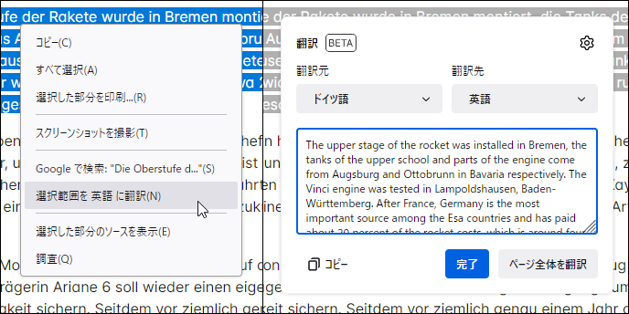
  * この機能は現在の所、翻訳元にも翻訳先にも日本語は選択できません。
  * この挙動は、`Preferences` ポリシーを用いて  
    `browser.translations.select.enable` を `false` に設定することで無効化できます（従来の動作に戻せます）。

[^impossible-to-deactivate-restore-last-session]: https://searchfox.org/mozilla-central/rev/b41bb321fe4bd7d03926083698ac498ebec0accf/browser/base/content/browser.js#7627
[^mouse-property]: https://support.microsoft.com/windows/change-mouse-settings-e81356a4-0e74-fe38-7d01-9d79fbf8712b
[^impossible-to-deactivate-hiding-cursor]: https://searchfox.org/mozilla-central/rev/b41bb321fe4bd7d03926083698ac498ebec0accf/widget/windows/nsLookAndFeel.cpp#578
[^search-category]: https://blog.mozilla.org/en/products/firefox/firefox-search-update/
[^register-startup]: https://support.mozilla.org/kb/open-firefox-automatically-when-you-start-computer
[^sanitize-on-shutdown]: https://mozilla.github.io/policy-templates/#sanitizeonshutdown-selective

## アドレスバー

* アドレスバーでのFirefox Suggestの候補表示において、検索エンジンが提供する候補の画像や説明文を一覧上で表示するようになった。（Firefox 122）  
  { width=400px }
  * この挙動は、`Preferences` ポリシーを用いて  
    `browser.urlbar.richSuggestions.featureGate` を `false` に設定することで無効化できます（従来の動作に戻せます）。
  * Firefox Suggestは、2024年6月現在は米国地域でのみ機能が有効化されます。他の地域では機能を使用できません。
* アドレスバーでのFirefox Suggestの候補表示において、MDN[^mdn]の記事を表示するようになった[^bug1867375]。（Firefox 122）  
  
  * この挙動は、`Preferences` ポリシーを用いて `browser.urlbar.suggest.mdn` を `false` に設定することで無効化できます（従来の動作に戻せます）。
  * Firefox Suggestは、2024年6月現在は米国地域でのみ機能が有効化されます。他の地域では機能を使用できません。
* クリップボード内にURL文字列がある場合に、アドレスバーのオートコンプリートの候補としてクリップボード内のURLを開く項目を表示<!--する-->できるようになった。（Firefox 125）
  * この機能はパフォーマンス低下の懸念があることから、初期状態では無効です。（Firefox 126）
  * この挙動は、「設定」→「検索」→「アドレスバー」→「クリップボード」で制御可能です。
  * この挙動は、`Preferences` ポリシーを用いて `browser.urlbar.suggest.clipboard` を `false` に設定することで<!--無効化できます（従来の動作に戻せます）-->有効化できます。
* アドレスバーで他のコンテナーで開かれているタブを検索できるようになった。（Firefox 125）
  * この機能は、タブのコンテナーが使用可能な場合（コンテナーを使用するアドオンがインストールされているか、`privacy.userContext.enabled` および `privacy.userContext.ui.enabled` が両方とも `true` に設定されている場合）にのみ有効です。
  * この挙動は、`Preferences` ポリシーを用いて `browser.urlbar.switchTabs.searchAllContainers` を `false` に設定することで無効化できます（従来の動作に戻せます）。
<!-- 設定への導線が増えただけなので説明対象外とする
* アドレスバーの設定を「検索」セクション（「設定」→「検索」→「アドレスバー」）で行えるようになった。（Firefox 123）
-->

[^mdn]: https://developer.mozilla.org/
[^bug1867375]: https://bugzilla.mozilla.org/show_bug.cgi?id=1867375

## セキュリティ・プライバシー保護

<!-- 本来そうあるべきだった動作に修正されたと見なし、説明対象外とする
* ポリシー設定などでプライベートブラウジングモードが無効化されている場合には、コマンドライン引数でもプライベートブラウジングモードを起動できないようになった。（Firefox 116）
-->
<!-- 動作・互換性に影響がないため、説明対象外とする。
* Web Audioの実装としてすべての環境でFDLIBM（数学計算用のライブラリー）を使うようにし、フィンガープリンティング耐性が高まった。（Firefox 118）
-->
* フィンガープリンティング防止のため、プライベートブラウジングモード（Firefox 118）および強化型トラッキング防止機能の厳格モード（Firefox 119）においては、Webサイトのフォントとしてシステムフォントと言語パックフォントのみが使われるようになった。  
  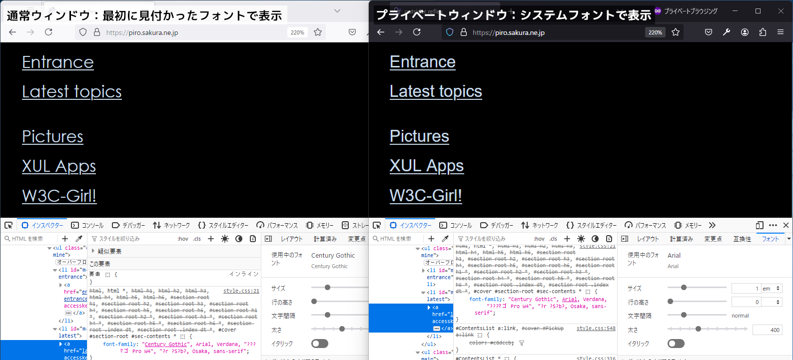
* `Preferences` ポリシーで以下の設定項目を制御可能になった。（Firefox 118）
  * TLSでの再接続時の安全な再ネゴシエーションの強制  
    `security.ssl.require_safe_negotiation`
  * 「設定」→「プライバシーとセキュリティ」→「許可設定」→「アドオンのインストールを求められたときに警告する」  
    `xpinstall.whitelist.required`
* 自動セッション復元機能が無効な場合でも、最近閉じたタブの一覧がセッションをまたいで保持され、手動でのセッション復元操作に続けてタブやウィンドウが復元されるようになった。（Firefox 119）
  * この挙動は、「設定」→「プライバシーとセキュリティ」→「ブラウザープライバシー」→「履歴」→「Firefoxに：記憶させる履歴を詳細設定する」→「Firefoxの終了時に履歴を消去する」→「表示したページとダウンロードの履歴」にチェックを入れることで無効化できます。
  * この挙動は、`SanitizeOnShutdown` ポリシーの `History` を `true` に設定することで無効化できます。
<!-- 動作・互換性に影響がないため、説明対象外とする。
* Total Cookie Protectionの一環として、個々人の識別に使われうるBlob URLがパーティショニングされるようになった。（Firefox 119）
* Storage Access APIの改善により、セキュリティとWebサイト互換性が向上した。（Firefox 119）
  * この変更はFirefoxにおけるサードパーティーCookieの段階的廃止の一環で行われたものです。
-->
* リンクの右クリックメニューからリンク先URLをコピーする操作について、トラッキング情報をURLから除去する「サイト追跡を除いたリンクをコピー」コマンドが追加された。（Firefox 120）  
  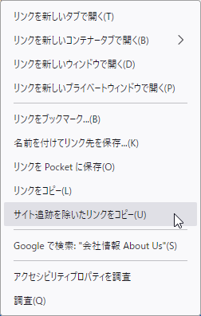{ width=200px }
  * 深い階層のURLからのパラメーター除去や、著名ショッピングサイトからのものを含む300以上のパラメーターの除去に対応（Firefox 126）
  * この機能は、MCDで `privacy.query_stripping.strip_on_share.enabled` を `false` に設定することで無効化できます。（ポリシー設定では制御できません。）
* グローバルポリシーコントロール[^global-policy-control]に対応し、ユーザー識別の拒否を明示的に通知する「Do Not Track」ヘッダーと同様に、ユーザー情報の第三者への売買の拒否を明示的に通知する「Do Not Sell」ヘッダーを設定できるようになった。（Firefox 120）
  * この機能は、アメリカ合衆国のいくつかの週など、特定の国・地域の法律上の要請に従うための物です。
  * この挙動は、「設定」→「プライバシーとセキュリティ」→「ウェブサイトのプライバシー設定」で制御可能です。
  * この機能は、MCDで `privacy.globalprivacycontrol.enabled` を変更することで制御可能です。（ポリシー設定では制御できません。）
<!-- 動作・互換性に影響がないため、説明対象外とする。
* プライベートブラウジングモードおよび強化型トラッキング防止機能の厳格モードにおいて、Canvas APIを通じたフィンガープリンティングをより効果的に防止するようになった。（Firefox 120）
-->
* Windowsの証明書ストアにインストールされたTLS用ルート証明書を、常に自動インポートするようになった。（Firefox 120）
  * この挙動は、「設定」→「プライバシーとセキュリティ」→「セキュリティ」→「証明書」「ユーザーがインストールしたサードパーティのルート証明書を自動的に信頼することをFirefoxに許可する」のチェックを外すことで無効化できます。
  * この挙動は、ポリシー設定で `Certificates.ImportEnterpriseRoots` を `false` に設定することで従来の動作に戻せます。
  * この機能でインポート対象となる証明書は、Windowsでは以下のレジストリキー配下に登録された物に限られます。
    * `HKEY_LOCAL_MACHINE\SOFTWARE` 配下
      * `\Microsoft\SystemCertificates`
      * `\Policy\Microsoft\SystemCertificates`
      * `\Microsoft\EnterpriseCertificates`
    * `HKEY_CURRENT_USER\SOFTWARE` 配下
      * `\Microsoft\SystemCertificates`
      * `\Policy\Microsoft\SystemCertificates`
<!-- 互換性に影響がないため、説明対象外とする。
* `about:logins`（ログインマネージャー）において、Alt-Enterで項目を編集、Alt-BackSpaceで項目を削除できるようになった。（Firefox 120）
-->
* オートコンプリートの`webauthn`トークン[^uuebauthn]に対応し、オートフィルダイアログでパスキーの候補を表示[^autofill-passkey]できるようになった。（Firefox 122）  
  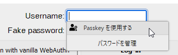{ width=250px }
<!-- 互換性に影響がないため、説明対象外とする。
* プライベートブラウジングモードにおいて `cacheAPI` を使用できるようになった。（Firefox 122）
-->
* ユーザーのプライバシーを保護するため、現在の文字色を入力として使用したフィルターを汚染済み[^tainted]として扱うようになり、HTML Canvasからの読み取りを制限するようになった。（Firefox 122）
  * Webページ内の文字色に基づいてHTML Canvasに描画を行い、その結果を画像として保存するような処理を含むWebアプリケーションについて、動作に支障が生じる恐れがあります。
* XSS攻撃を防ぐため、SVGの`<use>`で`data:` URLに対応しなくなった。（Firefox 122） 
  * XSS（クロスサイトスクリプティング）とは、攻撃者が送り込んだ悪意のコードを、そのページを閲覧した不特定多数のユーザーに、スクリプト（簡易的なプログラム）として実行させることを指し、このような攻撃をXSS攻撃と言います。本変更点は、攻撃者が作成したSVG画像を読み込んだ場合に、そこに含まれるスクリプトが意図しない権限で実行されてしまわないようになり、安全性が高まったことを説明する物です。
  * この挙動は、MCDを用いて `svg.use-element.data-url-href.allowed` を `true` にすることで従来の動作に戻せます。
* `AllowFileSelectionDialogs`[^allouu-file-selection-dialogs] ポリシーで、ファイル選択ダイアログの使用を禁止できるようになった。（Firefox 124）
* コンテナー機能の有効・無効を制御する以下の設定 `Preferences` ポリシーで制御可能になった。（Firefox 126）
  * コンテナー機能を使用するかどうか `privacy.userContext.enabled`（初期値：`false`）
  * コンテナー機能のUIを表示するかどうか `privacy.userContext.ui.enabled`（初期値：`false`）
* HTTPSでアクセスしているページ内に埋め込まれた画像、動画および音声については、記載されたURLがHTTPであっても、常にHTTPSでデータを取得するようになった[^aluuays-upgrade-to-https]。（Firefox 127）
  * いわゆるmixed contentのページでは画像、動画および音声が表示・再生できなくなる可能性があります。
  * この挙動は、`Preferences` ポリシーを用いて  
    `security.mixed_content.upgrade_display_content` を `false` に設定することで無効化できます（従来の動作に戻せます）。
* WindowsとmacOSにおいて、パスワードマネージャー[^passuuard-manager]に保存されたパスワードの読み出し時にデバイス認証（OSのパスワード、指紋認証、顔認証など）を求める事ができるようになった。（Firefox 127）
* `navigator.clipboard.read()` および `navigator.clipboard.write()` が有効化された。（Firefox 127）[^clipboard-api]
  * そのWebサイト以外のコンテンツを貼り付けようとした場合に、ユーザーに確認を求めるメッセージが表示されることがあります。
* `PostQuantumKeyAgreementEnabled` ポリシーで、TLSのポスト量子鍵共有機能（量子コンピューターの登場後も安全に鍵交換を行うための仕組み）を制御できるようになった。（Firefox 127）
* `HttpsOnlyMode` ポリシーで、HTTPSでの通信の強制を制御できるようになった。（Firefox 127）
* `HttpAllowlist` ポリシーで、HTTPSでの通信が強制されない例外サイトを指定できるようになった。（Firefox 127）
* アドオンの署名アルゴリズムが更新され、古い署名のXPIパッケージのインストールが禁止されるようになった。（Firefox 127）
  また、証明書の期限切れに備えて、ルート証明書が更新された。（Firefox 128）
  * `ExtensionSettings` ポリシーの `temporarily_allow_weak_signatures` オプションを使うことで、古い署名のパッケージのインストールを特別に許可することはできます。
* ユーザートラッキングと広告の提供に関わる実験的な仕様であるPrivacy Preserving Attribution API[^privacy-preserving-attribution-api]に対応した。（Firefox 128）
  * この機能は現在、特定のWebサイトのみを対象に限定的に機能が有効化されています（Origin Trial）。
  * この機能は設定の「プライバシーとセキュリティ」→「ウェブサイトの広告設定」→「プライバシー保護された広告解析をウェブサイトに許可する」で制御できます。
  * この機能は、`Preferences` ポリシーを用いて  
    `dom.private-attribution.submission.enabled` を `false` に設定することで無効化できます（従来の動作に戻せます）。

[^global-policy-control]: https://support.mozilla.org/ja/kb/global-privacy-control
[^uuebauthn]: https://github.com/w3c/webauthn/wiki/Explainer%3A-WebAuthn-Conditional-UI
[^autofill-passkey]: https://web.dev/articles/passkey-form-autofill
[^tainted]: https://www.w3.org/TR/filter-effects-1/#tainted-filter-primitives
[^allouu-file-selection-dialogs]: https://mozilla.github.io/policy-templates/#allowfileselectiondialogs
[^aluuays-upgrade-to-https]: https://blog.mozilla.org/security/2024/06/05/firefox-will-upgrade-more-mixed-content-in-version-127/
[^passuuard-manager]: https://support.mozilla.org/kb/password-manager-remember-delete-edit-logins
[^privacy-preserving-attribution-api]: https://support.mozilla.org/kb/privacy-preserving-attribution
[^clipboard-api]: https://developer.mozilla.org/docs/Web/API/Clipboard_API

## ネットワーク接続

 [`DNSOverHTTPS`[^dns-over-https] ポリシーで `Fallback` を用いて、フォールバック先となる既定のDNSプロバイダーを指定できるようになった。（Firefox 124）
* 「設定」→「一般」→「ネットワーク設定」→「接続設定」において、「システムのプロキシー設定を利用する」選択時に「システムのウェブプロキシー自動検出設定を利用する」でWPAD（Web Proxy Auto-Discovery）の使用可否を制御できるようになった。（Firefox 125）
  * この機能は `Preferences` ポリシーで `network.proxy.system_wpad` を設定することでも制御できます。
* `Proxy` ポリシーを内容未定義で記述した場合であっても、プロキシー関係の設定UIが無効化されるようになった。（Firefox 126）
* リンクの `rel="dns-prefetch"` 属性によるDNS先読みが、HTTPSでアクセスしているドキュメントにおいても全面的に有効化されました。（Firefox 127）
<!-- 不具合修正のため省略
* SOCKS v5プロキシーの使用時に、DNSクエリーが漏洩するのを防ぐため、DNSの問い合わせも初期状態でSOCKS v5プロキシー経由で行われるようになった。（Firefox 128）
* SPNEGOでの認証に失敗する場合があったのが修正された。（Firefox 128）
-->

[^dns-over-https]: https://mozilla.github.io/policy-templates/#dnsoverhttps

## ファイルのダウンロード

* `Preferences` ポリシーで  
  `browser.download.force_save_internally_handled_attachments` を `true` に設定することで、`Content-Disposition` ヘッダーでの `attachment` または `download` 指定を優先的に適用し、PDFのダウンロード用リンクなどのクリック時にファイルを開かずダウンロードできるようになった。（Firefox 118）
<!-- Firefox 125.0.2で撤回されたため掲載不要。今後の状況は https://bugzilla.mozilla.org/show_bug.cgi?id=1877195 を追う必要がある。
* 信頼できない可能性があるURLからのファイルのダウンロードを積極的に遮断するようになった。（Firefox 125）
  * この挙動は、`Preferences` ポリシーを用いて `dom.block_download_insecure` を `false` に設定することで無効化できます（従来の動作に戻せます）。
-->
<!--単なる不具合修正のため省略
* `DefaultDownloadDirectory` ポリシー指定時にダウンロードフォルダーをユーザーが選択できない不具合を修正。（Firefox 125）
-->
* MIME Typeが`text/*`である形式のファイルについて、原則として内容をタブ内でインライン表示するようになった。（Firefox 128）  
  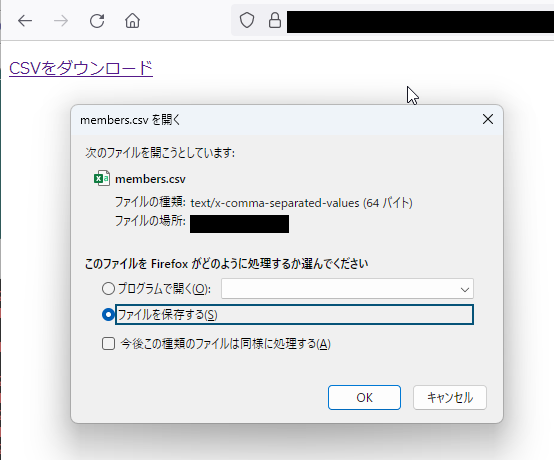{ width=400px }  
  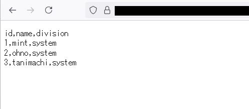{ width=400px }
  * この変更により、以下のMIME Typeに該当する場合を除き、MIME Typeが`text/*`である場合は、ファイルのダウンロードやヘルパーアプリケーションの起動が試みられなくなります[^patch-D212078]。
    * text/html
    * text/xml
    * text/xsl
    * text/calendar
    * text/x-calendar
    * text/x-vcalendar
    * text/vcalendar
    * text/vcard
    * text/x-vcard
    * text/directory
    * text/ldif
    * text/qif
    * text/x-qif
    * text/x-csv
    * text/x-vcf
    * text/rtf
    * text/comma-separated-values
    * text/csv
    * text/tab-separated-values
    * text/tsv
    * text/ofx
    * text/vnd.sun.j2me.app-descriptor
    * text/x-ms-iqy
    * text/x-ms-odc
    * text/x-ms-rqy
    * text/x-ms-contact
    * text/json
    * text/javascript
    * text/javascript1.0
    * text/javascript1.1
    * text/javascript1.2
    * text/javascript1.3
    * text/javascript1.4
    * text/ecmascript1.5
    * text/jscript
    * text/livescript
    * text/x-ecmascript
    * text/x-javascript
  * これらのMIME Type以外のテキスト型データを直接外部アプリケーションで開くことはできなくなりました。
    （`Handlers` ポリシーでも制御はできません。）
  * これらのMIME Type以外のテキスト型データを自動的にダウンロードさせるには、サーバー側で`Content-Disposition: attachment`ヘッダーを設定する、`Content-Type: application/octet-stream`で送出するようにするか、もしくはそのようにレスポンスヘッダーを書き換えるアドオンを使う必要があります。

[^patch-D212078]: 変更が導入されたパッチは https://phabricator.services.mozilla.com/D212078

## インストール・更新

* Chromeからのデータ移行時に、拡張機能も移行するようになった。（Firefox 119）

## Firefox View

* 「開いているすべてのタブ」「他のデバイスのすべてのタブ」の一覧表示に対応した。（Firefox 119）  
  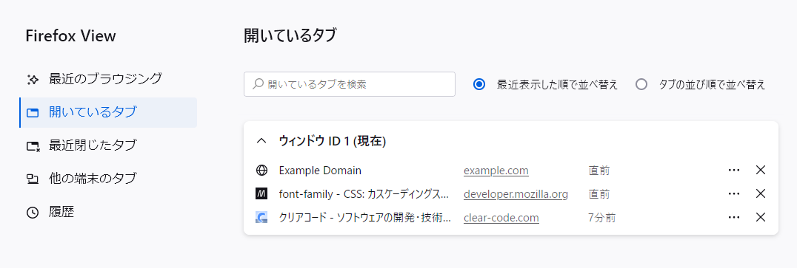{ width=400px }
  * 開かれているタブの一覧の表示順を「最近使用した順」（既定値）と「タブバー上の並び順」の間で切り替えられるようになった。（Firefox 124）
* 履歴の並べ替え表示に対応した。（Firefox 119）  
  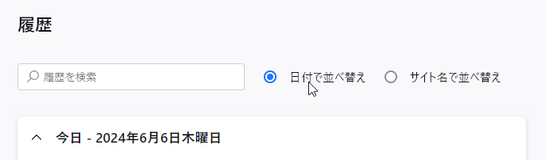{ width=400px }
* 各セクションの内容を横断した検索に対応した。（Firefox 123）
* 開かれているタブの一覧において、ピン留めされたタブも表示するようになった。これにより、メディア再生中のタブのミュート状態の切り替え、ブックマークの作成などの操作をより簡単に行えるようになった。（Firefox 125）  
  { width=400px }
* ポリシー設定でFirefox Accountが無効化されている場合は、Firefox Viewの画面内に「他のデバイスのすべてのタブ」が表示されないようになった。（Firefox 126）

## 内蔵PDFビューワー

* 既存のテキスト形式の注釈を編集できるようになった。（Firefox 116）  
  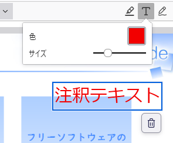{ width=200px }
* 画像の追加や代替テキストの設定をできるようになった。（Firefox 119）  
  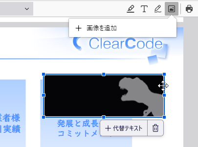{ width=200px }
  * この機能は、`Preferences` ポリシーで `pdfjs.enableStampEditor` を `false` にすることで無効化できます。
* PDFに追加された線、テキスト、画像などを削除するためのフローティングボタンを追加。（Firefox 121）
<!--
  * この機能は、`Preferences` ポリシーで `pdfjs.enableHighlightFloatingButton` を `false` にすることで無効化できます。
    →実際に試してみたところ、設定の状態に関わらずこれらのボタンは常に有効だった。
-->
* F7キーによるキャレットブラウジングがPDFビューワー上でも使用可能になった。（Firefox 124）
* 選択したテキストをマーカー風に強調表示できるようになった。（Firefox 125）  
  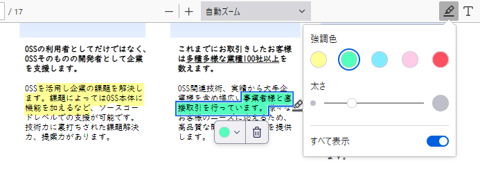{ width=400px }
  * この機能は、`Preferences` ポリシーで `pdfjs.enableHighlightEditor` を `false` にすることで無効化できます。

なお、PDFビューワーの編集機能の編集結果は、PDFの本文の変更ではなく「コメント（注釈）」として保存されます。
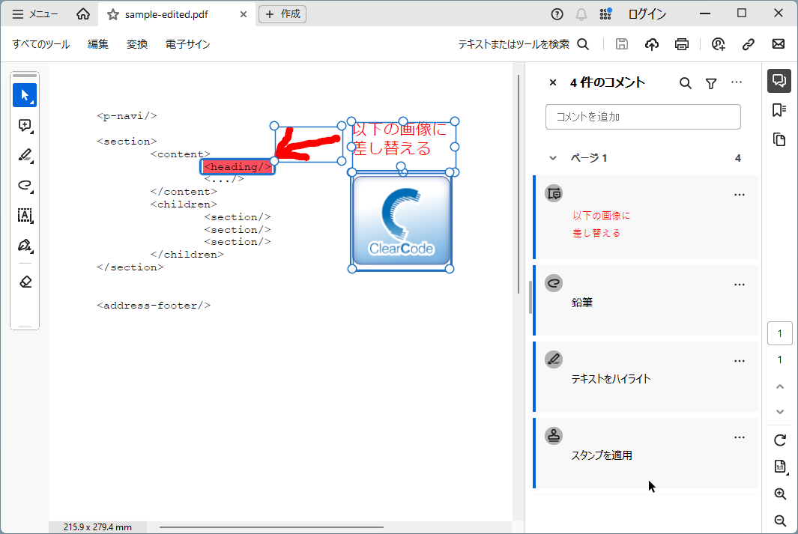

## 動画・音声・音楽再生

* 動画の別ウィンドウ再生（Picture-in-Picture）機能において、音量を調節できるようになった。（Firefox 116）
<!--単なる不具合修正のため省略
* スクリーンリーダー使用時にYouTubeの動画リストを正しくスクロールできるようになった。（Firefox 117）
* Google Meetにおいて、背景のぼかしを適用できるようになった。（Firefox 118）
-->
* 動画などのメディアファイルを `application/octet-stream` としてダウンロードする際に、ファイルの再生を試行せずにダウンロードするようになった。（Firefox 119）
* WindowsとLinuxにおいて、Picture-in-PictureのウィンドウをCtrlキーを押しながらドラッグすることで、ウィンドウが画面の最も近い角にスナップされるようになった。（Firefox 120）
* Windowsにおいて、AV1 Video Extension[^av1-video-extension]がインストールされていない場合に、AV1ビデオコーデックのハードウェアアクセラレーションを有効化するために`about:support`の画面でAV1 Video Extensionのインストールを促すようになった。（Firefox 121）  
  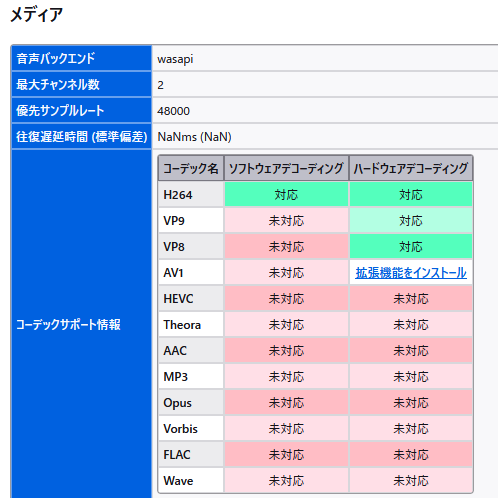{ width=300px }
* 不安定なインターネット接続でのビデオ通話の品質を向上するための仕様であるULPFEC（Uneven Level Protection Forward Error Correction）を初期状態で有効化した。（Firefox 122）
  * この機能は、 `Preferences` ポリシーを用いて  
    `media.navigator.video.red_ulpfec_enabled` を `false` に設定することで無効化できます（従来の動作に戻せます）。
<!-- 互換性の問題がない改善のため、説明を省略
* `setSinkId()` によって音声出力が別のデバイスにリダイレクトされている場合でも、マイク入力に対するエコー軽減を適用できるようになった。（Firefox 123）
* AV1ビデオコーデックのEME（Encrypted Media Extensions）に対応し、AV1形式で提供される動画ストリーミングをより高品質で再生できるようになった。（Firefox 125）
* NVIDIA RTX Video Super Resolution（VSR）およびNVIDIA RTX Video HDRに対応し、対応する環境（NVIDIA RTX GPUの20シリーズ、Windows 10/11 64bit版、VSRはNVIDIAドライバーバージョンR530以上、Video HDRはNVIDIAドライバーバージョン550以上で、NVIDIAコントロールパネルから機能を有効化している場合）での、低解像度の動画の拡大再生時の再生品質や、HRD10対応ディスプレイでの画質が向上しました。（Firefox 126）
* NetflixなどのサイトにおけるDRM付きの動画のストリーミング配信について、プライベートブラウジングモード中でも動画を再生できるようになった。（Firefox 128）
-->

[^av1-video-extension]: https://apps.microsoft.com/detail/9mvzqvxjbq9v?hl=ja-jp&gl=JP

## レガシーな仕様への対応終了、機能の廃止

* Windows 7、Windows 8、Windows 8.1への対応を終了。（Firefox 116）
* CSS、SVG、MathML、IndexedDB、HTMLの`<input>`要素、`<ul>`要素、`<ol>`要素などにおける一部の古い仕様について、廃止または初期状態で機能が無効化された。
<!-- 詳細は説明対象外とする。
* CSSの`offset-path`の指定を新たな仕様の構文として解釈するようになった。（Firefox 116）
  * この挙動は、`Preferences` ポリシーで `layout.css.motion-path-basic-shapes.enable` および `layout.css.motion-path-coord-box.enabled` を `true` にすることで従来の構文として解釈する状態に戻せます。
* `mathml.legacy_maction_and_semantics_implementations.disabled` を廃止し、`<semantics>` および `<maction>` が最初の子要素のみ表示するようになった。（Firefox 118）
* `mathvariant` で `normal` 以外のすべての値が非推奨となり、使用可能な要素も `<mi>` に限定されるようになった。（Firefox 118）
  * この挙動は、MCDで `mathml.legacy_mathvariant_attribute.disabled` を `false` にすることで従来の動作（`<mi>` 以外の要素でも `mathvariant` を使用でき、`normal` 以外の値も受け付ける）に戻せます。（ポリシー設定では制御できません。）
* `<input>`での非標準の`mozactionhint`属性を廃止（代わりに`enterkeyhint`属性の使用を推奨）。（Firefox 119）
* CSSで背景画像を切り抜くための非標準機能である `-moz-image-rect()` を廃止。（Firefox 120）
* `<ul>`と`<ol>`について、`type`属性による要素型に合わない指定を無視するようになった。（Firefox 122）
* CSSでWebページ内のUIのフォーカス可否を制御するための非標準機能である `-moz-user-focus` への対応を廃止。（Firefox 122）
* IndexedDBでの、`IDBObjectStore.createIndex()`の`locale`パラメーターや、`IDBIndex`の`isAutoLocale`および`locale`プロパティ、`IDBLocaleAwareKeyRange`インターフェースなど、カスタムロケール機能を廃止。（Firefox 123）
  * Firefoxでは、仕様に無い独自の機能として、IndexedDBの結果のソート順を地域・言語に合わせて変更する事ができましたが、このバージョンで、その独自拡張機能が廃止されました。
* MathML Coreの仕様に含まれない、数学フォントがない環境向けの暫定回避策としての、計算式の記号（`+`、`=`、`<`など）を縦方向にセンタリングする機能が初期状態で無効になった。（Firefox 126）
  * この挙動は、MCDで `mathml.centered_operators.disabled` を `false` にすることで従来の動作（記号を縦方向にセンタリングする）に戻せます。（ポリシー設定では制御できません。）
* Firefoxのみが対応していて最近仕様から削除された、`align-tracks`と`justfy-tracks`プロパティへの対応が廃止された。（Firefox 128）
* HTMLのメディア要素の非標準のメソッドであった`seekToNextFrame()`が廃止された。（Firefox 128）
-->

## Webアプリの動作の互換性に影響する変更

* Shiftキーを押しながらの右クリックで、マウスイベントをWebページに通知せずに常にFirefoxのコンテキストメニューを開けるようになった。（Firefox 117）
  * この挙動は、`Preferences` ポリシーで  
    `dom.event.contextmenu.shift_suppresses_event` を `false` にすることで従来の動作（WebページにShift-クリックのイベントを通知し、スクリプトでのキャンセルを許容する）に戻せます。
* キーイベント、ArrayBuffer、HTTPヘッダーによる先読み、SVG、`<marquee>`要素の機能などについて、他のブラウザーと共通の結果になるよう動作が変更された。
<!-- 詳細は説明対象外とする。
* Windowsの「Windowsキー」およびmacOSの「Commandキー」について、`KeyboardEvent.key` が値として `"OS"` ではなく `"Meta"` を、`KeyboardEvent.code` が値として `OSLeft` および `OSRight` ではなく `MetaLeft` おおび `MetaRight` を返すようになった。（Firefox 118）
* `ArrayBuffer.prototype.transfer`[^array-buffer-transfer]が有効化され、ArrayBufferのデータ移転が可能になった。（Firefox 122）
  * この挙動は、MCDで `javascript.options.arraybuffer_transfer` を `false` にすることで従来の動作（機能無効化）に戻せます。（ポリシー設定では制御できません。）
* HTTPステータスコード103 Early Hints[^early-hints]による先読みの仕様に完全に対応した。（Firefox 123）
* `SVGAElement.text` 廃止。（代わりに`SVGAElement.textContent`を使用することが推奨される。）（Firefox 125）
* `<marquee>` 要素のイベントハンドラー属性に対応する `bounce`、`finish`および`start`イベントが廃止された。（Firefox 126）
-->

[^array-buffer-transfer]: https://github.com/tc39/proposal-arraybuffer-transfer
[^early-hints]: https://developer.mozilla.org/docs/Web/HTTP/Status/103

## その他、Web技術への対応の改善

<!-- 詳細は説明対象外とする。
* CSP3（Content Security Policy Level 3）での、外部リソースの読み込み指定でのハッシュ値の明示に対応した。（Firefox 116）
  * `<script integrity="sha256-...">` のような指定により、外部埋め込みリソースの期待されるハッシュ値をWebページ側で明示することで、外部コンテンツの改竄への耐性を向上できます。（[詳細な仕様](https://w3c.github.io/webappsec-csp/#external-hash)）
* `input` と `textarea` において、`dirname` 属性で明示したパラメータ名で当該要素の書字方向（`rtl`または`ltr`）をサーバーに送信できるようになった。（[詳細な仕様](https://www.w3.org/International/questions/qa-html-dir#reportingdirection)）（Firefox 116）
* [オーディオ出力デバイスAPI](https://developer.mozilla.org/en-US/docs/Web/API/Audio_Output_Devices_API)が有効化され、メディア要素の出力をそのシステムの既定の出力から、許可された任意の出力デバイス（スピーカーなど）へリダイレクトできるようになった。（Firefox 116）
* Fetch APIやWebTransport APIにおいて、BYOBリーダーを用いて省メモリーでのリアルタイム読み取り・加工が可能となった。（Firefox 116）
* [CSS Nesting](https://developer.mozilla.org/ja/docs/Web/CSS/CSS_nesting)モジュールと[`&`ネスティングセレクター](https://developer.mozilla.org/ja/docs/Web/CSS/Nesting_selector)に対応（初期状態で機能を有効化）。（Firefox 117）
* [WebRTC Encoded Transforms](https://developer.mozilla.org/en-US/docs/Web/API/WebRTC_API/Using_Encoded_Transforms) に対応。（Firefox 117）
* イテレーション可能要素から `ReadableStream` を作成する [`ReadableStream.from`](https://developer.mozilla.org/docs/Web/API/ReadableStream/from_static) に対応。（Firefox 117）
* CSSの [`math-style`](https://developer.mozilla.org/docs/Web/CSS/math-style)、[`math-depth`](https://developer.mozilla.org/docs/Web/CSS/math-depth)、および [`font-size:math`](https://developer.mozilla.org/docs/Web/CSS/font-size) に対応。（Firefox 117）
* CSSの [`contain-intrinsic0size: auto none`](https://developer.mozilla.org/ja/docs/Web/CSS/contain-intrinsic-size)の構文に対応。（Firefox 117）
* Content-Security-Policyの `strict-dynamic` ソース式が `default-src` ディレクティブに強制されていなかった不具合を修正。（Firefox 117）
* `Range` ヘッダーが、値が1バイトの範囲内である場合にクロスオリジンでのリクエストで送信できるようになった。（Firefox 117）
* [`CanvasRenderingContext2D.getContextAttributes()`](https://developer.mozilla.org/en-US/docs/Web/API/CanvasRenderingContext2D/getContextAttributes) で、ラウザーが使用する2Dコンテキストの属性を取得できるようになった。（Firefox 117）
* `<search>` 要素に対応。（Firefox 118）
* クロスオリジンのインラインフレームで公開鍵証明書を取得するためのWebAuthentication APIインターフェースを使用可能にする、`Permission-Plicy` ヘッダーの `publicke-credentials-get` ディレクティブに対応した。（Firefox 118）
* CSSの[`font-synthesis-position`](https://developer.mozilla.org/en-US/docs/Web/CSS/font-synthesis-position)、および[`font-synthesis`](https://developer.mozilla.org/ja/docs/Web/CSS/font-synthesis)のposition指定に対応。（Firefox 118）
* CSSの数学関数 [`abs()`](https://developer.mozilla.org/en-US/docs/Web/CSS/abs)、[`sign()`](https://developer.mozilla.org/en-US/docs/Web/CSS/sign)、[`round()`](https://developer.mozilla.org/en-US/docs/Web/CSS/round)、[`mod()`](https://developer.mozilla.org/en-US/docs/Web/CSS/mod)、[`rem()`](https://developer.mozilla.org/en-US/docs/Web/CSS/rem)、[`pow()`](https://developer.mozilla.org/en-US/docs/Web/CSS/pow)、[`sqrt()`](https://developer.mozilla.org/en-US/docs/Web/CSS/sqrt)、[`hypot()`](https://developer.mozilla.org/en-US/docs/Web/CSS/hypot)、[`log()`](https://developer.mozilla.org/en-US/docs/Web/CSS/log)、[`exp()`](https://developer.mozilla.org/en-US/docs/Web/CSS/exp) に対応。（Firefox 118）
* CSSの[`font-size-adjust`](https://developer.mozilla.org/ja/docs/Web/CSS/font-size-adjust)の新しいキーワード `from-font` に対応。（Firefox 118）
* CSSの[`transform-box`](https://developer.mozilla.org/ja/docs/Web/CSS/transform-box)の値として、`content-box` および `stroke-box` に対応。（Firefox 118）
* `TextMetrics.emHeightDescent` および `TextMetrics.emHeightAscent` プロパティに対応。（Firefox 118）
* Encrypted Client Helloが使用可能になり、TLS接続時のハンドシェイク処理などでより安全な通信を行えるようになった。（Firefox 119）（[詳細な情報](https://blog.mozilla.org/en/products/firefox/encrypted-hello/)）
  * この機能は `DisableEncryptedClientHello` ポリシーで挙動を制御できます。（Firefox 127）
* `Cross-Origin-Embedder-Policy` ヘッダーでの `credentialless` 指定に対応した。（Firefox 119）
* CSSの `attr()` で、第2引数でグローバル属性が見付からない場合の代替値の指定に対応。（Firefox 119）
* [User Adtivation API](https://developer.mozilla.org/docs/Web/API/UserActivation)に対応し、`navigator.userActivation` 経由で現在のページ上でのユーザー操作のアクティブさを確認できるようになった。（Firefox 120）
* CSSの単位として、行の高さを表す長さの単位 `lh`、`rlh` に対応。（Firefox 120）
* WebAssembly GCが初期状態で有効になり、DartやKotlinのような新しい言語で開発されたプログラムをFirefox上で動作させられるようになった。（Firefox 120）
* CSSの `light-dark()` カラー関数に対応し、`prefers-color-scheme` メディアクエリー無しで明るい配色・暗い配色用の色を定義できるようになった。（Firefox 120）
* `Date.parse()` が、より様々な書式の日付表記を受け付けるようになり、他のブラウザーとの互換性が向上した。（Firefox 120）（Firefox 121）（Firefox 123）
* `:has()` セレクターに対応し、特定の条件にあてはまる子孫や兄弟を持つ要素を、セレクターのみで指定できるようになった。（Firefox 121）
* CSSの `text-indent` プロパティでの `hanging` 指定（最初の行以外の行頭にインデントを適用する）と `each-line` 指定（` ` による強制改行後の行頭にもインデントを適用する）に対応した。（Firefox 121）
* CSSの `text-wrap` プロパティでの `balance` 指定に対応し、見出しなどの10行未満のブロックに対して、各行の文字数が近くなるように自動折り返しさせられるようになった。（Firefox 121）
* [iframeの遅延読み込み（`<iframe loading="lazy">`指定により、画面内にフレームが入るまで読み込みを行わない）](https://developer.mozilla.org/docs/Web/Performance/Lazy_loading)に対応した。（Firefox 121）
* Promiseと、それに対するリゾルバー関数を返却する静的メソッドの[`Promise.withResolvers()`](https://developer.mozilla.org/en-US/docs/Web/JavaScript/Reference/Global_Objects/Promise/withResolvers)に対応。（Firefox 121）
* Unicode標準に基づいてWebコンテンツの自動改行を行うようになり、他のWebブラウザーとの互換性が向上した。また、中国語、日本語、ミャンマー語、ラオス語、クメール語、タイ語を含む東アジア・東南アジア圏の言語のコンテンツにおいて、テキストをダブルクリックした際に、その言語において自然な単語の単位でテキストを選択するようになった。（Firefox 122）
* CSSの `offset-path` における様々な指定に対応。（Firefox 122）
* CSSの `animations` において、[SMIL](https://developer.mozilla.org/docs/Web/SVG/SVG_animation_with_SMIL)を使用したSVGの[`viewBox`](https://developer.mozilla.org/docs/Web/SVG/Attribute/viewBox)属性に対応。（Firefox 122）
* [LargestContentfulPaint API](https://developer.mozilla.org/docs/Web/API/LargestContentfulPaint)に対応し、パフォーマンス測定においてユーザーの入力前に大きなコンテンツが描画されるタイミングに関する情報を提供できるようになった。（Firefox 122）
* `<select>`内での`
`に対応。（Firefox 122）
* `<select>`について、`showPicker()`でドロップダウンリストを表示させられるようになった。（Firefox 122）
* 未知のスキーマに対するフォールバック先のURLパーサーをDefaultURIに変更し、仕様の遵守度と他のブラウザーとの互換性を高めた。（Firefox 122）
* SVGのグラデーションについて、[SVG要素の `color-interpolation` 属性またはCSSの `color-interpolation` プロパティでlinearRGB色空間を指定](https://developer.mozilla.org/docs/Web/SVG/Attribute/color-interpolation)できるようになった。（Firefox 123）
* SVGのfeImage要素について、固定の幅・高さを持たないSVG画像を描画できなかったのを、幅300ピクセル×高さ150ピクセルと見なして描画するようになった。（Firefox 123）
* `<template>`要素の`shadowrootmode`属性指定に対応し、ShadowDOMを宣言的に定義できるようになった。（Firefox 123）
* CSSの [`content-visibility: auto`](https://developer.mozilla.org/en-US/docs/Web/CSS/content-visibility) が初期状態で使用可能になり、ユーザーに無関係のコンテンツのレンダリングを省略できるようになった。（Firefox 124）
* CSSの `text-wrap` が、 `text-wrap-mode` と `text-wrap-style` のショートハンド指定と見なされるようになった。（Firefox 124）
* CSSの `::first-letter` および `::first-line` 擬似要素を、CVGの `<text>` 要素にも適用できるようになった。（Firefox 124）
* [`AbortSignal.any()`](https://developer.mozilla.org/en-US/docs/Web/API/AbortSignal/any_static)に対応し、操作を中止するためのシグナルとして複数のトリガーを合成したシグナルを使用できるようになった。（Firefox 124）
* CSSの `align-content` が `display: block` の要素に対しても適用可能になった。（Firefox 125）
* CSSの `transform-box` での `content-box` および `stroke-box` 指定に対応した。（Firefox 125）
* 連続する文字列をUnicodeの仕様に基づいて分割する [`Intl.Segmenter`](https://developer.mozilla.org/en-US/docs/Web/JavaScript/Reference/Global_Objects/Intl/Segmenter) に対応した。（Firefox 125）
* [Popupver API](https://developer.mozilla.org/en-US/docs/Web/API/Popover_API)に完全に対応した、HTML要素の`popuover`属性で要素をポップアップ風にできるようになった。（Firefox 125）
* `navigator.clipboard.readText()` Web APIに対応した。（Firefox 125）
* `URL.parse()` に対応した。（Firefox 126）
  * `URL` コンストラクターでは例外が返されるケースで、こちらでは単に `null` が返されます。
* CSSの `zoom` プロパティが、CSSWGでのWeb仕様標準化に従い初期状態で有効化された。（Firefox 126）
  * この機能は、`Preferences` ポリシーで `layout.css.zoom.enabled` を `false` にすることで従来の動作（機能無効）に戻せます。
  * この機能で設定されたズーム率は、 `Element.currentCSSZoom` プロパティで参照できます。
* カスタム要素にマッチするCSSセレクターを追加可能にする[CSSのCustom state疑似クラス](https://html.spec.whatwg.org/multipage/custom-elements.html#custom-state-pseudo-class)に対応した。（Firefox 126）
-->
* [Screen Wake Lock API](https://developer.mozilla.org/en-US/docs/Web/API/Screen_Wake_Lock_API)に対応し、コンテンツ側の制御で画面の電源自動Offを無効化できるようになった。（Firefox 126）
  * この機能は、`Preferences` ポリシーで `dom.screenwakelock.enabled` を `false` にすることで従来の動作（機能無効）に戻せます。
<!-- 詳細は説明対象外とする。
* 既知のIndexedDBデータベースを列挙する機能である [`IDBFactory.databases()`](https://developer.mozilla.org/docs/Web/API/IDBFactory/databases) に対応。（Firefox 126）
* IndexedDBのトランザクションの永続性を調べるための機能である [`IDBTransaction.durability`](https://developer.mozilla.org/en-US/docs/Web/API/IDBTransaction/durability) に対応。（Firefox 126）
* `relayProtocol`および`url`プロパティを除いて [RTCIceCandidate](https://developer.mozilla.org/en-US/docs/Web/API/RTCIceCandidate) に仕様通りに対応した。（Firefox 126）
* 選択範囲の方向を判別するための `Selection.direction` プロパティを追加。（Firefox 126）
* [CSSのグラデーション表現において、色の補完に使用する色空間を指定できるようになった。](https://bugzil.la/1861363)（Firefox 127）
* [`setCodecPreferences`](https://www.w3.org/TR/webrtc/#dom-rtcrtptransceiver-setcodecpreferences)メソッドによって、特定のコーデック（RTX/RED/FECなどを含む）のネゴシエーションをWebアプリ側で無効化できるようになり、アプリケーションのレベルで、P2Pでの通信時に推奨コーデックとして送信するコーデックのリストを制御できるようになった。（Firefox 128）
* 画像とドキュメントに対するAcceptヘッダーが`image/svg+xml`を含むように[変更](https://developer.mozilla.org/docs/Web/HTTP/Content_negotiation/List_of_default_Accept_values)され、Fetchの標準仕様やその他のブラウザーとの互換性が向上した。（Firefox 128）
* `@property`と[CSS property-and-values API](https://developer.mozilla.org/docs/Web/API/CSS_Properties_and_Values_API)に対応した。（Firefox 128）
* SpiderMonkeyが[可変長のArrayBuffer](https://developer.mozilla.org/docs/Web/JavaScript/Reference/Global_Objects/ArrayBuffer/resize)と[拡大可能なSharedArrayBuffer](https://developer.mozilla.org/docs/Web/JavaScript/Reference/Global_Objects/SharedArrayBuffer/grow)に対応し、ArrauBufferのサイズ不足時に、新しいArrayBufferの作成やデータのコピーを行わなくてもよくなった。（Firefox 128）
* Request、Response、Blobなどの多くのオブジェクトで`bytes()`メソッドに対応し、[Uint8Arrayをより簡単に作成できるようになった](https://github.com/w3ctag/design-principles/issues/463)。（Firefox 128）
* CSSでの[相対的な色指定](https://developer.mozilla.org/en-US/docs/Web/CSS/CSS_colors/Relative_colors)が初期状態で有効化された。（Firefox 128）
* CSSの`content`プロパティで画像の代替テキストを使用できるようになった。（Firefox 128）
-->
* その他、CSS、IndexedDB、WebRTCなどの仕様の新機能に対応した。

## その他、法人運用への影響度が低いと思われる変更

* 特別なアクセシビリティツールを使用せずとも、サイドバー切り替えUIを（フォーカスが当たっている状態であれば）キーボードのカーソルキーでも操作できるようになった。（Firefox 116）
* `ExtensionSettings` ポリシーにおいて、`default_area` の指定に対応。（Firefox 117）
* `FirefoxHome` ポリシーにおいて、非推奨となった `Snippets` オプションに対応しなくなった。（Firefox 122）
* `UserMessaging` ポリシーにおいて、非推奨となった `WhatsNew` オプションに対応しなくなった。（Firefox 127）

<!--
以下、ブラウザーとしての使い勝手には影響しないため非表示

## その他のパフォーマンス向上

* HTTP/2でのファイルのアップロードのパフォーマンスが向上した。（Firefox 116）
* [HTTPステータスコード 103 Early Hints](https://blog.cloudflare.com/early-hints/)対応が有効化され、対応する特定のサーバーとの通信効率がより向上した。（Firefox 120）
* WebAssemblyにおける[末尾呼び出しの最適化](https://github.com/WebAssembly/tail-call/blob/main/proposals/tail-call/Overview.md)に対応。（Firefox 121）
* ARM64のmacOSとAndroid向けの最適化を改善。（Firefpx 123）
* macOS、Linux、Androidにおいてメインスレッド外でcanvasを描画するようになった。（Firefox 123）
* Windowsのタスクバーのジャンプリストの生成効率を改善した。（Firefox 124）
* Facebookなどで使われている[Content-encoding: zstd (zstandard compression)](http://facebook.github.io/zstd/)に対応した。（Firefox 126）

## その他の安定性の向上

* [ローカルファイルをコピーして、Webページ上に「貼り付け」した際、Clipboard API経由でファイルの内容を取得できなかった不具合](https://bugzilla.mozilla.org/show_bug.cgi?id=1699743)を解消。（Firefox 116）
* Facebookでスクロール中にスクロール位置が急に動く問題が修正された。（Firefox 119）
* Facebookでスクロール中にスクロール位置が急に動く問題が修正された。（Firefox 119）
* `Preferences`ポリシーにおいて、`Type`で明示的に設定の型を指定して、整数値の0や1が真偽値として判定されることを防げるようになった。（Firefox 123）
* GPUによるハードウェアアクセラレーションが有効な状態でcanvasが描画されているときに、ドライバーのクラッシュによって2Dコンテキストが失われたときの自動復帰を行うための機能である、`contextlost`イベントや`contextrestored`イベントに対応した。（Firefox 125）

## 開発者向け機能

* JavaScriptコンソールにおいて、Webサイトごとのカスタムフォーマッターを設定できるようになった。（Firefox 116）（[詳細情報](https://fxdx.dev/firefox-devtools-custom-object-formatters/)）
* Web開発ツールにおいて、CSSの互換性情報をアイコンで表示するようになった。（Firefox 117）
* 開発者コンソールにおいてログの永続化が有効の場合、`console.clear()` でコンソールの内容を消去しないようになった。（Firefox 117）
* JSONビューワーで不正な・破損したJSONを開こうとした場合に、自動的に生データの表示に切り替わるようになった。（Firefox 119）
* ネットワークモニターで、画像以外のリソースの通信についても、コンテキストメニューの「名前を付けて応答を保存」でHTTPレスポンスのBodyをファイルに保存できるようになった。（Firefox 123）

## 非日本語圏向け機能

* 英語ロケール使用環境において、更新通知のプロンプトの「Learn More」のリンクからリリースノートを開けるようになった。（Firefox 116）
* クレジットカード情報の保存機能を有効化する地域としてイタリア、スペイン、オーストラリア、ベルギー、ポーランドを追加。（Firefox 117）
  * この機能は `AutofillCreditCardEnabled` ポリシーで制御可能です。
* EU R&D Bergamotプロジェクトの支援により、いくつかの欧州圏の言語についてWebページのローカルでの翻訳を行えるようになった。（Firefox 118）
  * ローカル翻訳の質が向上した。（Firefox 122）
  * ツールチップや入力フォームのプレースホルダーも翻訳するようになった。（Firefox 123）
  * `UserMessaging`ポリシーの`FeatureRecommendations`で、ローカル翻訳機能のアピールを制御できるようになった。（Firefox 123）
  * カタルーニャ語の翻訳に対応した。（Firefox 126）
  * この機能は `TranslateEnabled` ポリシーを `false` に設定することで完全に無効化できます。（Firefox 126）
* Firefox Suggestにおいて、キーワードに基づいてアドオンが提供する項目をアドレスバーに直直接表示できるようになった。（Firefox 118）  
  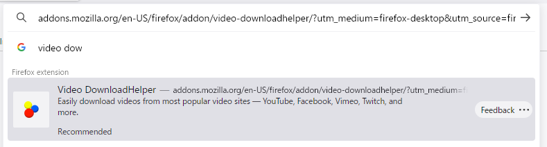
* `FirefoxSuggest`ポリシーで、Firefox Suggestの機能が制御可能となった。（Firefox 118）
* サンタリ語（sat）ロケールの提供を開始。（Firefox 119）
* ドイツにおいて、[Cookieの保存可否を訊ねるバナーの自動拒否機能](https://www.ghacks.net/2023/04/17/firefox-may-interact-with-cookie-prompts-automatically-soon/)がプライベートウィンドウにおいて初期状態で有効化された。（Firefox 120）
* ドイツにおいて、URLトラッキング防止がプライベートウィンドウにおいて初期状態で有効化され、Webサイトをまたいだユーザー識別のために使われる重要でないクエリーパラメーターが削除されるようになった。（Firefox 120）
* プライバシー重視の検索エンジンである「Qwant」を、ベルギー、イタリア、オランダ、スペイン、スイス、およびフランス地域のすべての言語で利用可能になった。（Firefox 124）
* アメリカ合衆国とカナダにおいて、住所を入力するフォームの値の保存と自動入力に対応。（Firefox 125）
  * この機能は `AutofillAddressEnabled` ポリシーで制御可能です。
* サライキ語（skr）ロケールの提供を開始（Firefox 128）
* アメリカ合衆国とカナダにおいて、アドレスバーを開いたときに以前の作業に戻る、もしくは次の行動を起こすためのヒントとして、直近の検索ワードに加えてトレンドの検索ワードも表示するようになった。（Firefox 128）

## macOS固有の改善・変更

* macOS 10.12、10.13、10.14への対応を終了。（Firefox 116）
* 設定画面で、Tabキーでのフォーム要素やリンクの間のフォーカス移動のON/OFFを切り替えられるようになった。（Firefox 117）
* macOSの[音声コントロールコマンド](https://support.apple.com/guide/mac-help/use-voice-control-commands-mh40719/mac)に対応した。（Firefox 121）
* [パスキー](https://support.apple.com/guide/mac-help/create-a-passkey-mchl4af65d1a/mac)の生成およびiCould Keychainへの保存に対応した。（Firefox 122）
* ウィンドウのすべての種類のフルスクリーン表示を、macOSのフルスクリーンAPIで実現するようになり、メニューバーやDockの振る舞いがよりmacOSのユーザー体験的に自然なものとなった。（Firefox 124）
* M3 MacにおいてAV1のデコードのハードウェアアクセラレーションが有効になった。（Firefox 126）
* リンクやその他のフォーカス可能な要素について、macOSのキーボード操作の設定によらず、初期状態でTabキーでフォーカス移動するようになった。（Firefox 127）
  * この機能は設定で無効化できます（従来の動作に戻せます）。
* `getUserMedia`経由でのマイク入力のキャプチャー時に、オーディオ品質を向上させるために、システムが提供する音声処理を使用するようになった。（Firefox 128）

## Linux固有の改善・変更

* Ubuntuにおいて、Snap版FirefoxでSnap版Chromiumのユーザー設定をインポートできるようになった。（Firefox 120）
* Linuxにおいて、初期状態でXWaylandに代わりWaylandこんポジターを使用するようになり、タッチパッドやタッチスクリーンでのジェスチャー操作、スワイプ操作、画面ごとに異なるDPI値の適用、より良い画面描画性能などの恩恵を受けられるようになった。（Firefox 121）
* Ubuntu、Debian、Linux Mint向けに新しい.debパッケージを提供するようになった。（Firefox 122）
* フィンガープリンティング防止のため、CPUアーキテクチャが32bitか64bitかをUA文字列に含めないようになった。（Firefox 127）

## Android固有の改善・変更

* Android 14またはそれ以後の環境でFirefox for Androidを使用する場合に、サードパーティ製のパスキー管理アプリのパスキーを生成したり使ったりできるようになった。（Firefox 128）

-->

<!--
## 現時点で判明している設定シートの変更点

### 追加

* Appearance-17: Webページ内のリンクの下線表示
* Download-7: Content-Dispositionヘッダーに基づいて、PDFのダウンロード用リンクなどのクリック時に、プレビューしてからダウンロードするかどうか
* Download-8: 信頼できないURLからのファイルのダウンロードの遮断
* MenuShortcut-66: アプリケーションメニュー＞動作しないサイトを報告
* MenuShortcut-67: リンク上のコンテキストメニュー＞サイト追跡を除いたリンクをコピー
* MenuShortcut-68: 設定＞一般＞一般＞起動＞Firefoxを既定のブラウザーに設定する
* MenuShortcut-69: 設定＞一般＞ファイルとプログラム＞プログラム＞ファイルの種類と取り扱い方法の一覧
* MenuShortcut-70: 設定＞一般＞Firefoxの更新＞更新履歴を表示
* MenuShortcut-71: 設定＞一般＞ネットワーク設定＞接続設定＞自動プロキシー設定スクリプト＞再読み込み
* MenuShortcut-72: 設定＞ホーム＞新しいウィンドウとタブ＞カスタムURL選択時の「現在のページを使用」「現在のタブグループを使用」
* MenuShortcut-73: 設定＞ホーム＞新しいウィンドウとタブ＞カスタムURL選択時の「ブックマークを使う」
* MenuShortcut-74: 設定＞ホーム＞既定値に戻す
* MenuShortcut-75: 設定＞プライバシーとセキュリティ＞ブラウザープライバシー＞強化型トラッキング防止機能＞例外を管理
* MenuShortcut-76: 設定＞プライバシーとセキュリティ＞ブラウザープライバシー＞Cookieとサイトデータ＞例外を管理
* MenuShortcut-77: 設定＞プライバシーとセキュリティ＞ブラウザープライバシー＞パスワード＞例外サイト
* MenuShortcut-78: 設定＞プライバシーとセキュリティ＞ブラウザープライバシー＞パスワード＞保存されたパスワード
* MenuShortcut-79: 設定＞プライバシーとセキュリティ＞セキュリティ＞証明書＞証明書を表示
* MenuShortcut-80: 設定＞プライバシーとセキュリティ＞セキュリティ＞証明書＞セキュリティデバイス
* MenuShortcut-81: 文字列選択時のコンテキストメニュー＞選択範囲を～に翻訳
* Privacy-70: 「Do Not Sell」ヘッダの送出の可否
* Privacy-71: Privacy Preserving Attribution APIの有効化
* Script-32: Shiftキーを押しながらの右クリックによる、Firefox本来のコンテキストメニューの強制表示
* Script-33: Screen Wake Lock APIによる、アイドル時の画面の自動電源オフ動作の停止
* Security-61: SVGの<use>でのdata: URLの使用
* Security-62: 安全な接続（HTTPS）で閲覧しているページに埋め込まれた画像、動画、音声の取得時の接続方法
* Security-63: TLSのポスト量子鍵共有機能の使用可否
* Security-64: Firefox 126以前向けの古い署名を含むアドオンのXPIパッケージの使用可否
* Ui-16: 印刷機能の使用可否
* Ui-17: ファイル選択ダイアログの使用可否
* Ui-18: コンテナー機能のUIを表示する

### 変更

* Appearance-2: ツールバー上の項目の初期設定（設定値の変更）
* Download-6: 未知の種類のファイルのダウンロード時の既定の挙動（既定値の変更）
* Install-7: Firefox/Thunderbirdの同梱（バージョン繰り上げ）
* Privacy-1: 履歴の保存（永続化）の可否（設定値の変更）
* Privacy-58: クレジットカード情報の保存（設定値の変更）
* Security-15: その他、バックグラウンドで行われる外部への通信の可否（設定値の変更）
* Ui-14: 組み込みのPDFビューワー上での編集操作の可否（設定値の変更）
* Update-9: Firefoxの自動更新の対象とするバージョンの範囲（バージョン繰り上げ）

### 廃止

* Appearance-15: タブバー上のFirefox Viewボタンの表示（Appearance-2で代用可）
* Download-5: Firefox 98以前からの移行時における、ファイルの種類ごとの取り扱い
* Network-33: クロスオリジンのリダイレクトでのAuthorizationヘッダーの引き継ぎ
* Privacy-15: 検索結果のローカライズ用地域コードの位置情報に基づく推定の可否
* Script-26: リッチテキストエディターの振る舞い
* Script-30: scrollendイベントによるスクロール操作終了の検知
* Tab-13: スニペットの表示
-->
