# Firefox ESR140のリリーススケジュール

Mozillaのリリースカレンダー[^release-calendar]では、Firefox ESR140のリリース予定は以下の通り記載されています。

[^release-calendar]: https://whattrainisitnow.com/calendar/

|リリース日     |通常版リリースバージョン|ESR版リリースバージョン|備考                |
|---------------|------------------------|-----------------------|--------------------|
| 2025年5月27日 | Firefox 139            | 115.24 + 128.11       |ESR140ベータ版      |
| 2025年6月24日 | Firefox 140            | 128.12/140.0          |ESR140正式版        |
| 2025年7月22日 | Firefox 141            | 128.13/140.1          |                    |
| 2025年8月19日 | Firefox 142            | 128.14/140.2          |                    |
| 2025年9月16日 | Firefox 143            | 140.3                 |ESR128のサポート終了|
| 2025年10月14日| Firefox 144            | 140.4                 |                    |
| 2025年11月11日| Firefox 145            | 140.5                 |                    |
| 2025年12月9日 | Firefox 146            | 140.6                 |                    |
| 2026年1月13日 | Firefox 147            | 140.7                 |                    |

Firefox ESR128のサポートは、2025年9月16日で終了します（以後はセキュリティ更新が提供されません）。

* リリース日は協定世界時 (UTC) を基準としています。日本時間では翌日となる場合があります。
* なお、リリーススケジュールは予告なく変更される可能性があります。

# 法人利用への影響が予想される代表的な変更点

* 

\newpage

# カテゴリごとの変更点

以下に挙げる変更点は、特段の断りがない限り、初期状態で挙動が従来版から変化しており、従来の挙動に戻すことはできません。
初期状態での挙動が従来版からは変化せず、任意の設定変更により新しい挙動を有効化できる物や、初期状態での挙動は変化するものの設定変更で従来の挙動に戻せる物については、個別にその旨を記載しています。

また、新しいWeb標準仕様への対応や他のブラウザーとの互換性の向上などについては、恩恵を受けるためには原則として、Webページ側での明示的な対応が必要です。
あしからずご了承ください。

## 外観、メニュー構成の変更

* リーダービュー[^Reader-View]にテキストのスペーシングと配置を指定するオプションを追加。（Firefox 129）  
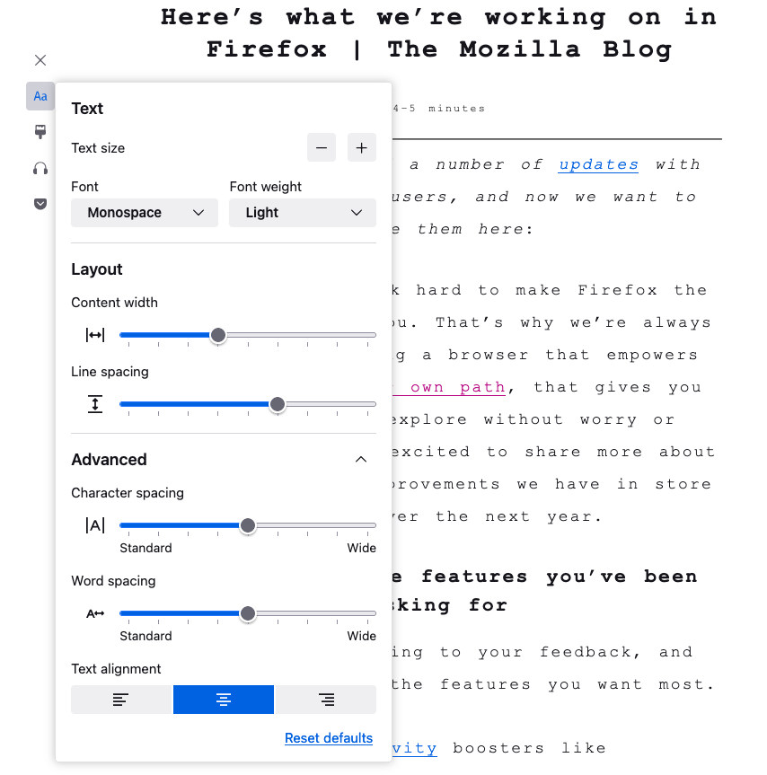
* リーダービューのテーマに「コントラスト」と「グレー」を追加。（Firefox 129）  
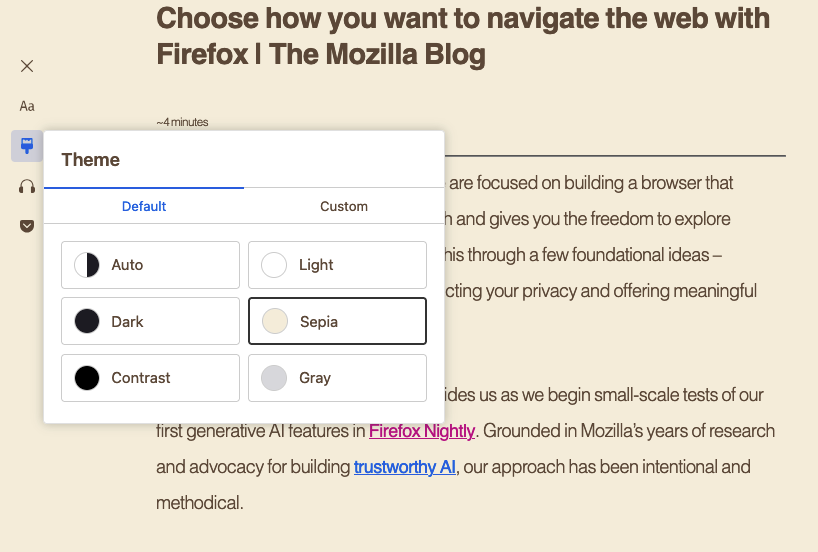
■最新の128.10.0esrでは両オプションもThemeメニュー自体も見当たらない。廃止されたかもしれない
* バックグラウンドタブ上へのマウスカーソル移動によりタブのプレビューが表示されるようになった。（Firefox 129）（Firefox 131）  
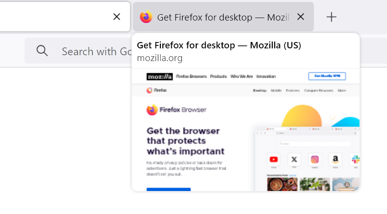
* 「設定」→「Firefox Labs」[^Firefox-Labs]ページにより、実験的な機能を簡単に試せるようになった。（Firefox 130）
  * タブを切り替えたとき、再生中の動画を自動的にピクチャーインピクチャーで開けるようになった。
* 検索バーが空白の場合、shift+enterまたはshift+クリックで検索エンジンのホームページへ進めるようになった。（Firefox 131）  
■Firefox138での挙動と差異あり。詳細は#17864-12参照
* 言語の違いによるテキストの書字方向の判定処理をHTML仕様で定義された最新モデルに追従することで、他ブラウザーとの相互運用性を向上した。（Firefox 132）
* 「他の端末からのタブ」を、従来のサイドバーからのほか、タブの一覧表示メニューからも表示できるようになった（Firefoxアカウントのログイン時のみ有効）。（Firefox 133）  
  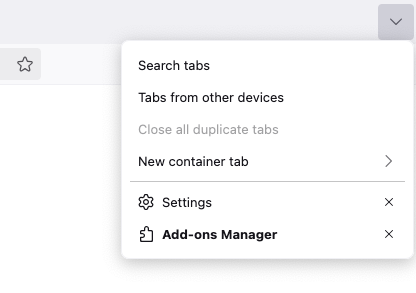
* ウェブページ翻訳[^translation]に日本語をサポート。（Firefox 135）
* AIチャットボット[^AI-Chatbot-feature]ボタンにより、使用するチャットボットをサイドバーから選べるようになった。（Firefox 135）  
  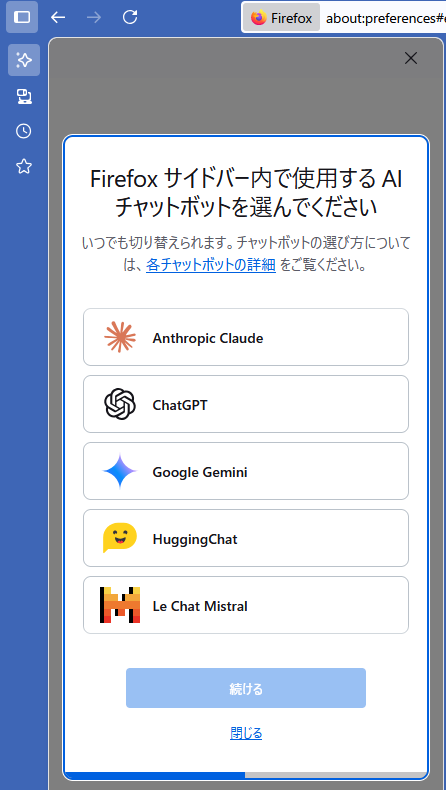  
  ■Firefox 128.10.0esrにはサイドバー存在せず
* 「サイト追跡を除いたリンクをコピー」（Copy Without Site Tracking）メニュー名を「追跡を除去したリンクをコピー」（Copy Clean Link）に変更。期待動作である「リスト情報に基づき既知のトラッキングパラメーターをリンクから取り除く」に即して明確化した。また、プレーンテキストのリンクにも適用される。（Firefox 135）

[^Reader-View]: https://support.mozilla.org/ja/kb/firefox-reader-view-clutter-free-web-pages
[^Firefox-Labs]: about:preferences#experimental
[^translation]: https://www.mozilla.org/ja/firefox/features/translate/
[^AI-Chatbot-feature]: https://blog.mozilla.org/en/mozilla/ai/ai-services-on-firefox/

## アドレスバー

* リンク内にトラッキングパラメーターが見つからないとき、右クリックメニューの「追跡を除去したリンクをコピー」オプションがグレーアウトされるようになった。（Firefox 132）  
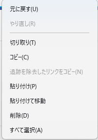

## セキュリティ・プライバシー保護

*  DisableFirefoxStudiesポリシー有効時にNimbus（Firefoxの実験ツール）も無効化されるようにした。（Firefox 129）
* UserMessagingポリシーにFirefox Labsを無効化できるオプションを追加。（Firefox 130）
* 位置情報などへのアクセスを一時的に許可する機能を追加。許可は1時間後またはタブを閉じるまで有効となる。（Firefox 131）  
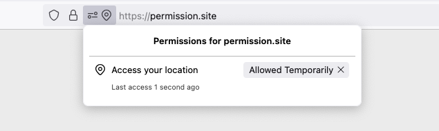
* PrivateBrowsingModeAvailability[^PrivateBrowsingModeAvailability] ポリシーを追加。（Firefox 131）
* 「強化型トラッキング防止機能」が「厳格」のとき、サードパーティーCookieをブロックするようになった。（Firefox 132）
* いわゆるmixed contentのページで、Webサイトのアイコン（favicon）がHTTPSで取得できないとブロックするようになった。（Firefox 132）
* ポスト量子鍵交換アルゴリズム（量子コンピューターの登場後も安全に鍵交換を行うための仕組み）としてmlkem768x25519をサポート。
  * TLS 1.3向け（Firefox 132）
  * HTTP/3向け（Firefox 135）
* 「強化型トラッキング防止機能」が「厳格」のとき、Bounce Tracking（中間サイトを介したトラッキング）を防御する機能を追加。リダイレクト動作に基づき検知し、定期的にCookieとサイトデータを消去する。（Firefox 133）
* `MicrosoftEntraSSO`ポリシー[^MicrosoftEntraSSO]を完全サポート。（Firefox 133）
* `Preferences`ポリシー[^Preferences]で`security.pki.certificate_transparency.mode`が設定可能となった。（Firefox 133）
* `Preferences`ポリシーで`identity.fxaccounts.toolbar.`で始まる各項目が設定可能となった。（Firefox 133）
* 一時的なユーザーアクティベーション動作について、従来のバージョンよりさらにHTMLモデル仕様に準拠したものとなった。この変更によりポップアップのブロック基準を緩和し、誤ったブロックを減少させる。（Firefox 134）
* 証明書の透明性が必須となり、証明書を信頼する前にWebサーバーに対してその証明書が公開されているという十分な証拠を求めるようになった（MozillaのRoot CA Programが発行した証明書を使用するサーバーのみが対象）。（Firefox 135）

[^PrivateBrowsingModeAvailability]: https://mozilla.github.io/policy-templates/#privatebrowsingmodeavailability
[^MicrosoftEntraSSO]: https://mozilla.github.io/policy-templates/#microsoftentrasso
[^Preferences]: https://mozilla.github.io/policy-templates/#preferences

## ネットワーク接続

* 外部（non-local）サイトへのデフォルトプロトコルがHTTPSとなった。サイトがHTTPS接続できない場合はHTTPへフォールバックする。（Firefox 129）
* 特定のプラットフォーム（Windows 11、Linux、Android 10+）において、OSのDNSリゾルバーによりHTTPS DNSレコードを解決できるようになった。（Firefox 129）

## ファイルのダウンロード

* 

## インストール・更新

* 

## Firefox View

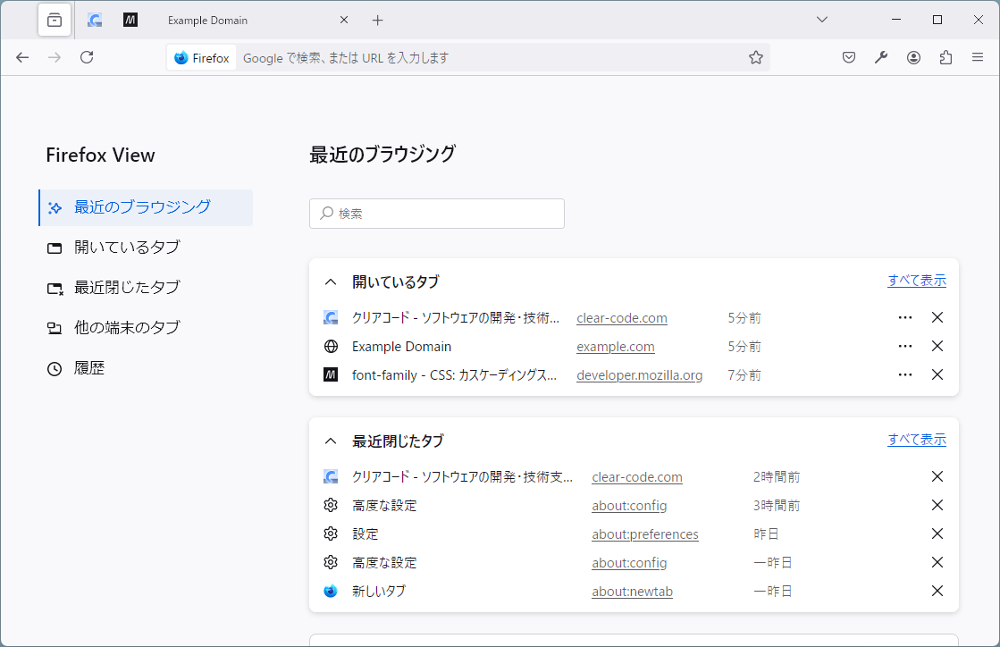

* 

## 内蔵PDFビューワー

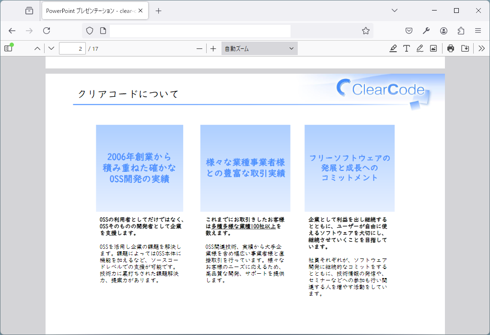

* 

## 動画・音声・音楽再生

* Microsoft PlayReady[^Microsoft-PlayReady]暗号化メディア再生の順次サポート。（Firefox 132）
* 「設定」→「Firefox Labs」→「ピクチャーインピクチャー: タブ切り替えで自動的に開く」対応サイトの拡大。（Firefox 133）
* WindowsにおいてHEVC（H.265）動画再生のハードウェアアクセラレーションに対応。（Firefox 134）

[^Microsoft-PlayReady]: コンテンツ保護・配信技術の総称 https://www.microsoft.com/playready/

## レガシーな仕様への対応終了、機能の廃止

* 開いているウィンドウに対してストレージアクセスを許可するヒューリスティックを無効化。（Firefox 132）
* ユーザー識別の拒否を明示的に通知する「Do Not Track」チェックボックスの削除。代替として、グローバル・プライバシー・コントロール（GPC）[^global-privacy-control]に基づいた「ウェブサイトにユーザーデータの販売や共有の拒否を通知する」設定を使用する。（Firefox 135）

[^global-privacy-control]: https://support.mozilla.org/ja/kb/global-privacy-control

## Webアプリの動作の互換性に影響する変更

* Curve25519プリミティブ（Ed25519シグネチャおよびX25519鍵生成）をサポート。（Firefox 130）

## その他、Web技術への対応の改善

* WindowsおよびmacOSにおいてWide Color Gamut WebGLに対応。現段階では8ビットでの広色域（Display P3）をサポート。（Firefox 132）
* 大半のSVGフィルタープリミティブに対してWebRenderハードウェアアクセラレーションが可能となった。（Firefox 132）
* WindowsにおいてCanvas2D（レンダリングAPI）がDirect2Dからプラットフォームに依存しないアクセラレーションバックエンドに変更された。（Firefox 133）

## その他、法人運用への影響度が低いと思われる変更

* 

以下、ブラウザーとしての使い勝手には影響しないため非表示

## その他のパフォーマンス向上

* ページ全文の翻訳後に、選択範囲のテキストを別の言語に翻訳できるようになった。（Firefox 130）  
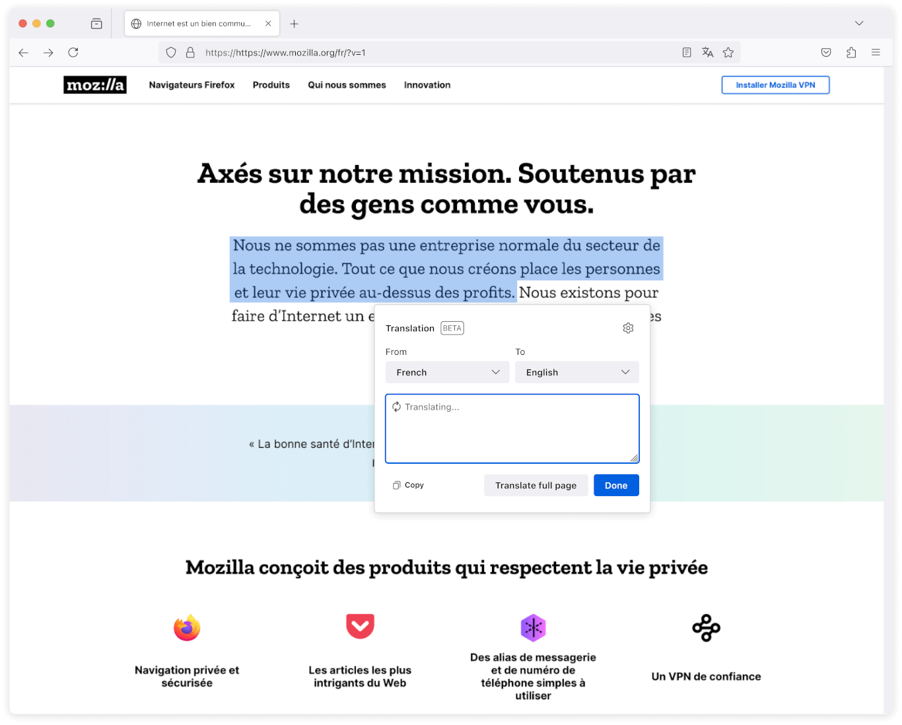
* ウェブページ翻訳で既定の言語を表示する際、以前に翻訳に使用したことがある言語を考慮するようになった。（Firefox 131）
* 証明書の圧縮をサポートし、TLSハンドシェイクにおける性能を向上。（Firefox 132）
* Webサイトがhistory APIを悪用し、履歴情報を過度に生成することで「戻る」「進む」によるページ遷移を困難にすることを防止する対策が導入された。「戻る」「進む」ボタン使用時に、ユーザーが操作したもの以外の履歴情報はスキップされる。（Firefox 135）

## その他の安定性の向上

* 「コピー」と「貼り付け」のコンテキストメニューが有効にならないことがある問題を修正。（Firefox 130）
* SOCKSホストでUseHTTPProxyForAllProtocolsポリシーが正しく設定されない問題を修正。（Firefox 131）
* サーバー時間が取得可能な場合、ローカル時間との時差を反映して`expire`属性の値が補正されるようになった。後で現在時刻が設定された場合も、サーバー時間の基準でCookieが有効期限内ならば有効と見なされる。（Firefox 133）
* 翻訳機能を改善し、いくつかの条件下でモデルが新たな造語を作り出す可能性が削減された。（Firefox 135）

## 開発者向け機能

* デスクトップ版がWebCodecs API[^WebCodecs-API]に対応。（Firefox 130）
* `HTMLVideoElement`インターフェースで`requestVideoFrameCallback()`メソッドをサポートし、開発者が各ビデオフレームを効率的に運用できるようになった。（Firefox 132）
* `getCapabilities`メソッドにより、WebアプリがリアルタイムでMediaStreamTrack（カメラ・マイク等）の性能情報を収集できるようになった。（Firefox 132）
* `fetchpriority`属性によりブラウザーが取得するリソースの相対的な順位を開発者が指定することで、リソースのロードを最適化できるようになった。script、link、imgの各要素で使用可能。（Firefox 132）
* PointerEventの座標を示す属性値について、整数のみでなく小数でも保有できるようになり、より緻密な制御が可能となった。（Firefox 135）
* W3Cの仕様改善[^improved-spec-compliance]に追随し、最後の`mouseover`または`pointerover`イベントターゲットが削除されたときの`mouseenter`、`mouseleave`、`pointerenter`、`pointerleave`イベントの挙動を変更。（Firefox 135）
* WebAuthnの`getClientCapabilities()`メソッドをサポート。（Firefox 135）

[^WebCodecs-API]: https://developer.mozilla.org/en-US/docs/Web/API/WebCodecs_API
[^improved-spec-compliance]: https://w3c.github.io/pointerevents/#dfn-fire-a-pointer-event

## 非日本語圏向け機能

* フランスとドイツの住所自動入力に対応。（Firefox 129）
* 「新しいタブ」上で米国およびカナダ国内の特定の地域の天気を直接表示できるようになった。（Firefox 130）  
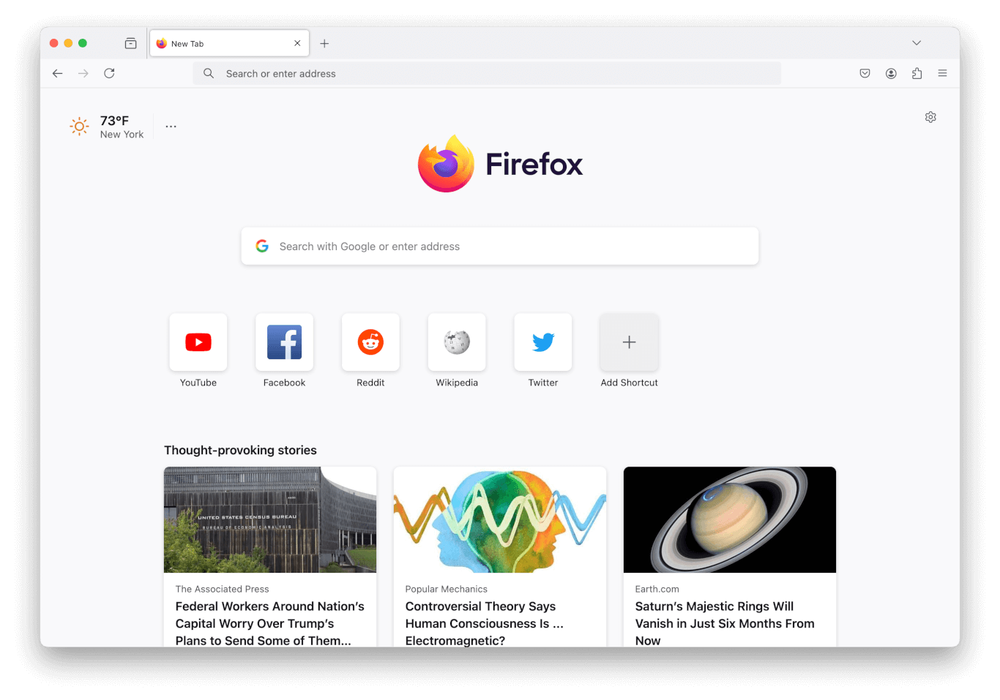
* ウェブページ翻訳にて以下の言語を新たにサポート。
  * カタロニア語、クロアチア語、チェコ語、デンマーク語、インドネシア語、ラトビア語、リトアニア語、ルーマニア語、セルビア語、スロバキア語、ベトナム語（Firefox 130）
  * スウェーデン語（Firefox 131）
  * 中国語（簡体）、韓国語、ロシア語（翻訳先のみ）（Firefox 135）
* ドイツ、オーストリア、ベルギー、イタリア、オランダ、スペイン、スイスの各国内の全言語でEcosia[^Ecosia]を利用可能となった。（Firefox 134）
* 米国内のユーザー向けに、順次「新しいタブ」のレイアウトを刷新。（Firefox 134）  
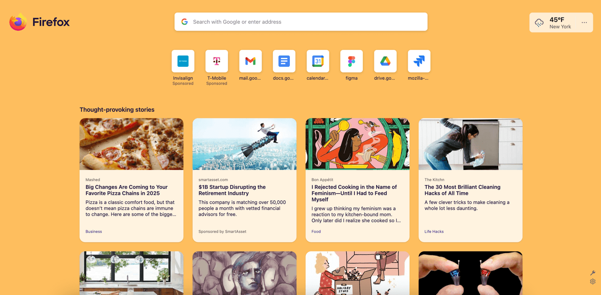
* 刷新した「新しいタブ」のレイアウトをStoriesが利用可能な全ての国のユーザーに適用。（Firefox 135）  
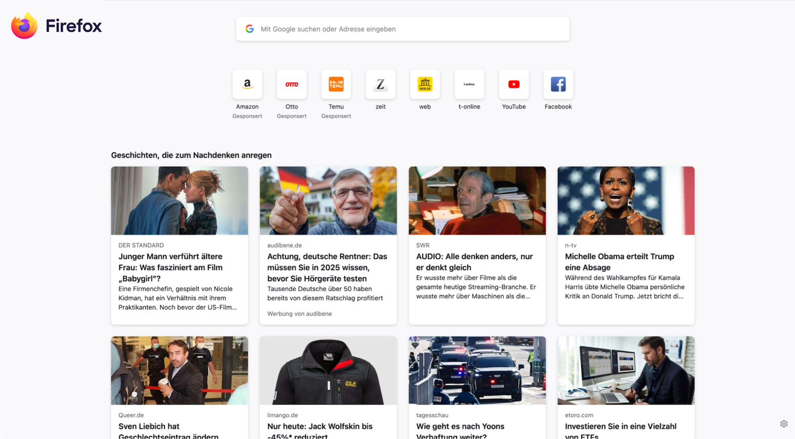
* クレジットカード情報の自動入力機能[^credit-card-autofill]を順次サポート。（Firefox 135）

[^Ecosia]: https://www.ecosia.org/
[^credit-card-autofill]: https://support.mozilla.org/ja/kb/credit-card-autofill

## macOS固有の改善・変更

* 同一ドキュメント内で複数言語のVoiceOver読み上げをサポート。（Firefox 129）
* Microsoft Entraアカウントでのシングルサインオンをサポート。
  * network.http.microsoft-entra-sso.enabled設定を追加（Firefox 131）
* macOS 15以降でウィンドウ単位の画面共有に対応。（Firefox 132）
* セッション再開機能を改善し、システム再起動前のセッションを自動的に再開始するようになった。（Firefox 132）
* macOSおよびLinuxにおいて、ウィンドウ内に複数のタブが開いてる状態で「終了」のキーボードショートカットを使用した場合、現在のタブのみを閉じるオプションを追加。（Firefox 135）

## Linux固有の改善・変更

* スクロール可能なエリアにおいて、オーバースクロールアニメーションが既定で有効となった。（Firefox 130）
* タッチパッドのホールドジェスチャに対応。2本指を置くことで慣性スクロールを中断できる。（Firefox 134）
* バイナリファイルの提供フォーマットをBZ2形式からXZ形式に変更。（Firefox 135）

## Android固有の改善・変更

* 

-->

以下も非表示

## 現時点で判明している設定シートの変更点

### 追加

* 

### 変更

* 

### 廃止

* 

-->
