# Firefox ESR153のリリーススケジュール

Mozillaのリリースカレンダー[^release-calendar]では、Firefox ESR153のリリース予定は以下の通り記載されています。

[^release-calendar]: https://whattrainisitnow.com/calendar/

|リリース日       |通常版リリースバージョン|ESR版リリースバージョン|備考                |
|-----------------|------------------------|-----------------------|--------------------|
| 2026年6月16日   | Firefox 152            | 140.12                |ESR153ベータ版      |
| 2026年7月21日   | Firefox 153            | 140.13/153.0          |ESR153正式版        |
| 2026年8月18日   | Firefox 154            | 140.14/153.1          |                    |
| 2026年9月15日   | Firefox 155            | 140.15/153.2          |                    |
| 2026年10月13日  | Firefox 156            | 153.3                 |ESR140のサポート終了|
| 2026年11月10日  | Firefox 157            | 153.4                 |                    |
| 2026年12月8日   | Firefox 158            | 153.5                 |                    |
| 2027年1月19日   | Firefox 159            | 153.6                 |                    |

Firefox ESR140のサポートは、2026年10月13日で終了します（以後はセキュリティ更新が提供されません）。

* リリース日は協定世界時 (UTC) を基準としています。日本時間では翌日となる場合があります。
* なお、リリーススケジュールは予告なく変更される可能性があります。

# 法人利用への影響が予想される代表的な変更点

* 

\newpage

# カテゴリごとの変更点

以下に挙げる変更点は、特段の断りがない限り、初期状態で挙動が従来版から変化しており、従来の挙動に戻すことはできません。
初期状態での挙動が従来版からは変化せず、任意の設定変更により新しい挙動を有効化できる物や、初期状態での挙動は変化するものの設定変更で従来の挙動に戻せる物については、個別にその旨を記載しています。

また、新しいWeb標準仕様への対応や他のブラウザーとの互換性の向上などについては、恩恵を受けるためには原則として、Webページ側での明示的な対応が必要です。
あしからずご了承ください。

## タブに関する外観、操作の変更

* 垂直タブ利用時に、サイドバー下部のツール領域のサイズを調整できるようになった。ドラッグして区切り線を下げることで、より多くのタブを表示できる。（Firefox 141）
  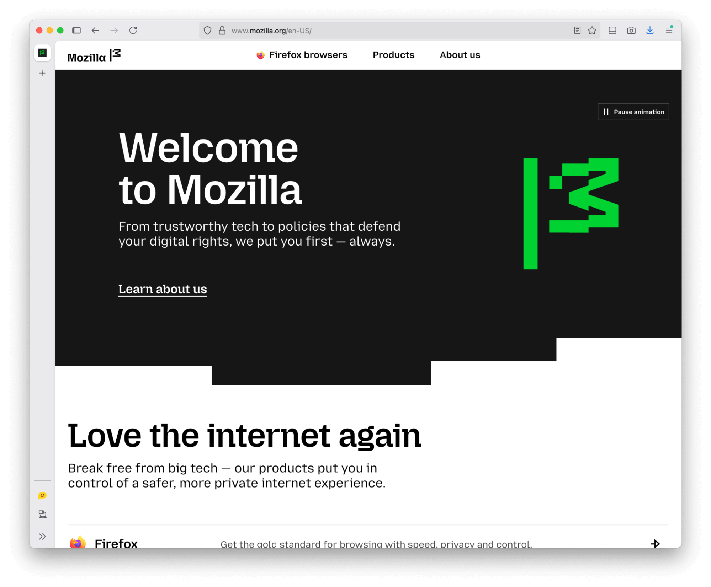
* タブグループが折りたたまれている場合も、アクティブなタブはタブバーに表示されるようになった。（Firefox 142, Firefox 144）
  
* タブバー上の先頭位置にタブをドラッグすることで、タブをピン留めできるようになった。（Firefox 143）
  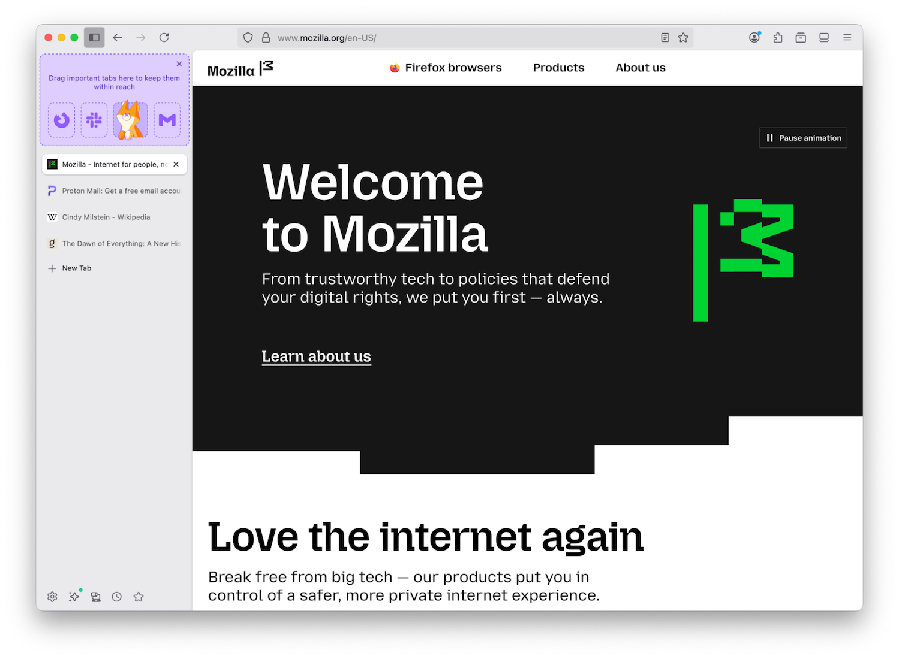
* MicrosoftのCopilotが[サイドバーで利用できるチャットボット](https://support.mozilla.org/ja/kb/ai-chatbot)に追加された。（Firefox 143）
* 折りたたまれたタブグループに対し、展開せずにそのままタブをドラッグできるようになった。（Firefox 144）
  
* タブグループ名の上にマウスカーソルを移動させることで、タブグループを開かずにグループ内のタブのプレビューが表示されるようになった。（Firefox 145）
  
* デスクトップ版の新規タブ用に、ブランドをイメージした新しい壁紙が利用可能となった。ライトモードとダークモード両方のバージョンが用意されている。（Firefox 145）
* 設定により「新しいタブ」に天気予報を表示できるようになった。位置情報の検出を有効にするか、手動で場所を検索するかで選択できる。（Firefox 146より順次導入）
  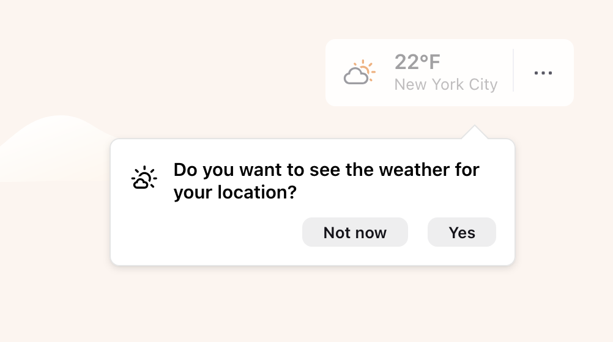
* 既定の「新しいタブ」ページのほか、新しいコンテナタブでも「新しいタブ」に設定した壁紙[^New-tab-wallpapers]が表示されるようになった。（Firefox 148）
* 分割ビュー機能により、1つのウィンドウ内に2つのページを並べて表示できるようになった。同時に2ページを使用した情報比較や調査や作業が簡単にできる。分割ビューを作るには、1つまたは2つのタブを選び「分割ビューを追加」または「分割ビューで開く」を選択する。（Firefox 149）
  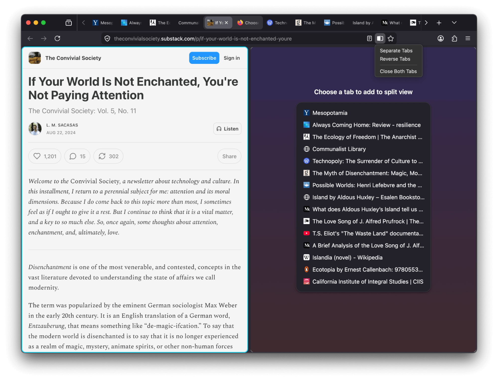
* 実験的な機能として、Firefox Labsにて「タブノート」が利用可能となった。Webページに短い注釈を添えることで、ページを開いた理由や、次の計画、確認したかった詳細事項などを後で開いた時に思い出せる。（Firefox 149）
  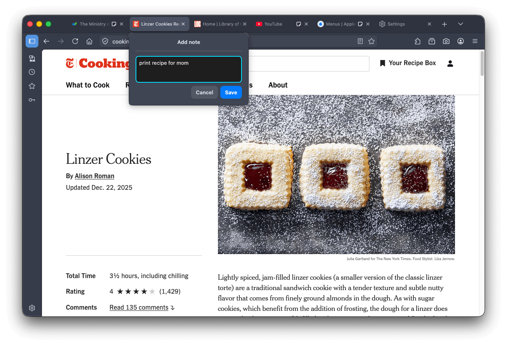
* 分割ビュー[^Split-View]の改善。任意のリンクを右クリックし、「リンクを分割ビューで開く」を選べば現在のタブの隣に並べて開けるようになった。また、分割ビュー作成時に開いているタブを探せるほか、タブのコンテキストメニューに追加された「左右のタブを入れ替える」オプションにより、表示位置を瞬時に入れ替えることもできる。（Firefox 150）
* 複数のタブを1ステップで共有できるようになった。タブを選択後に右クリックし「X 個のリンクをコピー」（Windows, Linux）または、「共有」→「X 個のリンクをコピー」（macOS）を選択する。読みやすさの観点から、リッチテキストをサポートするアプリへは、ページタイトルとURLの両方を貼り付ける。（Firefox 150）
* 設定→一般→タブグループ→「まとめてドラッグしたタブでタブグループを作成する」設定項目により、ドラッグ＆ドロップによるタブグループ作成を無効化できるようになった。タブグループの作成操作をコンテキストメニューからのみにできる。（Firefox 150）

[^New-tab-wallpapers]: https://support.mozilla.org/ja/kb/customize-items-on-firefox-new-tab-page#w_wallpapers
[^Split-View]: https://support.mozilla.org/ja/kb/split-view-firefox

## 外観全般、メニュー構成の変更

* Windows 11での慣例に従い、Windows 11版ではキャプションボタン（ウィンドウ上部のタイトルバー内に配置されたボタン）にシステム提供のフォントアイコン（文字として提供されたアイコン）を使用するようになった。（Firefox 141）
* カメラへのアクセス許可要求時にダイアログ内でプレビュー表示できるようになり、複数のカメラを切り替える際の利便性が向上した。（Firefox 143）
  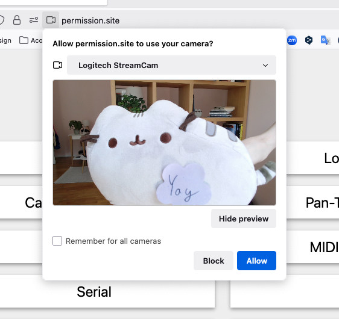
* 画像ファイル上の右クリックメニューに「Google Lens で画像を検索」が追加された（デスクトップ版のみ）。使用時には既定の検索エンジンをGoogleにする必要がある。（Firefox 144より順次導入）
  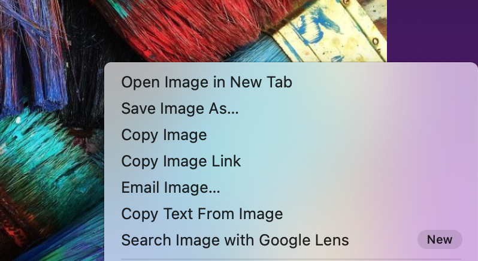
* 保存したパスワードをサイドバーからアクセス・管理できるようになった。新しいタブやウィンドウを開かずにすみ、ページを表示したままより手早くログインできる。（Firefox 145）
  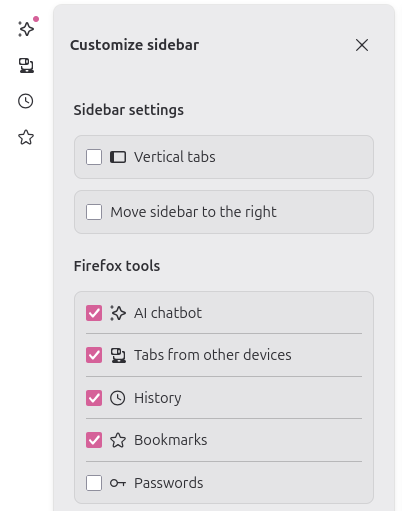
  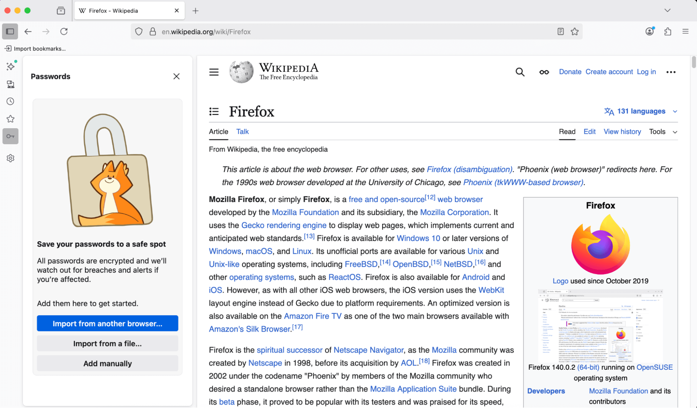
* 右クリックメニューの「選択部分へのリンクをコピー」（Copy Link to Highlight）により、リンクのアンカーが付いていない箇所も含め、ユーザーがページ内で任意に選択した範囲を他者と共有できるようになった。（Firefox 145）
* 「アプリからのリンクを使用中のタブの隣に開く」設定が追加された。メールクライアント等、アプリからの操作でFirefoxのタブが開かれる場面で、従来はタブの末尾に開いていたが、使用中のタブの隣に開けるようになった。（Firefox 145）
  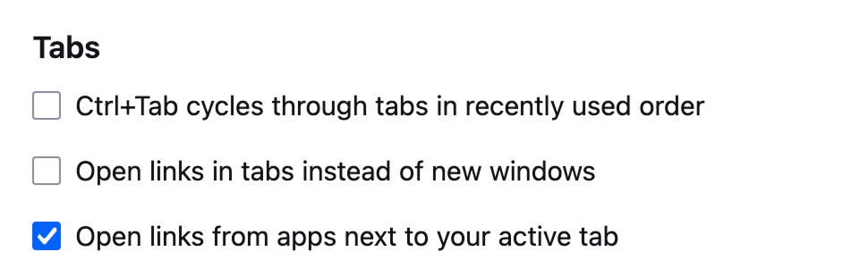
* 拡張機能がインストールされていない場合に「拡張機能」ボタンを押すと、ADD-ONSストアへのリンク付きで、拡張機能の利便性を強調するメッセージを表示するようになった。（Firefox 145）
* `DisableFirefoxStudies`（実験機能への参加可否）や`DisableTelemetry`（テレメトリーの実施可否）の状態にかかわらず、すべてのデスクトップ版ユーザーが「Firefox Labs」[^Firefox-Labs]を利用可能となり、より多くのユーザーが実験的な機能を簡単に試せるようになった。（Firefox 146）  ★Firefox-Labsを無効にする方法を調査する
* 検索結果ページの表示をスキップし、検索バーに入力した検索結果が直接表示されるようになり、より速く簡単なブラウジングを実現。（Firefox 146より順次導入）
  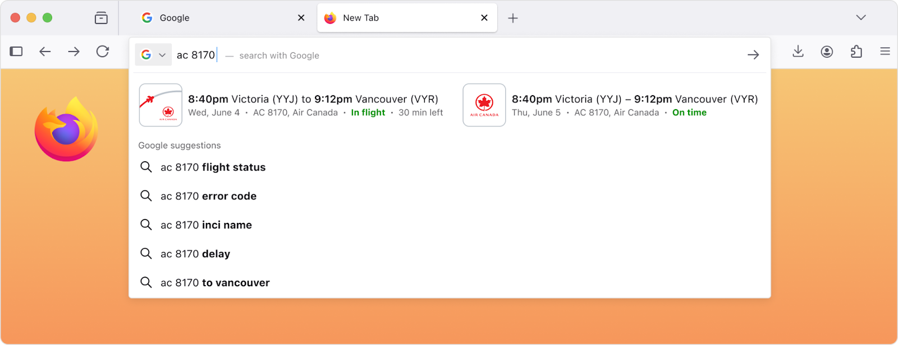
* 設定画面の「配色の管理」のUIを改善し、ラベルの隣に配色のサンプルが保持されるようになった。（Firefox 146）
  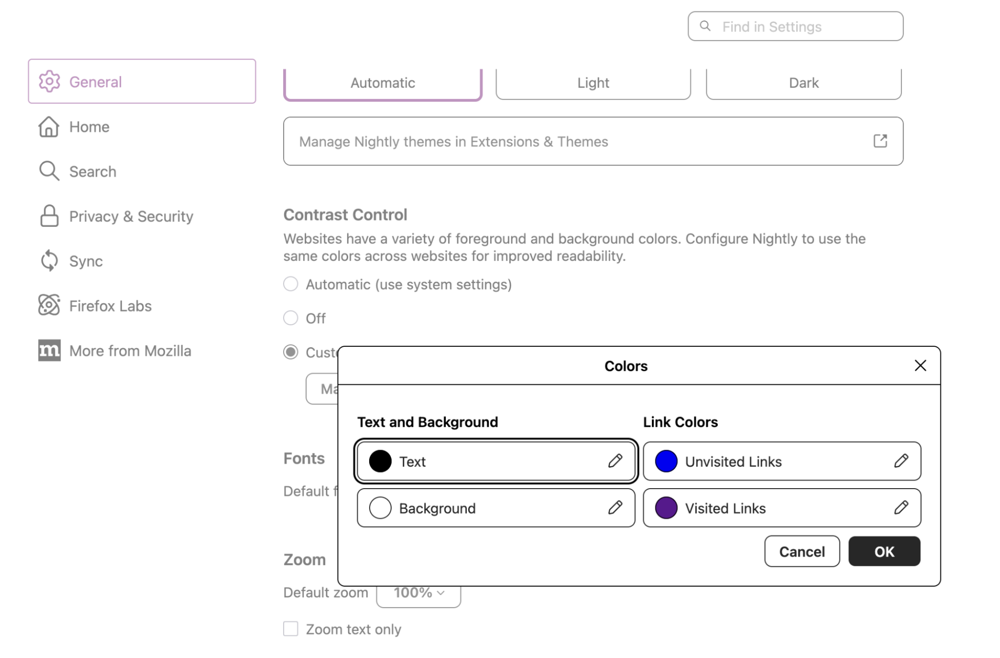
* 設定画面に、AI強化機能を管理するための「AI制御」セクションが追加された[^AI-controls]。（Firefox 148）
  
  * https://support.mozilla.org/ja/kb/firefox-ai-controls
* 「ツールバーをカスタマイズ」[^Customize-toolbar]に「共有」ボタンが追加された。Windows またはmacOSの共有オプションを利用し、現在のタブを簡単に共有できる。（Firefox 149）
* エラーページの表示が、Firefox全体のビジュアルに合うよう刷新された。より統一感のあるユーザーエクスペリエンスを実現し、何が問題だったのかよりわかりやすく表示する。（Firefox 149）
  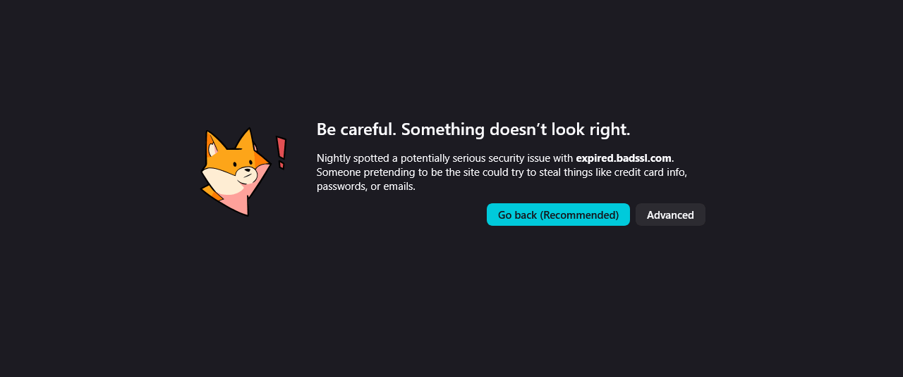
* デスクトップ版の`about:translations`ページでリアルタイムのプライベート翻訳をサポート。アドレスバーに`translate`と入力することでもページへ遷移できる。（Firefox 150）
  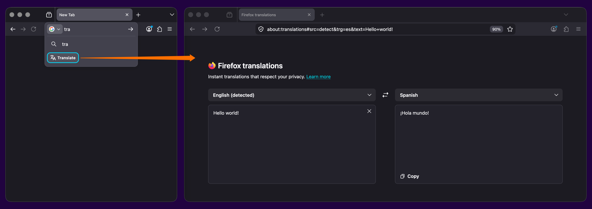
* 新しいプロファイル管理システムを利用するWindows 10、Windows 11ユーザーについても、設定→同期→バックアップ を有効にすることでプロファイルがファイルにバックアップ[^Firefox-Backup]されるようになった。（Firefox 150）
* メニューの「その他のツール」セクションから`about:translations`ページへアクセスできるようになった。（Firefox 151 beta）
* 「設定」（`about:preferences`）内の検索バー（設定を検索）欄が大きくなり、カラム全体に表示されるようになった。設定内の検索がより簡単となった。（Firefox 151beta）
* Windows版において、位置情報の利用時にWindowsの許可設定を尊重するようになった。以前のように許可設定を上書きするのでなく、必要に応じて、FirefoxはユーザーにWindowsのアクセス許可を有効にするよう求める。（Firefox 151beta）
* デスクトップ版において、プロファイルディレクトリのマシン内または別マシンへの移動・復元後に、インストールされた拡張機能とテーマが正常に復元されるようになった。（Firefox 151beta）
* キーボードまたはマウスによるWebサイト表示のズーム機能において、変更される表示倍率の段階がより多く、細かくなった。（Firefox 152.0a1Nightly）

[^Firefox-Labs]: https://support.mozilla.org/ja/kb/firefox-labs-explore-experimental-features-firefox
[^AI-controls]: https://blog.mozilla.org/en/firefox/ai-controls/
[^Customize-toolbar]: https://support.mozilla.org/ja/kb/customize-firefox-controls-buttons-and-toolbars
[^Firefox-Backup]: https://support.mozilla.org/ja/kb/firefox-backup

## アドレスバー

* アドレスバー上で単位変換できるようになった。[^Unit-conversion] 長さ、温度、質量、力、角度およびタイムゾーンをサポートしている。電卓機能と同様に、結果をクリックすることでクリップボードへのコピーも可能。（Firefox 141）
  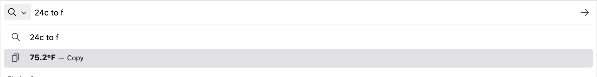 
* Windows版Firefoxで、Webページをタスクバーに直接ピン留めすることで、Webアプリとして実行できるようになった。対応ページには、アドレスバー上に「タブをタスクバーに追加します」アイコンが表示される。詳細は[Windows の Firefox でウェブアプリを使う](https://support.mozilla.org/ja/kb/web-apps-firefox-windows)を参照。（Firefox 143）
* デスクトップ版に、AI搭載の回答エンジンである「Perplexity」を組み込み。複雑な質問にも会話形式で回答し、複数のソースを探さずにすむ。既定の検索エンジンに指定するか、アドレスバーに`@perplexity`と入力することで利用できる。（Firefox 144より順次導入）
* 実験的な機能として、キーボードショートカットのカスタマイズが可能となった。入力しにくい、または覚えにくいホットキーの置き換えや、他のソフトウェアとの競合の解消、好みのショートカットセットの作成などができる。アドレスバーに`about:keyboard`を入力すると設定画面が表示される。（Firefox 147）
* `TrustPanel`（アドレスバー左側のアイコンクリック時に表示される情報パネル）にアドレスバーからアクセスする「プライバシーとセキュリティ」パネルを統合し、ユーザーが現在のページのプライバシーとセキュリティの設定を1か所で確認できるようにした。（Firefox 149）
  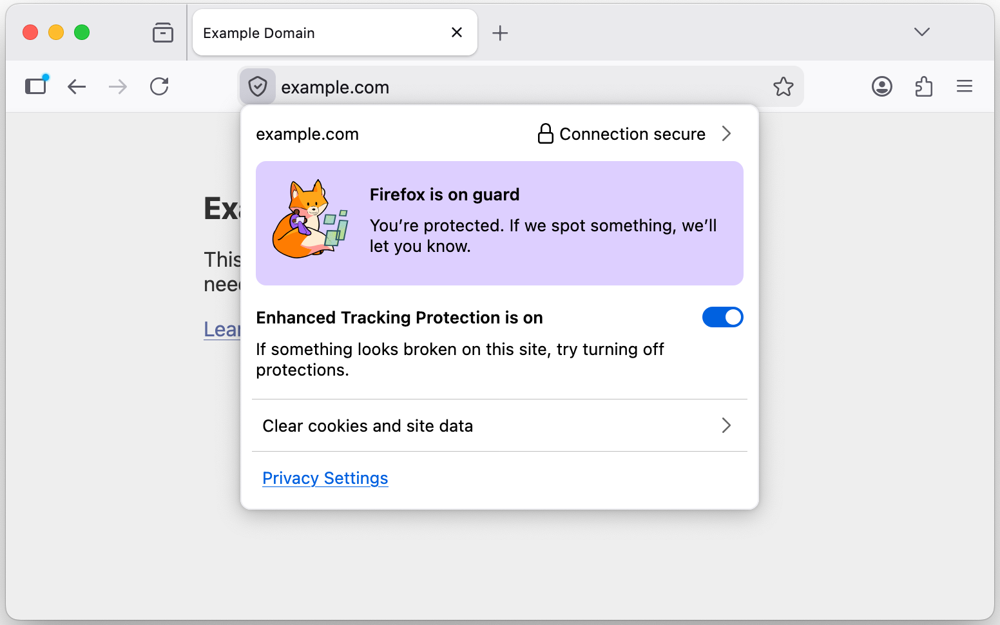
  * 詳細：https://support.mozilla.org/ja/kb/how-do-i-tell-if-my-connection-is-secure
* ユーザーの閲覧傾向に基づき、よくアクセスするページ（サイトのホームページだけでなく、サイト内の特定のページも含む）を自動補完し、不要な候補を非表示にすることもできるようになった。（Firefox 152.0a1Nightly）
* アドレスバーに「mute」（または「shush」または「sssh」）と入力し、アドレスバーのクイックアクションを使用することで、ブラウザの音声をミュートできるようになった。この操作により、すべてのFirefoxウィンドウで音声再生中のタブの音声が一括でミュートされる。（Firefox 152.0a1Nightly）

[^Unit-conversion]: https://support.mozilla.org/ja/kb/solve-math-calculations-directly-your-firefox-addr

## セキュリティ・プライバシー保護

* 日本の住所自動入力[^Address-autofill]に対応。（Firefox 141）
  [フォーム上で住所を自動入力する](https://support.mozilla.org/ja/kb/automatically-fill-your-address-forms)
* リンク先のプレビュー機能により、訪問前にリンク先の情報を参照できるようになった。リンクの長押し、または右クリックメニューの「リンク先をプレビュー」によりプレビューが表示される。利用可能なRAM容量が3GB以上のユーザーに対し適用。（Firefox 142より順次導入）
* 強化型トラッキング防止機能（ETP）の「厳格」モードで例外リストをサポート。トラッカー遮断によるサイトの動作の問題を修正できるようになった。例外リストは「ベースライン（中核的な機能）」と「便利機能（付随する機能）」に別れており、プライバシー保護機能の基幹部分を損なうことなく、サイト互換性の改善をユーザーが選択できる。参考：[強化型トラッキング防止の例外を管理する](https://support.mozilla.org/ja/kb/manage-enhanced-tracking-protection-exceptions)、[サイトの表示が崩れた場合にするべきこと](https://support.mozilla.org/ja/kb/enhanced-tracking-protection-firefox-desktop?as=u&utm_source=inproduct#w_what-to-do-if-a-site-seems-broken)
（Firefox 142）
* フィンガープリント採取防止機能を拡充し、ユーザーのコンピュータに関する特定の属性について、採取の試みに対し定数値を報告するようになった。詳細は[Firefoxのフィンガープリント採取防止機能](https://support.mozilla.org/ja/kb/firefox-protection-against-fingerprinting#w_suspected-fingerprinters)を参照。（Firefox 143）
* 「プロファイルを管理」機能[^Profile-management]の全世界への展開。「仕事」「学校」「休暇の計画」といった任意の用途別にプロファイルを分けることで、ブックマーク、タブ、閲覧履歴の各情報を完全に分けて保存できるため、プライバシーの保護に役立つ。プロファイルには任意の名称を付けられるほか、アバターやテーマをカスタマイズでき、簡単に識別と切り替えができる。詳細は[Firefoxのプロファイルを管理する](https://support.mozilla.org/ja/kb/profile-management)を参照。（Firefox 144より順次導入）
  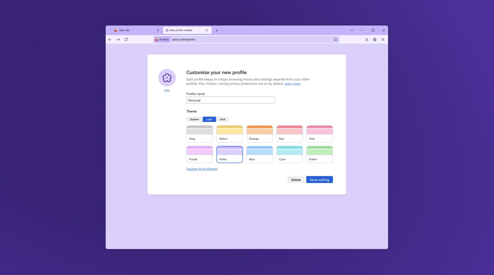
  * Windows 10版を含め全ユーザーが利用可能となった。（Firefox 150）
* 強化型トラッキング防止機能（ETP）の「厳格」モード利用時にローカルネットワークへのアクセス制限が既定で有効となった。外部のWebサイトがローカルネットワークリソースへアクセスする場合、Firefoxはユーザーに明示的な許可を求める。（Firefox 147より順次導入）
  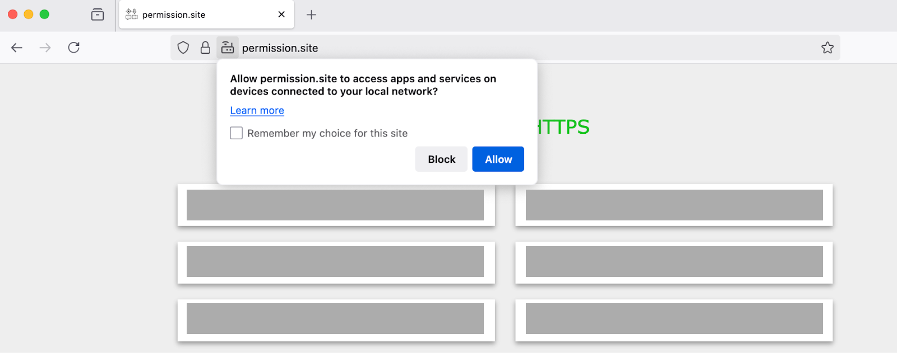
  * [Firefox での個人のデバイスとローカルネットワークの権限の制御](https://support.mozilla.org/ja/kb/control-personal-device-local-network-permissions-firefox)
* ローカルネットワークへのアクセス制限機能を順次サポート。Webサイトがローカルネットワーク上のデバイスやデバイス上のアプリおよびサービスに接続する前に、許可を求める必要がある。従来この機能は強化型トラッキング防止機能を「厳格」に設定しているユーザーに限定されていた。（Firefox 151betaより順次導入）
* リモート改善設定（「更新間で Firefox の機能、パフォーマンス、安定性の向上を許可する」）[^Remote-improvements]をテレメトリー項目（「技術データと対話データをMozillaに送信する」）から分離した。テレメトリーデータの共有や実験的研究への参加をしていなくても、リモートブラウザの変更情報を受け取れるように設定できる。（Firefox 148）

* SafeBrowsing（詐欺コンテンツと危険なソフトウェアからの保護）により悪質と判定されたWebサイトに対して、通知を自動的にブロックし、アクセス許可を永久に取り消すようになった。この機能により、安全でないサイトによるバックグラウンド通知の送信を遮断し、広告、スパム、フィッシング利用を予防する。（Firefox 149）
* Webサイトに位置情報の使用許可を与える際、Windowsの設定で位置情報へのアクセスが許可されていない場合は有効にするよう促すようになった。この挙動は、以前は一部のWindows11バージョンに限定されていたが、サポートするすべてのWindowsバージョンに適用される。（Firefox 150）
* プライベートブラウジングモードに新しいプライバシー機能が追加された。ブラウザ全体を閉じなくても、現在のプライベートセッションからすべてのデータを即座に消去できる。（Firefox 151beta）
* 強化型トラッキング防止機能「標準」のフィンガープリンティング保護機能が強化された。コンピュータに関する情報の開示量を抑え、Webサイトをまたいでユーザーを追跡しようとする試みを制限する。（Firefox 151beta）

[^Address-autofill]: https://support.mozilla.org/en-US/kb/automatically-fill-your-address-web-forms
[^new-phase-of-privacy-protections]: https://blog.mozilla.org/en/firefox/fingerprinting-protections/
[^enhanced-tracking-protection]: https://support.mozilla.org/ja/kb/enhanced-tracking-protection-firefox-desktop

## ネットワーク接続

* 無料で利用できる内蔵VPNを提供[^built-in-VPN]。旅行中に公共のWi-Fiを利用する、機密性の高い健康情報を検索する、個人的な買い物をする、といったケースで簡単に安全を確保できる。ログイン後に機能を有効にすることで、Firefoxでの閲覧時に安全なプロキシー経由で通信し、位置情報とIPアドレスを隠蔽できる。月間50GBまで利用でき、特定のWebサイトでの有効無効の切り替えも可能。米国、英国、ドイツ、フランスにて順次展開中。（Firefox 149より順次導入）
  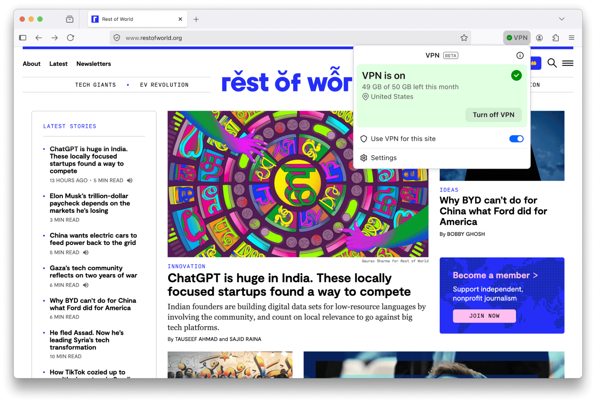
  * **法人向けの注記** 本機能は法人環境は利用不可であり、ポリシー制御を利用するユーザーへは提供されない。手動での有効化は可能だが、4月7日より、管理者はポリシー設定により無効化できる。また`BlockAboutConfig`ポリシーにより、手動での有効化も禁止できる。
  * カナダでも利用可能となった。（Firefox 150）  ★153の状況を確認＆抑止方法の調査

[^built-in-VPN]: https://support.mozilla.org/ja/kb/built-in-vpn

## ファイルのダウンロード

* プライベートブラウジングモードでファイルをダウンロードした際に、セッション終了後にファイルを保持するか削除するかを聞くようになった。この挙動は設定により変更可能。（Firefox 143）
  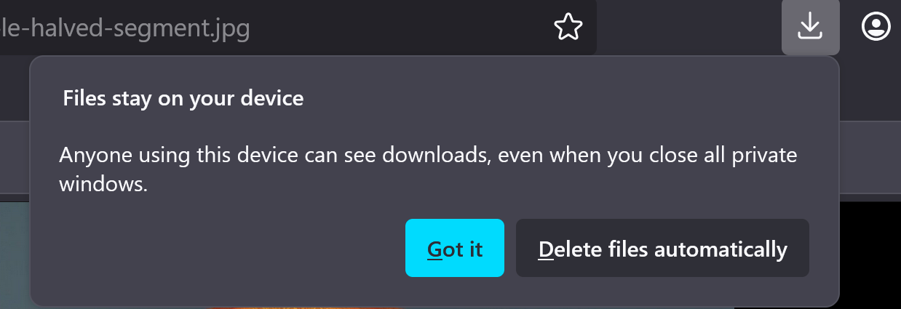
  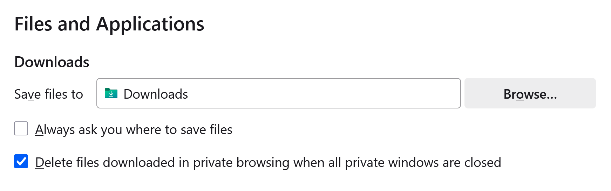

## インストール・更新

* 大半のWindowsユーザーについて、既存のFirefox起動用のショートカットが、デスクトップランチャー（インストール済みの場合はFirefoxを起動し、未インストールの場合はFirefoxのインストールを促すプログラム）に置き換わった。これにより、新しいWindowsデバイスにFirefoxがデフォルトではインストールされていないが、OneDriveなどのクラウドストレージを介してデスクトップランチャープログラムが同期されている可能性がある場合、インストールが簡単となる。（Firefox 145）
参考 https://support.mozilla.org/ja/kb/firefox-desktop-launcher  ★従来に戻す（無効化する）方法があるかを調べる

## 内蔵PDFビューワー

* PDFファイル内に、ユーザーの注釈（要約・質問・タスクなど）としてコメントを作成・編集・削除できるようになった[^Comment-in-PDFs]。コメントサイドバーにすべてのコメントが表示され目的のコメントにジャンプできるようになっており、長文のPDFや書き込みの多いPDFの場合に便利である。（Firefox 145）
  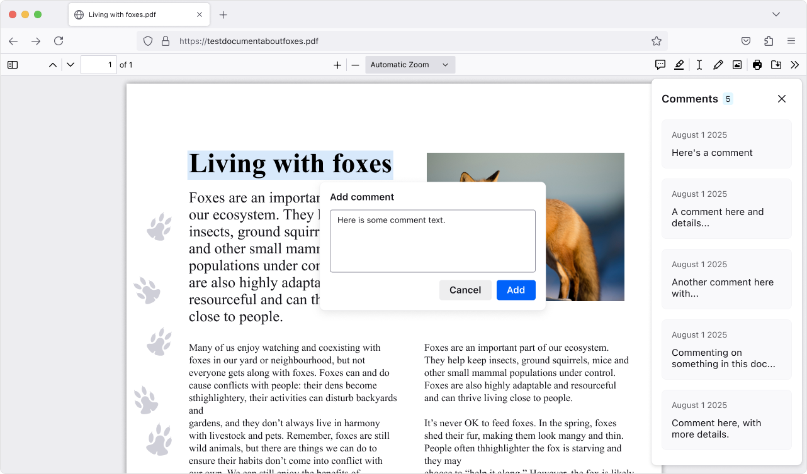
* PDF内の数式の読み上げ機能が改善された。[^Implications-for-PDF-viewers]（Firefox 148）
* PDF編集機能[^built-in-PDF-editor]をサポート。ページ単位で、並べ替え、コピー、ペースト、削除、エクスポートができる。（Firefox 150）
* 複数のPDFファイルを内蔵ビューワーで直接1つのファイルに結合できるようになった。（Firefox 151beta）

[^Comment-in-PDFs]: https://support.mozilla.org/ja/kb/view-pdf-files-firefox-or-choose-another-viewer#w_pdf-huairunokomento
[^Implications-for-PDF-viewers]: https://pdfa.org/accessible-math-in-pdf-finally/#:~:text=Implications%20for%20PDF%20viewers
[^built-in-PDF-editor]: https://support.mozilla.org/ja/kb/view-pdf-files-firefox-or-choose-another-viewer

## 動画・音声・音楽再生

* Windows 11 22H2+、macOS、Android 9+でxHE-AACオーディオ再生をサポート。（Firefox 143）
* 動画を一時停止させずに、ピクチャーインピクチャー[^Picture-in-picture]のウィンドウを閉じることができるようになった。「閉じる」ボタン上でのShift + クリックか`Shift + Esc`押下により、再生を続けたまま閉じられる。（Firefox 144）
* 「タブを切り替えた時、再生中の動画をピクチャーインピクチャーモードにする」設定が追加され、タブで再生中の動画がバックグラウンドに移行した際、ピクチャーインピクチャーの再生ウィンドウを自動的に開けるようになった。（Firefox 147）
  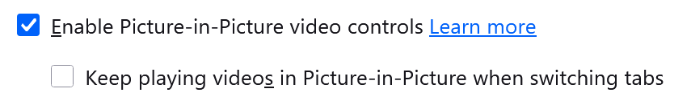
* 再生、一時停止、全画面表示、ミュート、ループなどの動画再生制御が、右クリックメニューからできるようになった。従来カスタム動画プレーヤーによってアクセスが制限されていたInstagramやTikTokなどのサイトでも利用可能。（Firefox 152.0a1Nightly）

[^Picture-in-picture]: https://support.mozilla.org/ja/kb/about-picture-picture-firefox

## レガシーな仕様への対応終了、機能の廃止

* 互換性の観点から`FirefoxHome`ポリシー[^FirefoxHome]に`Pocket`関連設定が復活した。また、`Pocket`の代替として`Stories`設定が追加された。（Firefox 141）  ★実態を調べる
* Windows版でのDirect2Dサポートを終了。（Firefox 146）

[^FirefoxHome]: https://mozilla.github.io/policy-templates/#firefoxhome

<!--純粋なユーザー体験向上のため、説明を省略
## その他、Web技術への対応の改善

* グリッドアルゴリズムを更新し、CSS Grid仕様との整合性を高めた。行サイズにパーセンテージを使用するグリッドレイアウトや、アスペクト比を持つ要素（画像など）を含むアイテムが、より多くのケースで正しく表示されるようになった。（Firefox 143）
* `<input type=color>`が、従来のhex形式（`#ffffff`）に加え、CSSの`<color>`形式を認識するようになった。現在のところ、入力値はすべてhex形式に変換される。（Firefox 143）
* `
`要素に`display`プロパティが設定できない制限が解除された。あわせて展開/折りたたみ可能なコンテンツを設定するための`::details-content`擬似要素が追加された。（Firefox 143）
* パスワードマネージャーに保存されたログイン情報のディスク上での暗号化方式を、3DES-CBCからよりモダンなAES-256-CBCに変更した。Firefox Syncを利用したログイン情報については、既にAES-256-GCMを使用している。（Firefox 144）
* ハードウェアアクセラレーションにより、PDFファイルのロードが大幅に高速化された。（Firefox 149）
* 親プロセスでロードできるJavaScriptファイルの要件を厳格化することでセキュリティを強化し、潜在的な脅威に対する防御をさらに強固にした。（Firefox 149）
* Windows版での位置情報処理にWindows 7のlocation APIに代わってモダンな`Windows.Devices.Geolocation`APIを使用するようになった。（Firefox 149）

-->
## その他、法人運用への影響度が低いと思われる変更

* Windows UI Automationをサポートし、Windows Voice Access、Text Cursor Indicator、Narratorといったアクセシビリティツールの使い勝手が向上した。（Firefox 143より順次導入）
* Windows版で他のアプリケーションからリンクを開いた際、現在の仮想デスクトップ上のウィンドウか、もしくは必要に応じて新しいウィンドウのみを使用するように変更された。（Firefox 144）
* 書字方向の異なる言語間での翻訳機能が改善された。（Firefox 145）
  
* フィンガープリンティング削減の研究成果に基づき、プライバシー保護機能[^new-phase-of-privacy-protections]をさらに向上させた。プライベートブラウジングモードか、強化型トラッキング防止機能（ETP）の「厳格」モードを利用することで、ユニークなユーザーと特定される比率がほぼ半減し、より安全でプライバシーの守られたブラウジングとなる。（Firefox 145）
* Bounce Tracking（中間サイトを介したトラッキング）を防御する機能を強化し、強化型トラッキング防止機能[^enhanced-tracking-protection]の「厳格」モードにて「ステートレス」モードを既定で有効とした。トラッカーにステート（状態）を持たさないことで、より進化したトラッキング手法をブロックするようになった。（Firefox 145）
* Safe Browsing V5 プロトコルをサポート[^Safe-Browsing-V5-protocol]し、Safe Browsing V4プロトコルをV5のLocal Listモード[^local-list-mode]へ移行中。（Firfox 147）
* Freedesktop.orgの「XDG Base Directory Specification[^XDG-Base-Directory-Specification]」に対応。設定やキャッシュをXDGの定める場所に保存するようになった。（Firefox 147）
* Unicode ICUライブラリをリリース78[^ICU-release78]に更新し、Unicode 17[^unicode17]および新規ロケールをサポート。（Firefox 147）
* Windows10版、Windows11版FirefoxでAMDおよびNVIDIA製GPUを搭載したHDRディスプレイで高ダイナミックレンジ（HDR）ビデオをサポート（現時点ではIntel+NVIDIA搭載ノートPCは対象外）。さらに多数のGPUベンダーで利用できるよう開発中。Windowsの設定画面で該当ディスプレイのHDRモードが有効になっていることを確認する。他のブラウザよりもHDRビデオが明るく表示される場合がありますが、今後のリリースで改善される予定。また、パフォーマンスの最適化も行われる。(Firefox 151beta)

[^Safe-Browsing-V5-protocol]: https://developers.google.com/safe-browsing/reference?hl=ja
[^local-list-mode]: https://developers.google.com/safe-browsing/reference/Local.List.Mode?hl=ja
[^XDG-Base-Directory-Specification]: https://specifications.freedesktop.org/basedir/latest/
[^ICU-release78]: https://github.com/unicode-org/icu/releases/tag/release-78.1
[^unicode17]: https://blog.unicode.org/2025/09/unicode-170-release-announcement.html
[^Remote-improvements]: https://support.mozilla.org/ja/kb/remote-improvements

<!--
以下、ブラウザーとしての使い勝手には影響しないため非表示

## その他のパフォーマンス・利便性の向上

* Windowsにおいて、Firefox終了時または再起動中に永続的な通知（ユーザーが確認するまで残る通知）をクリックすると、当該Webサイトのメインページではなく対象のページを正しく表示するように改善された。（Firefox 142）
* サイドバーに配置した拡張機能を、アイコンの右クリックメニューから「サイドバーから削除する」を選択して削除できるようになった。（Firefox 142）
* アドレスバーでの閲覧履歴の検索結果表示を改善し、重複した内容が表示される確率を減らした。（Firefox 142）
* Netmonitorを改善し、リクエストの完了前にNetworkパネル内にヘッダー/Cookie/パラメータが表示されるようになった。（Firefox 142）
* 垂直タブの外観と揃えるため、水平タブをわずかに丸みを持たせた形状に修正した。ボタン、テキスト入力欄、アドレスバーについても同様に微修正した。（Firefox 145）
* ローカル翻訳モデルを「zstd」圧縮するようになり、ダウンロードサイズおよびストレージ使用量を削減した。 https://en.wikipedia.org/wiki/Zstd
  * Firefox内蔵の翻訳機能は、Webサービスに依存せず端末上で実行されるため、機密情報やプライバシー情報の漏洩の恐れがありません。
* 自動化に関する既定値を更新し、エージェントによるタスク完遂までのステップや、途中で行き詰まる可能性を削減した。（Firefox 145）
* バックアップを有効にすることで、Windows 10ユーザーもパスワード、ブックマーク等が自動的に保護されるようになった。ブラウジングデータは、パスワードにより暗号化されデバイス内に日次で保存される。新規または既存のデバイスにFirefoxを新規インストールする際、そのOSに関わらず、バックアップから復元することで中断したところから作業を再開できる。現時点でWindowsデバイスでのみ有効だが、他のOSでも順次導入予定。（Firefox 146より順次導入）
  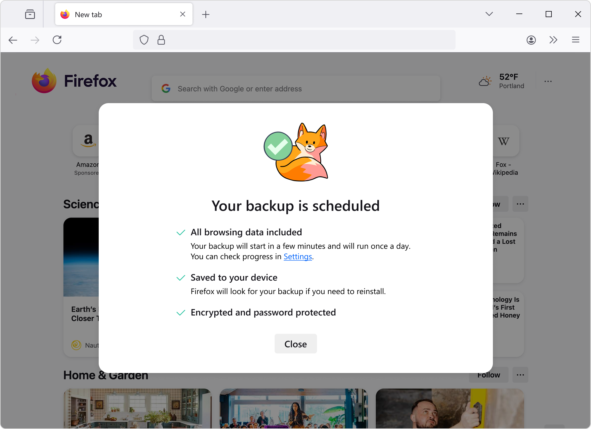
* 法人向けFirefoxサポートの提供を開始。（Firefox 146）   https://blog.mozilla.org/en/firefox/firefox-support-for-organizations/
* AMD製GPU搭載システムにおける動画再生性能の向上。ハードウェアデコードされたビデオのゼロコピー再生（対応している場合）を可能にすることで、IntelおよびNVIDIA製GPU搭載システムと同等の性能を実現した。（Firefox 147）
* Accept-Languageヘッダーで、他の主要ブラウザと同様の品質値（q値）を使用するようになった。第二言語の値はq=0.5に代わりq=0.9として送信され、以降言語ごとに0.1ずつ減少する（最小値は0.1）。この変更により、品質値が低いリクエストを誤って拒否していた一部のサーバーとの互換性の問題が解決される。（Firefox 147）
* サービスワーカー内でESモジュールをサポートし、他の主要ブラウザーと挙動を合わせ、モダンなWebアプリの互換性を向上させた。（Firefox 147）
* Firefox終了時に履歴をクリアする機能（Firefox を閉じる度に Cookie とサイトデータを削除する）を利用しているWindows 10ユーザーもバックアップ機能を利用できるようになった[^Firefox-Backup]。Firefoxを閉じるとき削除する設定のデータはバックアップに含まれない。（Firefox 148）
* `about:blank`の初期ドキュメントがWeb対応した。`about:blank`に移動したブラウジングコンテキストの最初のナビゲーションは同期的に完了し、2番目のパーサー生成ドキュメントに置き換えられることはなくなる。（Firefox 148）
* MicrosoftストアからFirefoxをインストールしたユーザーも[Windows の Firefox でウェブアプリを使う](https://support.mozilla.org/ja/kb/web-apps-firefox-windows)が利用できるようになった。（Firefox 150）
* JavaScriptコンパイル結果をメモリ上にキャッシュし、同じドメイン内のナビゲーション間で共有することで、ページ読み込みパフォーマンスを向上させた。このキャッシュは既存のスタイルシートおよび画像用メモリ内キャッシュと同様の仕組みで動作する。そのため、DevTools、WebDriver、`webRequest`や`declarativeNetRequest`などのWebExtensions APIに対し、キャッシュされたリクエスト/レスポンスの処理方法に影響を与える可能性がある。（Firefox 152.0a1Nightly）
* マルチモニター環境において「Firefoxについて」ウィンドウを開く際、より確実に最後にFirefoxウィンドウを表示していたディスプレイで開くようになった。（Firefox 152.0a1Nightly）

## その他の安定性の向上

* ブックマークダイアログのスクロール速度の向上。（Firefox 142）
* blobイメージのドラッグ＆ドロップサポートの改善。（Firefox 142）

## 開発者向け機能

* `Preferences`ポリシー[^Prefernces]の更新により以下が設定可能となった。
  * `mathml.disabled`, `svg.context-properties.content.enabled`, `svg.disabled`, `webgl.disabled`, `webgl.force-enabled`, `xpinstall.enabled`, `security.csp.reporting.enabled`（Firefox 141）
  * `privacy.baselineFingerprintingProtection`または`privacy.fingerprintingProtection` で始まるもの（Firefox 141）
  * `security.webauthn.always_allow_direct_attestation`（Firefox 144）
* `Permissions`ポリシー[^Permissions]の更新により画面共有の許可を制御可能となった。（Firefox 142） 
* `EnableTrackingProtection`ポリシー[^EnableTrackingProtection]の更新により以下が可能となった。（Firefox 142）
  * 「厳格（strict）」または「標準（standard）」のカテゴリー設定
  * 「疑わしいフィンガープリント採取」の抑止
* 拡張機能向けにwllama APIをサポート。（Firefox 142）
* デバッガーに「一時停止中のオーバーレイを表示」設定を追加。（Firefox 142）
  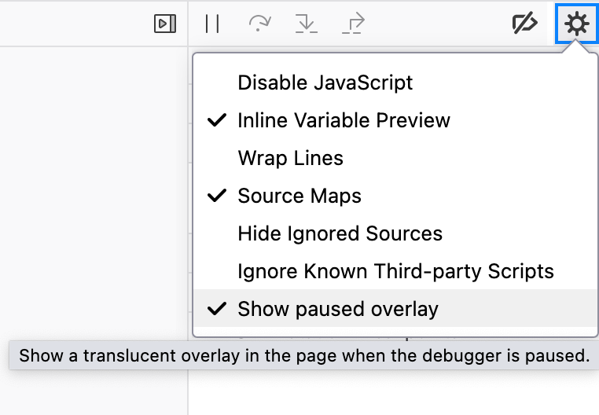
* 以下のAPIをサポート。（Firefox 142）
  * [Prioritized Task Scheduling API](https://developer.mozilla.org/en-US/docs/Web/API/Prioritized_Task_Scheduling_API)
  * [Selection.getComposedRanges() API](https://developer.mozilla.org/en-US/docs/Web/API/Selection/getComposedRanges)
  * [URLPattern API](https://developer.mozilla.org/ja/docs/Web/API/URLPattern)
* `GenerativeAI`ポリシー[^GenerativeAI]を追加。ESRで適用可能なオプションは`chatbot`のみ。（Firefox 144）
* （ESRは適用対象外）`VisualSearchEnabled`ポリシー[^VisualSearchEnabled]を追加。（Firefox 144）
* スタイルルールの｀var()｀関数内から、CSS カスタムプロパティの定義にジャンプできるようになった。（Firefox 144）
* インスペクターのイベントツールチップにおいて、カスタムイベントの横にバッジが表示されるようになり、組み込みイベントとの区別が容易になった。（Firefox 144）
* 以下をサポート。（Firefox 144）
  * [Element.movebefore API](https://developer.mozilla.org/ja/docs/Web/API/Element/moveBefore)
  * [math-shift compact](https://developer.mozilla.org/ja/docs/Web/CSS/Reference/Properties/math-shift#compact)
  * [PerformanceEventTiming.interactionId](https://developer.mozilla.org/ja/docs/Web/API/PerformanceEventTiming/interactionId)。入力イベントをグループ化できる。これにより、インタラクションから次のペイントまでの応答性（[INP](https://developer.mozilla.org/en-US/docs/Glossary/Interaction_to_next_paint)）指標のサポートが可能となった
  * ｀command｀および`commandfor`属性
  * [View Transitions API](https://developer.mozilla.org/ja/docs/Web/API/View_Transition_API)レベル1。異なるウェブサイトのビュー間のアニメーション遷移を簡単に作成するための仕組みを提供する
  * ハードウェアWebRenderを使用して[linear-gradient](https://developer.mozilla.org/docs/Web/CSS/gradient/linear-gradient)、[conic-gradient](https://developer.mozilla.org/docs/Web/CSS/gradient/conic-gradient)、[radial-gradient](https://developer.mozilla.org/docs/Web/CSS/gradient/radial-gradient)の各関数をレンダリングする場合、ディザリングの適用
  * [upsert proposal](https://github.com/tc39/proposal-upsert)。MapとWeakMapにgetOrInsert、getOrInsertComputedメソッドが追加される。これらはキーに関連付けられた値か、挿入したデフォルト値を返すため、キーが既に存在するか不明な場合の処理​​が簡素化される。
  * [RTCDataChannel](https://developer.mozilla.org/ja/docs/Web/API/RTCDataChannel)用の[worker transfer](https://developer.mozilla.org/ja/docs/Web/API/Web_Workers_API/Transferable_objects)
  * [getUserMedia](https://developer.mozilla.org/ja/docs/Web/API/MediaDevices/getUserMedia)の`resizeMode`制約。カメラから取り込んだ動画を任意の解像度にトリミング、縮小できる。
  * Windows版WebGPU[^WebGPU]の[GPUDevice.importExternalTexture API](https://developer.mozilla.org/en-US/docs/Web/API/GPUDevice/importExternalTexture)
* Windows版[WebCodecs](https://developer.mozilla.org/en-US/docs/Web/API/WebCodecs_API)にVideoEncoder用のバッチエンコードパスが追加された。デフォルトのバッチサイズが大きくなったことで、スループットの向上と送信遅延の低減によりパフォーマンスが向上した。（Firefox 144）
* Gecko固有の`CSS2Properties`が`CSSStyleProperties`に名称変更された。最新のWeb標準に準拠し、他のブラウザエンジンとの相互運用性を向上させる。（Firfox 144）
* `GenerativeAI`ポリシーにすべての生成 AI 機能を有効化または無効化するオプションが追加された。（Firefox 145）
* （ESRは適用対象外）`EnableTrackingProtection`ポリシーが厳格モードの場合に BaselineExceptions と ConvenienceExceptions が設定可能となった。（Firefox 145）
* `<input type="time">`および`<input type="datetime-local">`でタイムピッカーが有効化されているとき、キーボードおよび補助入力機能を全面的にサポートするようになった。（Firefox 146）
* （ESRは適用対象外）Windows のアンインストール用レジストリキーからバージョン番号、アーキテクチャ、言語が削除された。（Firefox 146）
* `BrowserDataBackup`ポリシー[^BrowserDataBackup]を追加。プロファイルのバックアップと復元を有効または無効にする。（Firefox 146）
* ポスト量子鍵交換アルゴリズム（量子コンピューターの登場後も安全に鍵交換を行うための仕組み）として、WebRTCにおけるML-KEMをサポート。DTLS 1.3ハンドシェイク中にポスト量子（PQ）鍵共有を送信する。ML-KEMは、大型量子コンピュータを持つ攻撃者に対しても安全であると考えられている次世代の公開鍵暗号システム。（Firefox 146）
* WebCryptoでの圧縮楕円曲線暗号をサポート。数学的に復元できる状態のまま公開鍵のサイズを半分ほどに削減できるため、帯域やストレージの節約となる。（Firefox 146）
* Skiaグラフィックライブラリを更新。（Firefox 146）
* インスペクターのルールビューで、未使用のCSSカスタムプロパティがデフォルトで非表示となった。表示の改善だけでなく、インスペクターパネルのレンダリング速度の向上にもつながる。（Firefox 146）
* `@scope`ルール[^Atscope]をサポート。このルールにより、スタイル設定をDOMのサブツリーに限定でき、過度に詳細なセレクタを記述せずにすむ。（Firefox 146）
* `contrast-color()`CSS関数をサポート。色値に対し、コントラストが高い（≒視認性の高い）色を返す。現在の仕様[^current-spec-on-contrast]では返却値は黒または白に限定されているが、将来的に制限が解除される予定。（詳細： https://developer.mozilla.org/en-US/docs/Web/CSS/Reference/Values/color_value/contrast-color ）（Firefox 146）
* テキスト装飾の挿入位置をページ作者が調整できるプロパティ「text-decoration-inset」[^text-decoration-inset]を導入。（Firefox 146）
* CSSの`width`と`height`プロパティの値として、レガシーの「-webkit-fill-available」キーワードをサポート。この値を使用するWebコンテンツのレンダリングが改善される。このキーワードは最近標準化された`stretch`キーワードのエイリアスだが、stretch`キーワードはFirefoxではまだ有効化されていない。（Firefox 146）
* ビューのトランジション：「View transition」擬似要素が要素パネルに表示され、関連するアニメーションがアニメーションパネルに表示されるようになった。(Firefox 147)
* アンカーの位置指定：有効なアンカー名を持つ要素について、要素ビューに`anchor`バッジが表示されるようになった。また、`position-try-fallbacks`を使用する要素が選択されると、CSSルールパネルに`@position-try`CSSルールが表示されるようになった。（Firefox 147）
* JSONビューワーに、リソースをFirefox Profilerにインポートしてサイズの詳細を取得するためのボタンが追加された。（Firefox 147）
* 疑似要素のセレクターをCSSルールパネルに追加し編集できるようになった。（Firefox 147）
* Navigation APIをサポート[^Navigation-API]。このAPIにより、ブラウザのナビゲーション操作を開始、傍受、管理できる。History APIやwindow.locationといった従来のWebプラットフォーム機能の後継にあたり、それらの欠点を解消したものである。（Firefox 147）
* CSS Module Scripts[^CSS-Module-Scripts]をサポートし、JavaScriptモジュールシステムとimport属性を使用しスタイルシートをインポートできるようにした。（Firefox 147）
* CSSの`counter-*`プロパティと`quotes`プロパティを`::marker`擬似要素でサポート。（Firefox 147）
* CompressionStreamとDecompressionStreamの両方でBrotliフォーマットをサポート。（Firefox 147）
* `:active-view-transition-type`セレクタおよび関連するView Transitions APIの変更をサポート。（Firefox 147）
* `Document.activeViewTransition`プロパティを通じて、ドキュメント上で現在アクティブなビュー遷移を明示するようになった。（Firefox 147）
* 要素同士を関連づけることで、CSSのアンカー位置指定をサポート[^CSS-Anchor-positioning]。アンカーに配置された要素は、それらが結合されているアンカー要素を基準として、サイズと位置を設定できるようになる。（Firefox 147）
* Storage-Access-Headersをサポート。Storage Access APIより先にストレージアクセスが許可されていた場合、サーバーがHTTPヘッダーを介してパーティション化されていないCookieを選択できるようにした。（Firefox 147）
* CSSのroot-font-relative単位である`rcap`、`rch`、`rex`、`ric`を実装。（Firefox 147）
* WebGPUのサービスワーカーサポートが追加され、すべてのワーカーコンテキストで利用できるようになった。WebGPUをバックグラウンドで実行できるため、複数のタブや時間帯にわたりリソースを効率的に共有できるため、拡張機能やその他のページにとって利便性が向上する。（Firefox 148）
* 「ジョイントイテレーション」に関する提案に含まれる`Iterator.zip()`および`Iterator.zipKeyed()`メソッドをサポート。他の多くのプログラミング言語の`zip`メソッドと同様に、位置ごとに値をグループ化することで、複数のイテレータを1つのイテレータに結合できるようになる。（Firefox 148）
* Trusted Types APIをサポート[^Trusted-Types-API]。主にクロスサイトスクリプティング攻撃の防止を目的とする。（Firefox 148）
* HTML操作の新しい手法であるSaniteize APIをサポート[^Sanitizer-API]。[element.setHTML()](https://developer.mozilla.org/docs/Web/API/Element/setHTML)メソッドにより、クロスサイトスクリプティング（XSS）などのセキュリティ上の脆弱性をなく[element.innerHTML](https://developer.mozilla.org/docs/Web/API/Element/innerHTML)と同様にHTMLコンテンツを挿入できる。また、HTML を安全に解析するための補完的なメソッドである[document.parseHTML()](https://developer.mozilla.org/docs/Web/API/Document/parseHTML_static) も利用できる。（Firefox 148）
* [location.ancestorOrigins](https://developer.mozilla.org/ja/docs/Web/API/Location/ancestorOrigins)属性をサポート。（Firefox 148）
* Navigation APIインタフェースの[NavigationPrecommitController.addHandler()](https://developer.mozilla.org/docs/Web/API/NavigationPrecommitController)をサポート。コミット前の段階でコミット後のナビゲーションハンドラを登録でき、複数ステップのナビゲーションプロセスが可能となる。（Firefox 148）
* CSSのアンカー位置指定の一環として[position-try-order](https://developer.mozilla.org/docs/Web/CSS/Reference/Properties/position-try-order)プロパティをサポート。フォールバック位置決定の試行順序を制御する。（Firefox 148）
* CSSの[shape()](https://developer.mozilla.org/docs/Web/CSS/basic-shape/shape)関数をサポート。[clip-path](https://developer.mozilla.org/docs/Web/CSS/clip-path)のような形状を持つプロパティで、レスポンシブな自由形状を定義できるようになった。[path()](https://developer.mozilla.org/docs/Web/CSS/basic-shape/path)と違って、標準的なCSS構文を使用し各種CSS単位をサポートし、数式も使用できる。（Firefox 148）
* 開発者ツールの「ストレージ」に、選択したストレージのエントリーをすべて削除するボタンを追加。（Firefox 149）
* 「計算済み」ビューに表示される計算済みのCSS値について、関連する各CSS宣言に加え、「規則」ビューの宣言にジャンプするためのアイコン[^Examine-computed-CSS]が追加された。（Firefox 149）
* `showPicker()`に、テキストベースの`<input>`要素をサポート。要素は関連付けられた`<datalist>`を持ち、自動入力ドロップダウンを表示する。（Firefox 149）
  * 詳細情報：https://developer.mozilla.org/en-US/docs/Web/API/HTMLInputElement/showPicker#showpicker_for_a_datalist_input
* `xywh()`と`rect()`関数が、従来の`clip-path`と`offset-path`に加え、`shape-outside`プロパティでも利用可能となった。（Firefox 149）
* CSS font-familyの[`math`](https://developer.mozilla.org/en-US/docs/Web/CSS/Reference/Properties/font-family#math)値をサポートし、MathMLの[`<math>`](https://developer.mozilla.org/en-US/docs/Web/MathML/Reference/Element/math)要素でデフォルトで使用するようになった。Web開発者は高度な数式表現のできる専用フォントを指定できる。Firefoxでは、Firefoxの設定で定義された数式用のセリフ体フォントが使用される。（Firefox 149）
* [`popover="hint"`](https://developer.mozilla.org/en-US/docs/Web/API/Popover_API/Using#using_hint_popover_state)HTML属性をサポート。（Firefox 149）
* `:playing`、`:paused`などの[media要素の疑似クラス](https://bugzilla.mozilla.org/show_bug.cgi?id=2013367#c0)を有効化。（Firefox 149）
* 仕様に準拠した[`HTMLMediaElement.captureStream()`](https://w3c.github.io/mediacapture-fromelement/#html-media-element-media-capture-extensions)APIを有効化。（Firefox 149）
* 新規のReporting API[^Reporting-API]による汎用的なレポートの仕組みを提供。各種のプラットフォーム機能（コンテンツセキュリティポリシー、権限ポリシー、機能廃止レポートなど）に基づいたレポートを、Webアプリケーションが一貫した方法で提供できるようになった。（Firefox 149）
* （ESRは適用対象外）`AIControls`ポリシーを追加[^AIControls]。設定でAIコントロールを構成できる。（Firefox 150）
* （ESRは適用対象外）`IPProtectionAvailable`ポリシーを追加[^IPProtectionAvailable]。ユーザーが組み込みVPNを利用できないようにする。（Firefox 150）
* `<dialog>`要素などオープンな状態を持つ要素でのみ使用可能な擬似クラス`:open`を含んだ擬似クラスの切り替えパネルに、要素固有の新しいセクションを追加。あわせて、`<a>`要素と`<area>`要素にのみ適用されることから、既存の擬似クラス`:visited`の切り替え機能もこのセクションに移された。（Firefox 150）
  * 詳細情報：https://firefox-source-docs.mozilla.org/devtools-user/page_inspector/how_to/examine_and_edit_css/index.html#viewing-common-pseudo-classes
* `Document.caretPositionFromPoint()`メソッドについて、新しく追加された`shadowRoots`オプションで`ShadowRoot`が渡された場合にのみ、Shadow DOM 内の位置を返すように変更された。（Firefox 150）
* Webサイト接続時にMozilla Root CAプログラムに登録されていない認証局が発行した証明書を使用している場合、開発者ツールの「ネットワーク」にそれを表示するようになった。（Firefox 150）
* アクセシビリティ通知（スクリーンリーダーなど向け）のためariaNotify API[^ariaNotify-API]をサポート。ARIAライブリージョンよりも人間工学的に優れ、信頼性の高い代替手段となる。（Firefox 150）
* media要素の擬似クラス（例：`:playing`,`:paused`）をサポート。再生状態に基づいてより正確なスタイルが設定できる。（Firefox 150）
* highlightsFromPoint() APIをサポート[^highlightsFromPoint-API]。指定された位置にあるすべてのハイライトを返すことで、WebページがCSSによるハイライトと相互にやりとりできる。（Firefox 150）
* 色と同様に画像に対しても`light-dark()`関数をサポート[^light-dark]。Webサイトのダークモードのサポートに役立つ。（Firefox 150）
* `color-mix()`関数の色値の入力数制限の「2」が解除され、任意の数の色を受け付けられるようになった。（Firefox 150）
* srcsetにより複数の画像が定義され、遅延読み込みされたimage要素のために、`sizes`属性[^sizes-property]に新たに`auto`をサポート。image要素のレイアウト幅に基づいてブラウザーが適切な画像を自動的に選択できるようになる。（Firefox 150）
  * 詳細情報：https://ericportis.com/posts/2023/auto-sizes-pretty-much-requires-width-and-height/
* `CSSContainerRule.conditions`を新たに導入し、すべてのコンテナクエリ条件の配列を保持する。単一の名前とクエリしかサポートしていなかった`CSSContainerRule.containerName`と`CSSContainerRule.containerQuery`の置き換えを目的とし、両プロパティは廃止される。（Firefox 151beta）
* [`@container`](https://developer.mozilla.org/ja/docs/Web/CSS/Reference/At-rules/@container)規則で指定できるクエリ条件は従来1つだけだったが、リスト形式で複数指定できるようになった。（Firefox 151beta）
* 一時的なサイト権限が、Permissions API[^Permissions-API]に正しく反映されるようになった。（Firefox 151beta）
* 印刷時、あるいは複数列を持つコンテナ内において、絶対位置で指定された要素のレンダリングを改善し、より正確に要素の配置と分割をするようになった。（Firefox 151beta）
* Shadowルートのスロット割り当て動作を宣言的に定義する機能をサポート。（Firefox 151beta）
* コンテナのスタイルクエリをサポート[^container-style-queries]し、コンテナのカスタムプロパティの計算値に基づいて要素にスタイルを適用できるようになった。`@container`規則内で1つ以上の`style()`関数を使用することで実現できる。（Firefox 151beta）
* Document Picture-in-Picture API[^Document-Picture-in-Picture-API]をサポート。Webページが、常に最前面に表示されるポップアップ内にコンテンツを配置できるようになった。（Firefox 151beta）
* 新規のFullscreen Keyboard Lock APIの`requestFullscreen`メソッド[^requestFullscreen]にオプションの引数が追加された。Webサイトが、フルスクリーン表示中に Escapeキーを押してもフルスクリーンが終了しないように（代わりに長押しが必要になるように）要求できるようになった。従来予約されていた特定のブラウザのホットキーをデフォルトで無効にすることも可能。（Firefox 151beta）
* Web Serial API[^Web-Serial-API]を介してシリアル通信をサポートするマイクロコントローラを管理できるようになった。ESPデバイス、BBCmicro:bit、Raspberry Pi Picos、3Dプリンター、CNCマシンといったマイクロコントローラ、開発ボード、その他サポートされているデバイスのプログラミングが可能となる。（Firefox 151beta）
* CSSのアンカー位置指定[^CSS-Anchor-positioning]内の暗黙的なアンカーの動作が更新された。[position-anchor](https://developer.mozilla.org/ja/docs/Web/CSS/Reference/Properties/position-anchor)はデフォルトで`normal`となる。[position-area](https://developer.mozilla.org/docs/Web/CSS/Reference/Properties/position-area)使用時は暗黙的なアンカーは自動的に適用される。他方で、`anchor()`または`anchor-center`を使用するポップオーバーでは、オプトインするには`position-anchor: auto`が必要となる。（Firefox 151beta）
* GTKについて、RTLテキストフィールドにおける単語ベースの選択コマンドの方向を修正。（Firefox 152.0a1Nightly）
* 開発者ツールの設定パネルからJavaScriptトレーサーを有効化することで、すべてのJavaScript関数呼び出しをトレースできるようになった。パフォーマンスプロファイラとは異なり、サンプルを記録するのではなく、すべての関数呼び出しをトレースする。（Firefox 152.0a1Nightly）
* 1つのドキュメントに複数のmapをインポートできるようになった。Web開発者は最新のJavaScriptモジュールの構造化と読み込みにおいて、より柔軟な対応が可能となる。（実験的な機能として導入）（Firefox 152.0a1Nightlyより順次導入）
* `action`オプションにより、Web通知にアクションボタンを追加できるようになった。追加されたアクションは、通知テキストの下に表示されるか、macOSの場合は「Options」リストに表示される。（Firefox 152.0a1Nightly）
* `field-sizing`プロパティが利用可能となった。フォームコントロールにより、コンテンツに合わせてサイズを調整できる。（Firefox 152.0a1Nightly）
* WebAssemblyのJS-Promise-Integration提案をサポートし、アプリケーションをよりWebへ移植しやすくなった。（Firefox 152.0a1Nightly）

[^Prefernces]: https://mozilla.github.io/policy-templates/#preferences
[^Permissions]: https://mozilla.github.io/policy-templates/#permissions
[^WebGPU]: https://developer.mozilla.org/ja/docs/Web/API/WebGPU_API
[^EnableTrackingProtection]: https://mozilla.github.io/policy-templates/#enabletrackingprotection
[^GenerativeAI]: https://mozilla.github.io/policy-templates/#generativeai
[^VisualSearchEnabled]: https://mozilla.github.io/policy-templates/#visualsearchenabled
[^BrowserDataBackup]: https://mozilla.github.io/policy-templates/#browserdatabackup
[^Atscope]: https://developer.mozilla.org/ja/docs/Web/CSS/Reference/At-rules/@scope
[^current-spec-on-contrast]: https://www.w3.org/TR/css-color-5/#contrast-color
[^text-decoration-inset]: https://drafts.csswg.org/css-text-decor-4/#text-decoration-inset-property
[^Navigation-API]: https://developer.mozilla.org/en-US/docs/Web/API/Navigation_API
[^CSS-Module-Scripts]: https://developer.mozilla.org/ja/docs/Web/JavaScript/Guide/Modules#loading_non-javascript_resources
[^CSS-Anchor-positioning]: https://developer.mozilla.org/ja/docs/Web/CSS/Guides/Anchor_positioning
[^Storage-Access-API]: https://developer.mozilla.org/ja/docs/Web/API/Storage_Access_API
[^Trusted-Types-API]: https://developer.mozilla.org/en-US/docs/Web/API/Trusted_Types_API
[^Sanitizer-API]: https://developer.mozilla.org/en-US/docs/Web/API/Sanitizer
[^Examine-computed-CSS]: https://firefox-source-docs.mozilla.org/devtools-user/page_inspector/how_to/examine_and_edit_css/index.html#page-inspector-how-to-examine-and-edit-css-examine-computed-css
[^Reporting-API]: https://developer.mozilla.org/en-US/docs/Web/API/Reporting_API
[^AIControls] https://firefox-admin-docs.mozilla.org/reference/policies/aicontrols/
[^IPProtectionAvailable]: https://firefox-admin-docs.mozilla.org/reference/policies/ipprotectionavailable/
[^ariaNotify-API]: https://developer.mozilla.org/en-US/docs/Web/API/Document/ariaNotify
[^highlightsFromPoint-API]: https://developer.mozilla.org/en-US/docs/Web/API/HighlightRegistry/highlightsFromPoint
[^light-dark]: https://developer.mozilla.org/ja/docs/Web/CSS/Reference/Values/color_value/light-dark
[^color-mix]: https://developer.mozilla.org/ja/docs/Web/CSS/Reference/Values/color_value/color-mix
[^size-property]: https://developer.mozilla.org/en-US/docs/Web/API/HTMLImageElement/sizes
[^Permissions-API]: https://developer.mozilla.org/ja/docs/Web/API/Permissions_API
[^container-style-queries]: https://developer.mozilla.org/ja/docs/Web/CSS/Reference/At-rules/@container#container_style_queries
[^Document-Picture-in-Picture-API]: https://developer.mozilla.org/en-US/docs/Web/API/Document_Picture-in-Picture_API
[^requestFullscreen]: https://developer.mozilla.org/ja/docs/Web/API/Element/requestFullscreen
[^Web-Serial-API]: https://developer.mozilla.org/ja/docs/Web/API/Web_Serial_API

## 非日本語圏向け機能

* （Englishロケールのみ）ローカルAIモデルにより、類似タブを自動的にグループ化し、グループ名候補が提示されるようになった。（Firefox 141）
  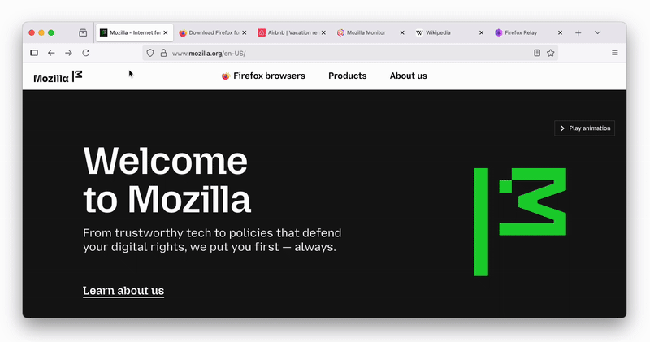
* 以下の地域の住所自動入力[^Address-autofill]に対応。
   * 日本、ブラジル、スペイン（Firefox 141）
   * スイス（Firefox 147）
   * オーストラリア、インド、イタリア、ポーランド、オーストリア（Firefox 149）
   * オランダ（Firefox 151beta）
* バレンシア語版のスペルチェッカー用辞書としてカタルーニャ語（バレンシア語の方言）辞書を組み込み。（Firefox 141）
* ウェブページ翻訳にて以下の言語を新たにサポート。
  * アルバニア語、グジャラート語、ヘブライ語、ヒンディー語、カンナダ語、マレー語、マラヤーラム語、ペルシア語、テルグ語（Firefox 141）
  * アゼルバイジャン語、ベンガル語、アイスランド語（Firefox 144）
  * 中国語（繁体）、ベトナム語（翻訳先のみ）（Firefox 148）
  * ボスニア語、ノルウェー語（ブークモール）、セルビア語、タイ語（Firefox 149）
* 米国内のユーザー向けに「新しいタブ」に表示されるおすすめ記事が、「Entertainment」「Health」などのジャンルごとにグループ分けされるようになった。ジャンル単位でのフォローやブロックも可能。（Firefox 142）
  
* 以下の地域で、アドレスバーに重要な日付やイベント（例：「母の日」）を表示できるようになった。（Firefox 143）
  * 米国、英国、ドイツ、フランス、イタリア
* 翻訳品質の改善
  * 日本語を含む各言語（Firefox 144）
  * クロアチア語（Firefox 149）
* フランス、ドイツ、イタリアで英語バージョンのFirefoxを利用するユーザーを対象に、アドレスバーに休日や重要な日付が英語でサジェストされるようになった。（Firefox 146）

[^Address-autofill]: https://support.mozilla.org/en-US/kb/automatically-fill-your-address-web-forms

## macOS固有の改善・変更

* 既定で専用のGPUプロセスを利用するようになった。WebGPU、WebGL、Firefox自身のWebRenderを含む。グラフィックスのコードに致命的なエラーが生じてもブラウザーをクラッシュさせずに、自動的にGPUプロセスを再起動する。（Firefox 146）
* WebGPUをサポート。Apple Siliconプロセッサを搭載したデバイスの全macOSバージョンで対応。（Firefox 147）
* Lockdownモード有効時にWebコンテンツに絵文字が表示されない不具合を修正。（Firefox 150）
* Universal ClipboardによるiOSデバイスからのURLを正しくペーストできるようになった。（Firefox 151beta）
* `<select>`によるドロップダウンをOSネイティブのメニューとして表示するようになり、外見や挙動をシステムの他の要素と揃えた。（Firefox 151beta）
* macOSおよびLinuxでローカルプロファイルのバックアップをサポートし、プラットフォーム間での復元が可能となった。（Firefox 151beta）
* カーソル移動コマンドについて、段落境界に関するものを含め、より高度な動作となるよう改善された。（Firefox 152.0a1Nightly）
* 書字方向が右から左の言語で、矢印キーを使用したテキスト編集コマンドの問題が修正された。（Firefox 152.0a1Nightly）
* 画像をデスクトップまたはFinderウィンドウにドラッグした際の画像保存の信頼性が改善された。（Firefox 152.0a1Nightly）

## Linux固有の改善・変更

* パッケージマネージャーによるアップデート適用後の再起動が不要となり、またメモリ使用量も削減された。（Firefox 141）
* 32bit版Linuxのサポートを終了。（Firefox 145） https://blog.mozilla.org/futurereleases/2025/09/05/firefox-32-bit-linux-support-to-end-in-2026/
* Linux（Wayland）での非整数比の拡大縮小表示をネイティブでサポート。（Firefox 146）
* 利用可能な場合に、GTK3に代わりXDG Portalのファイルピッカーをデフォルトで使用するようになった。通常、ユーザーのデスクトップ環境との統合性がより高く、強力であるため。（Firefox 149）
* GTK絵文字ピッカーをサポート。システムのショートカット（通常は`Ctrl`+`.`）を使用して、絵文字を挿入できる。（Firefox 150）
* Red Hat、Fedora、openSUSE、その他RPMベースのディストリビューションを使用するLinuxユーザー向けに、新しい.rpmパッケージを同梱するようになった。（Firefox 150）
* 設定画面に、AI強化機能を管理するための「AI制御」セクションを追加[^AI-controls]。

## Android固有の改善・変更

* WindowsタブレットおよびAndroidデバイスで[ScreenOrientation](https://developer.mozilla.org/ja/docs/Web/API/ScreenOrientation)インタフェースのlock()、unlock()メソッドをサポート。（Firefox 144）
* AndroidのBackボタンによるポップアップとダイアログウィンドウの終了をサポート。あわせてスクリプト内で制御するための[`CloseWatcher`](https://developer.mozilla.org/docs/Web/API/CloseWatcher)APIを実装。（Firefox 149）
* ツールバーを縦方向にスワイプすると、タブの一覧をすばやく表示できるようになった。（Firefox 151beta）
* ダウンロードの既定の保存先を選択できるようになった。（Firefox 152.0a1Nightly）
* AI機能を細かく制御するための設定を追加し、今後のAI機能のブロックも可能となった。（Firefox 152.0a1Nightly）

-->

<!--以下も非表示

## 現時点で判明している設定シートの変更点

### 追加

* `GenerativeAI`ポリシー
* `BrowserDataBackup`ポリシー

### 変更

* 

### 廃止

* 

-->
