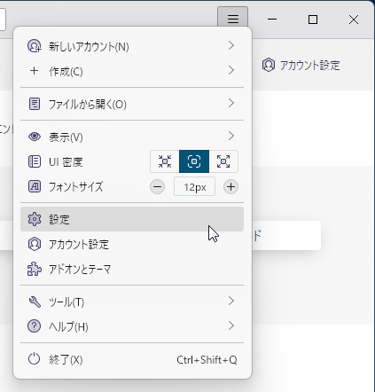
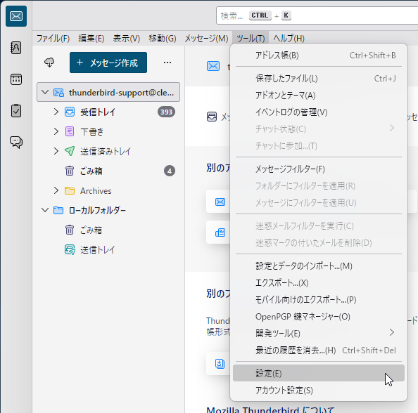
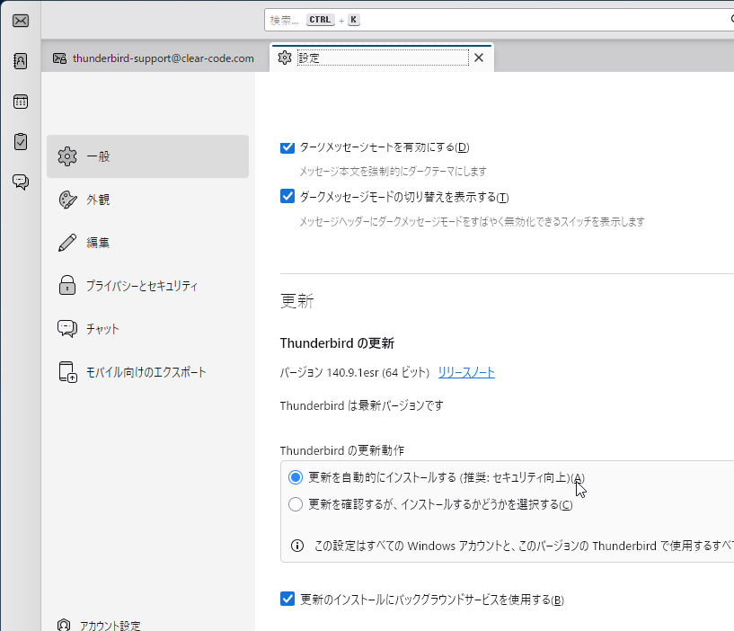
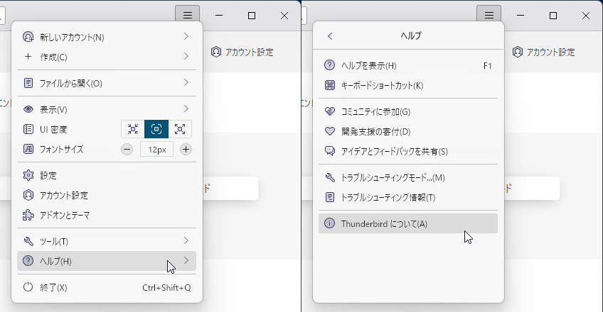
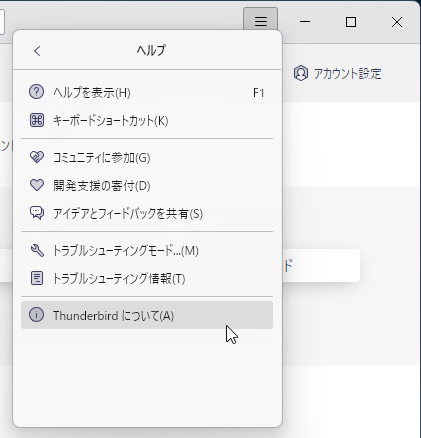
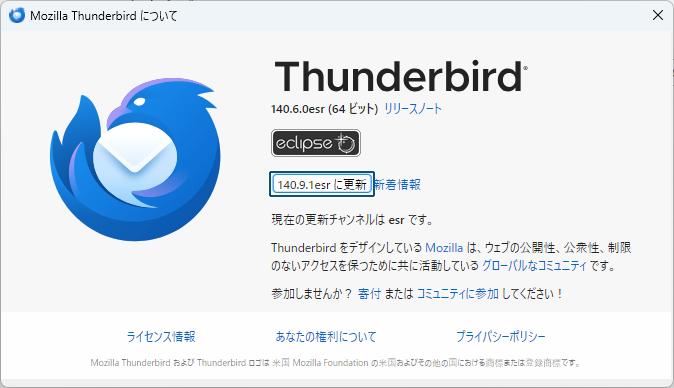
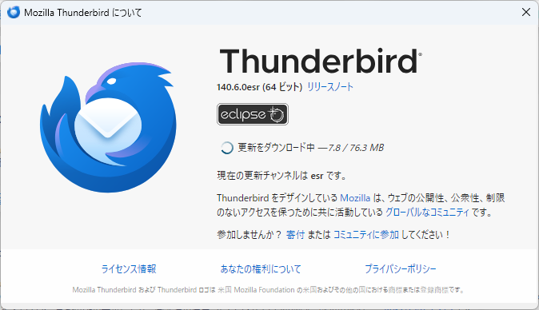
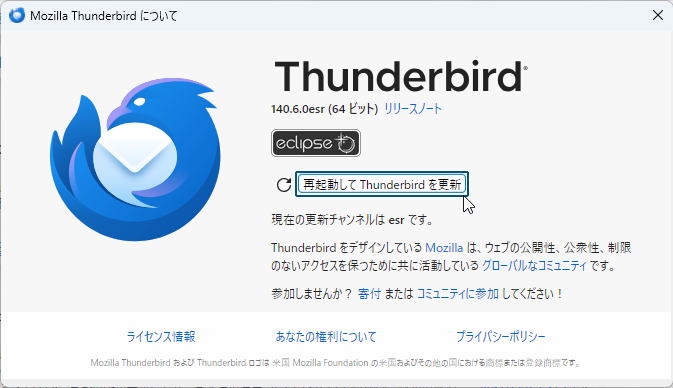
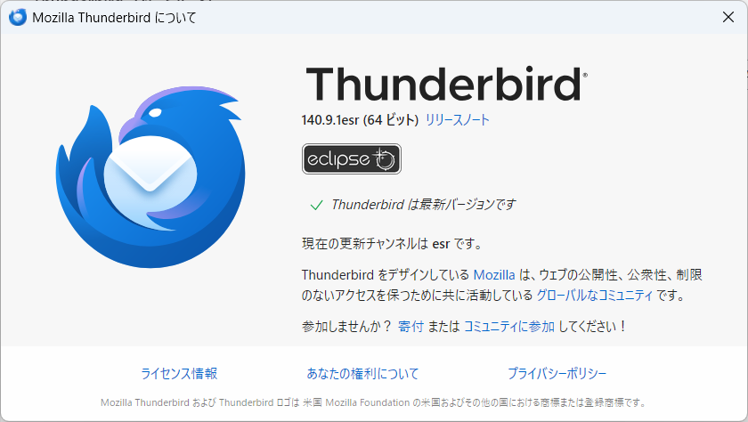

# 概要

本手順書は、Thunderbirdを自動更新機能を用いて更新する手順を説明するものです。

# 事前準備

Thunderbirdの更新にあたっては、事前に以下の条件を整えてください。

* PCがインターネットに接続されており、任意のアプリケーションで以下のURLへアクセス可能であること。
  （プロキシーなどでアクセス可能なURLを制限している場合、以下のURLのパターンへのアクセスを許可してください。）
  - https://aus.thunderbird.net/*
  - https://aus5.mozilla.org/*
  - https://download.mozilla.org/*
  - https://download-installer.cdn.mozilla.net/*

# 自動更新の実施

Thunderbirdの更新作業を行う環境において、前述の準備が終わっているものとします。

## 自動更新の有効化

1. Thunderbirdを起動します。
2. メインウィンドウ右上の「≡」のボタンをクリックしてメニューパネルを開き、「設定」を選択します。  
    { width=300 }  
   または、メインウィンドウのメニューバー（非表示になっている場合はAltキーで表示できます）の「ツール」→「設定」を選択します。  
    { width=300 }
3. Thunderbirdの設定画面が開かれたら、左ペインで「一般」を選択し、右ペインを下までスクロールして「更新」という見出しを探します。  
    { width=500 }  
   「Thunderbirdの更新動作」で「更新を自動的にインストールする」を選択し、「更新のインストールにバックグラウンドサービスを使用する」にチェックを入れます。
   * 「更新のインストールにバックグラウンドサービスを使用する」がグレーアウトして無効化されている場合、Thunderbirdのインストール時に必要なサービスがインストールされていません。その場合、Thunderbirdのインストーラーを実行し、ウィザードで「Mozilla Maintenance Service」のインストールを有効にしてThunderbirdのインストールを完了させてください。

以上でThunderbirdの自動更新機能の有効化は完了です。

## 更新の実施

1. Thunderbirdを起動します。
2. メインウィンドウ右上の「≡」のボタンをクリックしてメニューパネルを開き、「ヘルプ」→「Thunderbirdについて」を選択します。  
    { width=600 }  
   または、メインウィンドウのメニューバー（非表示になっている場合はAltキーで表示できます）の「ヘルプ」→「Thunderbirdについて」を選択します。  
    { width=300 }
3. 「（新しいバージョンの番号）に更新」ボタンが表示されている場合は、それをクリックします。  
    { width=500 }
4. 更新のダウンロードが完了するまで待ちます。（自動更新によってバックグラウンドでダウンロードが完了していた場合、この画面は表示されません。）  
    { width=500 }
5. 更新のダウンロードが完了して「再起動してThunderbirdを更新」ボタンが表示されたら、それをクリックします。  
    { width=500 }
6. Thunderbirdが自動的に再起動します。再起動が完了したら、メインウィンドウ右上の「≡」のボタンをクリックしてメニューパネルを開き、「ヘルプ」→「Thunderbirdについて」を選択するか、または、メインウィンドウのメニューバー（非表示になっている場合はAltキーで表示できます）の「ヘルプ」→「Thunderbirdについて」を選択します。
7. バージョン番号が更新後のバージョンになっていて、「Thunderbirdは最新バージョンです」と表示されていることを確認します。  
    { width=500 }

以上でThunderbirdの更新は完了です。
