# 概要

本手順書は、Thunderbirdのデータ（ユーザープロファイル）を、含まれる情報を極力維持したまま、あるWindows PCから別のWindows PCへ移行する手順を説明するものです。

# 事前準備

データ移行作業の実施にあたっては、事前に以下の条件を整えてください。

* 移行先のPCには、移行元のPCで使用していたものと同じか、より新しいバージョンのThunderbirdをインストールしてください。
  * 移行先のPCのThunderbirdのバージョンが古いと、データ損失が発生する恐れがあります。
* 移行先のPCのThunderbirdのインストール先パスは、移行元のPCと同じ位置に揃えてください。
  初期状態でのインストール先は `C:\Program Files\Mozilla Thunderbird` となります。
* ログオンユーザーのホームディレクトリー名（一般的には `C:\Users\(ログオンユーザー名)` のログオンユーザー名部分）は、移行元のPCと同じ名前に揃えてください。
  * ログオンユーザーのホームディレクトリー名が移行元のPCと移行先のPCとで異なっている場合でも、データの移行は可能ですが、移行先の初回起動時にメールの読み込み・表示に不具合が生じる可能性があります。
* 両方のPCにおいて、Thunderbirdが完全に終了した状態で作業を行ってください。
  * メニューパネル内のコマンド「終了」を実行してください。  
    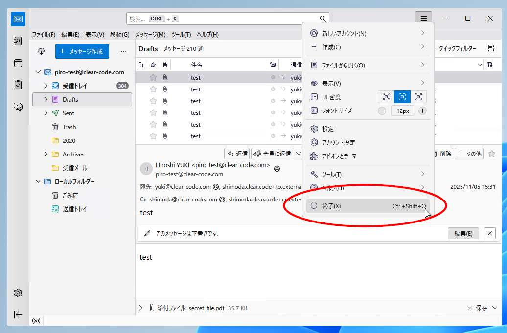{ width=500 }
  * Ctrl-Shift-ESCでタスクマネージャーを起動して、「詳細」表示に切り替え、「名前」列をクリックしてプロセスを名前順に並べ替えて、 `thunderbird.exe` のプロセスが残留していないことを確認してください。  
    もしThunderbirdの終了後も `thunderbird.exe` のプロセスが10分以上残留している場合は、項目を右クリックして「プロセス ツリーの終了」で強制終了してください。  
    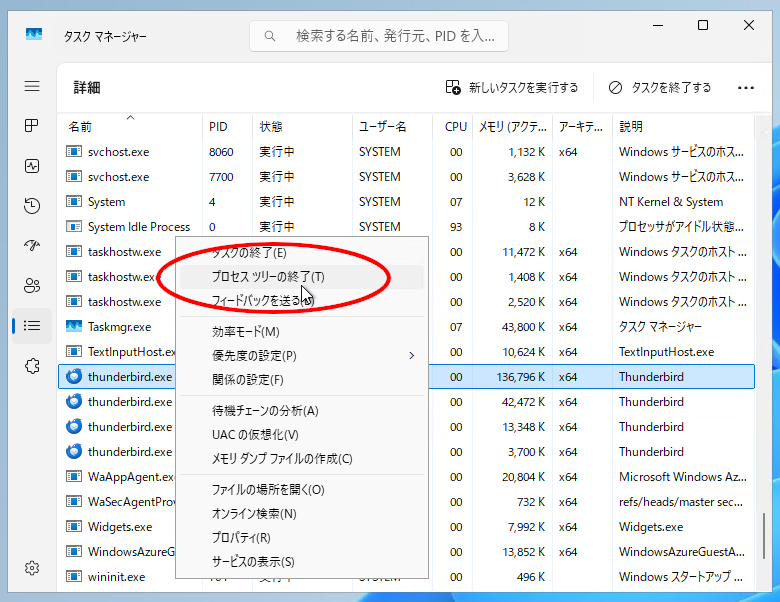{ width=500 }

# データの移行

移行元のPCと移行先のPCの両環境において、前述の準備が終わっているものとします。

## 移行元PCでの作業

1. PCにおいて、エクスプローラーを開き、アドレスバーに `%AppData%` と入力してEnterキーを押してフォルダーを開きます。  
   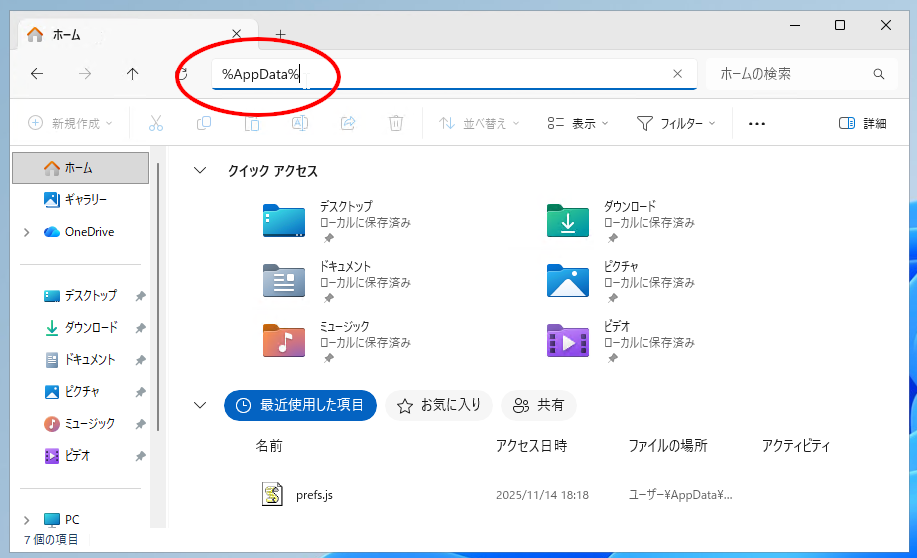{ width=500 }
2. 開かれたフォルダー（通常は `C:\Users\(ログオンユーザー名)\AppData\Roaming`）内にある `Thunderbird` フォルダーを右クリックし、「コピー」を選択します。  
   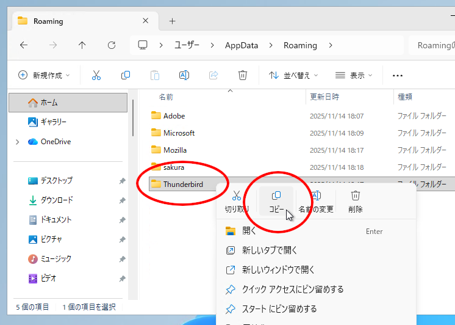{ width=500 }
3. 移行元のPCと移行先のPCで共通してアクセス可能なファイル共有サーバー上の共有フォルダーか、USBメモリーなどの持ち運び可能なストレージ領域などを開き、フォルダーの余白部分を右クリックして「張り付け」を選択します。  
   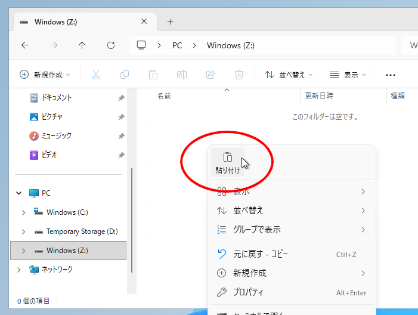{ width=500 }

## 移行先PCでの作業

1. 前節でプロファイルを張り付けた共有フォルダーまたは持ち運び可能なストレージ領域などを開き `Thunderbird` フォルダーを右クリックして「コピー」を選択します。  
   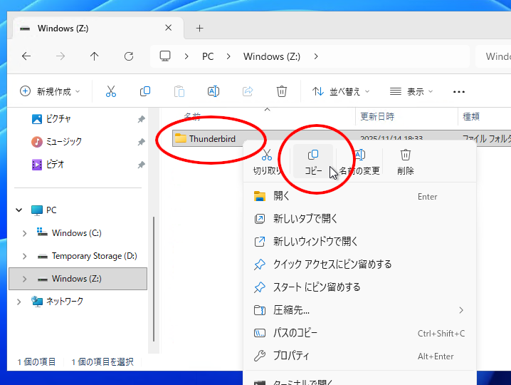{ width=500 }
2. エクスプローラーを開き、アドレスバーに `%AppData%` と入力してEnterキーを押してフォルダーを開きます。  
   { width=500 }
3. 開かれたフォルダー（通常は `C:\Users\(ログオンユーザー名)\AppData\Roaming`）内にある `Thunderbird` フォルダーを右クリックし、「削除」を選択します。  
   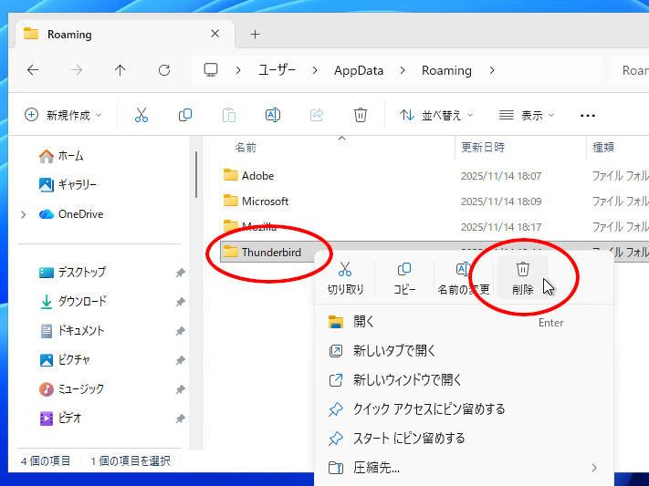{ width=500 }
4. 前項で開かれたフォルダーの余白部分を右クリックして「張り付け」を選択します。  
   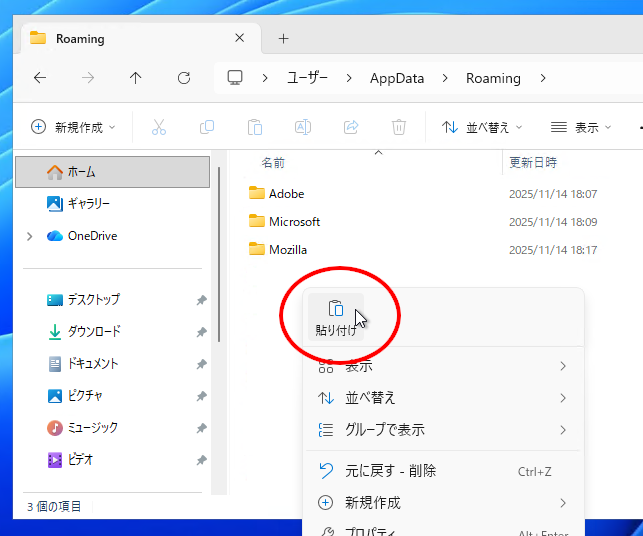{ width=500 }
5. 貼り付け後の `Thunderbird` フォルダーを開き、`Profiles` フォルダーに含まれるフォルダーのプロパティを確認して、最もサイズが大きいフォルダーを特定します。  
   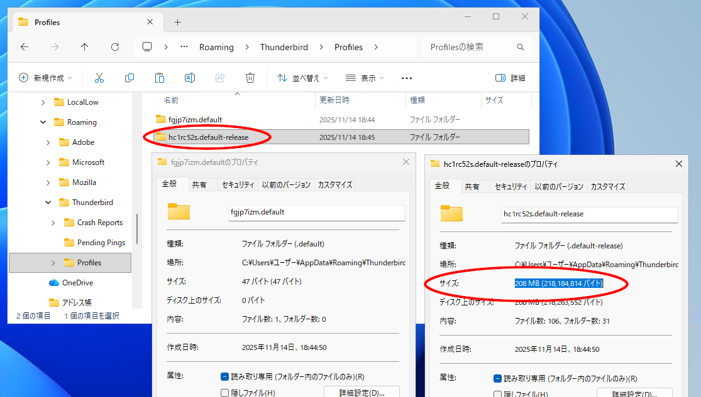{ width=500 }
6. 前項で特定した最もサイズが大きいフォルダーを開きます。  
   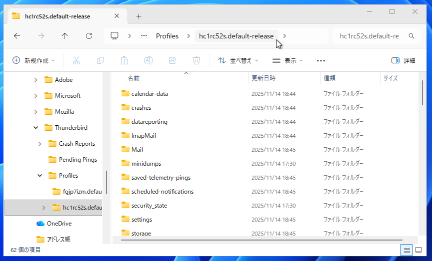{ width=500 }
7. 前項で開いたフォルダー内で、以下のフォルダーおよびファイルのうち存在するものすべてを、右クリックして「削除」を選択し削除します。
   * `chrome_debugger_profile`（フォルダー）
   * `crashes`（フォルダー）
   * `datareporting`（フォルダー）
   * `minidumps`（フォルダー）
   * `saved-telemetry-pings`（フォルダー）
   * `shader-cache`（フォルダー）
   * `addonStartup.json.lz4`（ファイル）
   * `compatibility.ini`（ファイル）
   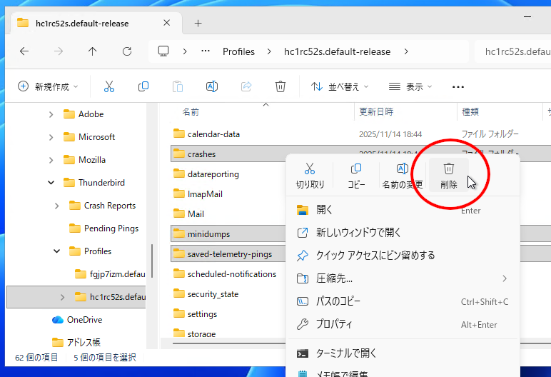{ width=500 }
8. エクスプローラーを開き、アドレスバーに `%LocalAppData%` と入力してEnterキーを押してフォルダーを開きます。  
   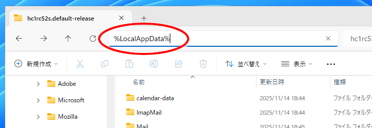{ width=500 }
9. 開かれたフォルダー（通常は `C:\Users\(ログオンユーザー名)\AppData\Local`）内にある `Thunderbird` フォルダーを削除します。  
   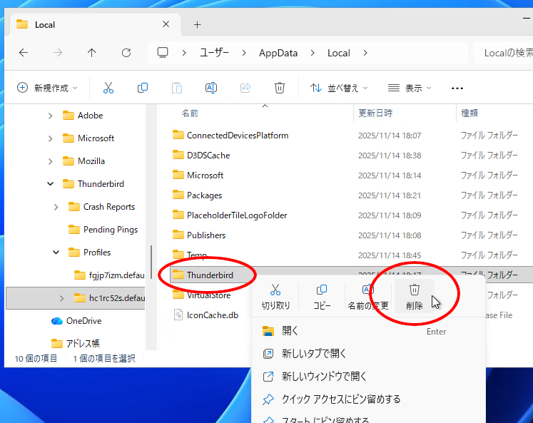{ width=500 }
10. Thunderbirdを起動し、移行元環境と同様の状態になっていることを確認します。  
   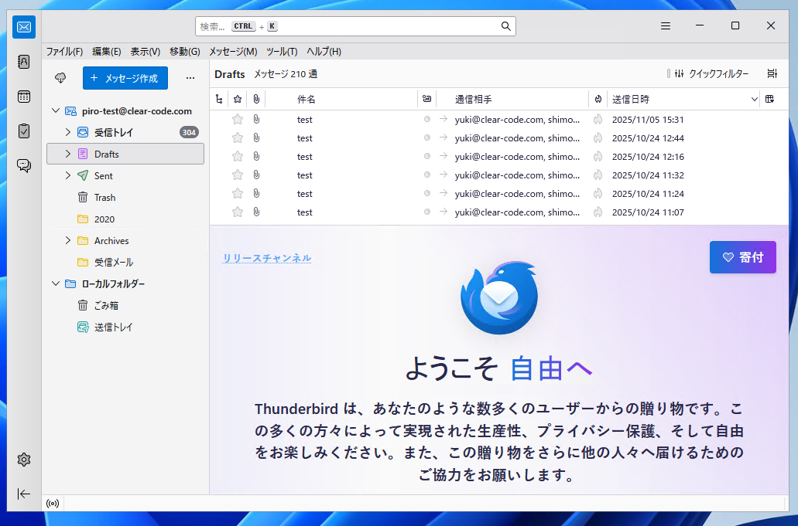{ width=500 }

以上でデータの移行は完了です。
